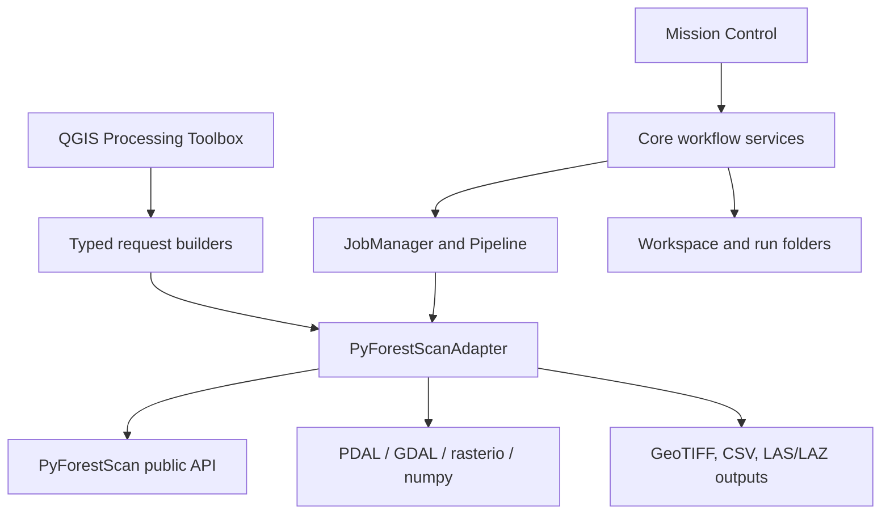

# PyForestScan QGIS

PyForestScan QGIS is a professional QGIS interface for [PyForestScan](https://pyforestscan.sefa.ai/), an open-source Python library for deriving forest structural products from airborne LiDAR. The plugin provides a guided desktop workflow for GIS users and an expert Processing Toolbox surface for analysts who need direct PyForestScan parameter control.

PyForestScan remains the scientific engine. This repository provides the QGIS application layer: environment diagnostics, dataset inspection, product planning, processing orchestration, output loading, batch execution, workspace history, and documentation.

## Current Capabilities

- **Mission Control** guided workflow for single datasets and batch runs.
- **Environment diagnostics** for QGIS Python, PyForestScan, PDAL, GDAL, rasterio, and numpy.
- **Dataset Explorer** reports with point count, bounds, CRS, density, classifications, warnings, footprint preview, JSON/CSV/HTML outputs.
- **Scientific Advisor** with deterministic, documented recommendations and QGIS next-step guidance.
- **Product Planner** for selected metrics, shared parameters, product-specific parameters, and output planning.
- **Implemented products**: CHM, PAD, PAI, Canopy Cover, FHD, Rumple summary, Point Density, Voxel Statistic, DTM, Height Above Ground point-cloud output.
- **Batch processing** with preflight checks, manifests, resume/retry, checkpointed summaries, sequential mode, and guarded Parallel Safe mode.
- **Workspace state** with recent workspaces, notes, timeline, run history, and local `.pyforestscan/` metadata.
- **Expert Processing Toolbox** grouped by Diagnostics, Input / I/O, Preprocessing / Filters, Terrain, and Metrics.
- **PyForestScan Backend Manager** production installation architecture for future user-local dependency installation, currently detection, verification, QGIS compatibility reporting, manifest-driven dry-run planning, repair planning, structured logs, transaction staging, and developer-guarded installer execution. Public one-click installation remains disabled.

External Worker mode is disabled. It is preserved as research code only and is blocked from normal use.

## Architecture



Core logic is kept QGIS-free where practical. QGIS UI and layer-loading behavior live in `pyforestscan_qgis/ui/`; PyForestScan calls live behind `pyforestscan_qgis/core/adapter.py`.

## User Workflows

### Guided Mode: Mission Control

1. Select a LiDAR dataset and output folder.
2. Run Dataset Explorer.
3. Review Scientific Advisor recommendations.
4. Build a Product Plan.
5. Run selected products.
6. Review outputs, reports, logs, and workspace history.

### Expert Mode: Processing Toolbox

The Processing Toolbox exposes direct PyForestScan controls for diagnostics, height normalization, preprocessing/filter chains, DTM generation, and metric generation. Guided tools such as Dataset Explorer and Product Planner are handled by Mission Control and are not registered as top-level Processing algorithms.

### Batch Mode

Batch processing discovers multiple LiDAR files, runs preflight checks, creates one run folder per file, writes checkpointed summaries, and continues after individual file failures unless stop-on-error is enabled.

## Outputs

| Product | Output | Notes |
| --- | --- | --- |
| CHM | `chm.tif` | Single-band GeoTIFF. |
| PAD | `pad.tif` | Multi-band GeoTIFF; QGIS default display uses RGB bands 5/3/2 when available. |
| PAI | `pai.tif` | Single-band GeoTIFF. |
| Canopy Cover | `canopy_cover.tif` | Single-band GeoTIFF. |
| FHD | `fhd.tif` | Single-band GeoTIFF. |
| Rumple | `rumple_summary.csv` | Scalar CSV summary. |
| Point Density | GeoTIFF | Expert toolbox output. |
| Voxel Statistic | GeoTIFF | Expert toolbox output for selected point dimension/statistic. |
| DTM | GeoTIFF | Ground-classified terrain raster. |
| Height Above Ground | LAS/LAZ | Optional point-cloud output from HAG read/preprocess workflows. |

## Installation and Local Testing

Build and validate a QGIS-installable ZIP:

```bash
python3 scripts/package_plugin.py
python3 scripts/validate_plugin_package.py dist/pyforestscan_qgis.zip
```

The package script writes both `dist/pyforestscan_qgis-v<version>.zip` and the latest convenience copy `dist/pyforestscan_qgis.zip`. Install either ZIP in QGIS through **Plugins > Manage and Install Plugins > Install from ZIP**.

Before processing, run **PyForestScan / Diagnostics / Environment Check** or the Mission Control Environment page. Windows QGIS dependency guidance is documented in [Windows QGIS Dependencies](docs/development/WINDOWS_QGIS_DEPENDENCIES.md).

## Internal Release Pipeline

For internal beta distribution, run:

```bash
python3 scripts/package_plugin.py
python3 scripts/validate_plugin_package.py dist/pyforestscan_qgis.zip
python3 scripts/check_docs_links.py
python3 scripts/validate_release.py
python3 scripts/prepare_github_release.py --dry-run
```

Release packaging produces `dist/release_manifest.json` with the plugin version, commit, branch, ZIP SHA-256, package size, PBM manifest version, backend manifest hash, and validation status. Report issues through the repository issue tracker or the internal testing channel selected for the beta.

## Screenshots

Screenshots are captured during release QA and stored under `docs/images/`.

Planned release screenshots:

- Mission Control Home dashboard.
- Dataset page with footprint preview.
- Scientific Advisor recommendations.
- Product Planner settings.
- Processing and Results pages.
- Batch preflight and batch summary.
- Processing Toolbox expert metric dialog.

## Documentation

Start with the [Documentation Index](docs/README.md).

Key entry points:

- [Getting Started](docs/getting-started/README.md)
- [User Guide](docs/user-guide/README.md)
- [Scientific Methods](docs/scientific-methods/README.md)
- [Architecture](docs/architecture/README.md)
- [Developer Guide](docs/developer/README.md)
- [PyForestScan API Audit](docs/api/README.md)
- [PyForestScan Backend Manager](docs/backend/PBM_ARCHITECTURE.md)
- [PBM Install Plan](docs/backend/PBM_INSTALL_PLAN.md)
- [PBM Manifest](docs/backend/PBM_MANIFEST.md)
- [PBM Transaction Model](docs/backend/PBM_TRANSACTION_MODEL.md)
- [QGIS Compatibility Layer](docs/development/QGIS_COMPATIBILITY_LAYER.md)
- [Release Checklist](docs/releases/INTERNAL_RELEASE_CHECKLIST.md)
- [Known Limitations](docs/KNOWN_LIMITATIONS.md)

## Roadmap

Near-term release priorities:

- Internal v1.0 QA across QGIS 3.44.x on Windows.
- Manual screenshots and sample-data validation notes.
- Product-level crop/bounds workflow design.
- Safer large EPT tiling workflow design.
- Public QGIS Plugin Repository readiness review.

## Contributing

Read [CONTRIBUTING.md](CONTRIBUTING.md), [Security Policy](SECURITY.md), and the [Code of Conduct](CODE_OF_CONDUCT.md). Contributions should preserve the adapter boundary, keep guided workflows simple, and document scientific or UX changes.

## Citation

Citation guidance is provided in [CITATION.cff](CITATION.cff). Cite PyForestScan separately when using its scientific engine.

## License

This project is licensed under the MIT License. See [LICENSE](LICENSE).
