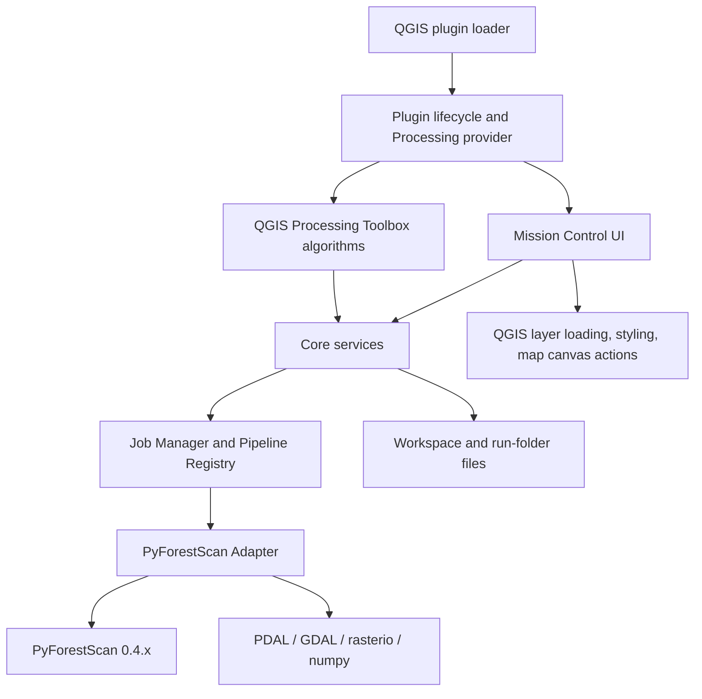
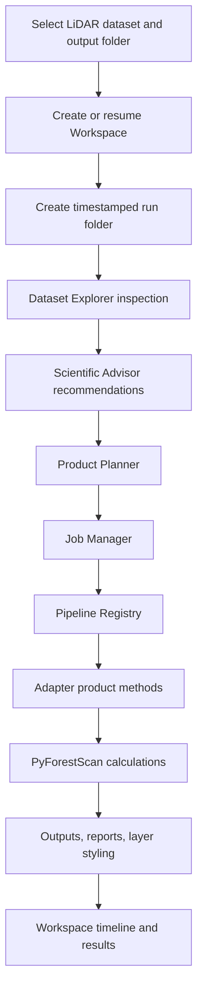
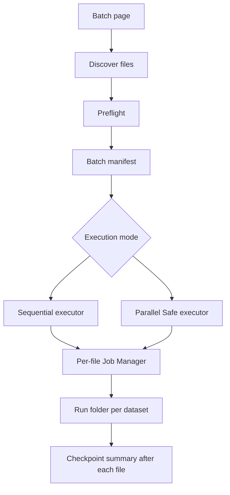
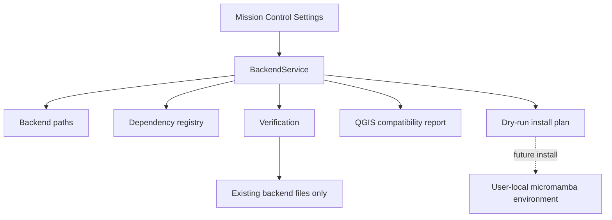

# Architecture

PyForestScan QGIS is a QGIS Processing plugin and Mission Control application for generating forest-structure products with PyForestScan. The plugin owns the user experience, orchestration, validation, reports, workspaces, and QGIS integration. PyForestScan remains the scientific computation engine.

## Current Runtime Model



The plugin has two supported user surfaces:

- **Guided Mode:** Mission Control guides single-dataset and batch workflows through workspace state, Dataset Explorer, Product Planner, Scientific Advisor, Job Manager, Pipeline, Adapter, and PyForestScan.
- **Expert Mode:** QGIS Processing Toolbox algorithms expose advanced PyForestScan controls for experienced users while preserving the adapter boundary.

External worker batch execution is disabled. Sequential and bounded Parallel Safe batch execution remain available.

## Architectural Boundaries

| Layer | Owns | Must Not Own |
| --- | --- | --- |
| QGIS plugin lifecycle | `metadata.txt`, plugin registration, Processing provider registration, resources | Scientific processing decisions |
| Mission Control UI | User workflows, state presentation, QGIS actions, layer styling, report links | Direct PyForestScan or PDAL calls |
| Processing algorithms | QGIS parameters, feedback, result handoff | Business logic or direct scientific calls |
| Core services | Validation, planning, jobs, pipelines, reports, batch orchestration, workspaces, knowledge recommendations | QGIS imports unless explicitly isolated in UI integration |
| Adapter | Stable plugin-owned interface to PyForestScan and scientific dependencies | QGIS UI behavior |
| PyForestScan | Scientific calculations | Plugin state, UI, QGIS layer loading |

The dependency direction is intentionally one-way:


## Guided Workflow



Mission Control hides internal JSON handoff files by default. Advanced run files, logs, manifests, and diagnostic reports remain available under technical details.

## Run Folder Contract

For a single dataset, Mission Control writes outputs under the selected output root:

```text
<output_root>/
  pyforestscan_runs/
    <YYYYMMDD_HHMMSS_datasetstem>/
      reports/
      tables/
      outputs/
      logs/
      temp/
```

The run folder is the reproducibility boundary for one processing attempt. It contains Dataset Explorer reports, Product Planner reports, product outputs, job summaries, and final run reports. It is not a QGIS project file and is not a database.

## Workspace Persistence

Workspaces are local folders under `.pyforestscan/` in a user-selected output root. They store JSON and Markdown state for:

- Workspace identity and session status.
- Recent runs and output links.
- Timeline events.
- User notes in `notes.md`.
- Lightweight resume context.

Workspace files are local persistence only. The plugin does not create accounts, use cloud sync, or manipulate QGIS project files as part of the workspace model.

## Batch Architecture



Batch processing creates one run folder per input file and writes `batch_manifest.json`, `batch_summary.json`, `batch_summary.csv`, and `batch_summary.html`. Preflight checks must run before execution. Completed files are skipped by default on resume, failed files can be retried, and output loading into QGIS is opt-in to avoid overwhelming a desktop session.

## Pipeline and Product Execution

Product execution is registered through the Pipeline Registry. Validation stages run before product stages, and product stages call the adapter rather than PyForestScan directly.

Implemented product paths include CHM, Canopy Cover, PAD, PAI, FHD, Rumple summary, Point Density, Voxel Statistics, DTM, and Height Above Ground workflows where exposed by Guided or Advanced Mode. Product-specific details live in [Scientific Methods](scientific-methods/README.md).

## Scientific Advisor

The Scientific Advisor uses deterministic Knowledge Engine rules from `pyforestscan_qgis/core/knowledge/`. It consumes inspected dataset facts and returns transparent recommendations, warnings, product suggestions, parameter notes, and QGIS next actions. Scientific thresholds are configurable and documented when calibration or literature review is still needed. There is no AI/LLM component.

## QGIS Integration

QGIS-specific code is kept in UI or Processing integration modules. This includes:

- Mission Control windows and page layouts.
- Adding footprint layers and zooming the map canvas.
- Loading product rasters and tables.
- Applying default raster styling and PAD RGB band visualization.
- Opening folders, reports, or QGIS panels where safe.

Core services and knowledge modules should remain importable in plain Python tests without QGIS.

## PyForestScan Backend Manager

The PyForestScan Backend Manager (PBM) is a new core subsystem for future user-local dependency management. It resolves platform-specific backend paths, stores typed backend configuration, maintains a dependency registry, verifies existing backend files, reports QGIS compatibility, and previews a registry-driven dry-run install plan through a service facade.

PBM does not currently install dependencies, download Micromamba, modify QGIS Python, change user environment variables, replace existing processing execution, or run PyForestScan jobs. It prepares the boundary for a future managed backend located under the user profile rather than the QGIS installation. QGIS 3.x is the current supported target; QGIS 4.x checks are defensive until real QGIS 4 builds can be validated.



See [PBM Architecture](backend/PBM_ARCHITECTURE.md), [PBM Install Plan](backend/PBM_INSTALL_PLAN.md), and [PBM QGIS Compatibility](backend/PBM_QGIS_COMPATIBILITY.md) for details.

## Design Rules

- Preserve `Mission Control -> JobManager -> Pipeline -> Adapter -> PyForestScan` for guided scientific processing.
- Preserve `Processing Toolbox -> Algorithm -> Request Builder -> Adapter -> PyForestScan` for expert algorithms.
- Keep PyForestScan calls behind adapter methods and request builders.
- Keep JSON, CSV, HTML, GeoTIFF, LAS/LAZ, and workspace file contracts documented.
- Treat outputs, reports, provenance, and error messages as part of the scientific product.
- Do not expose unsafe external worker execution until a true headless launcher is proven.
