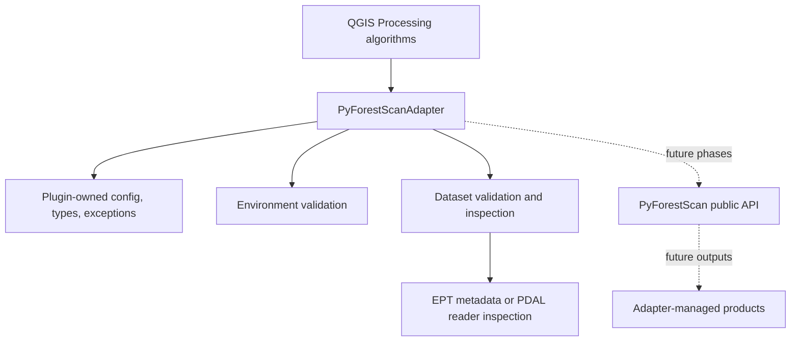
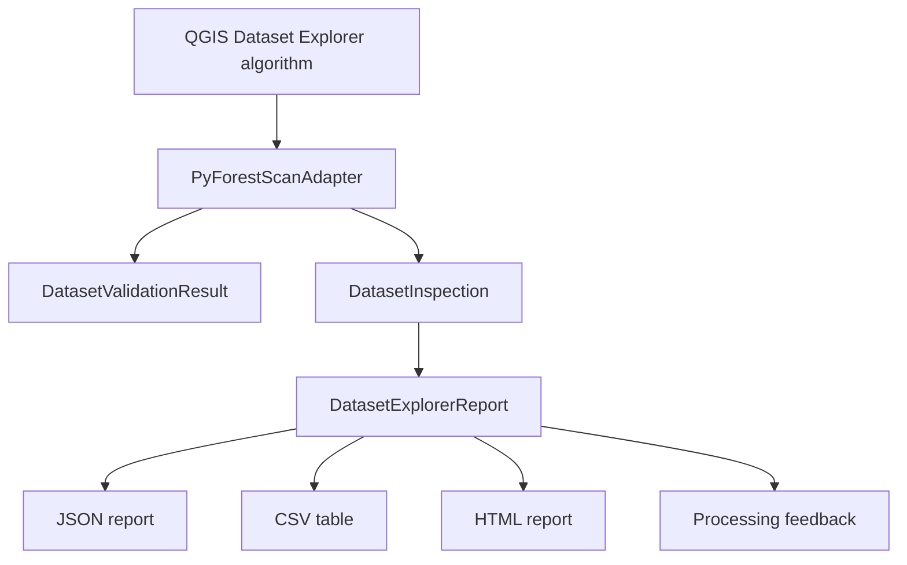
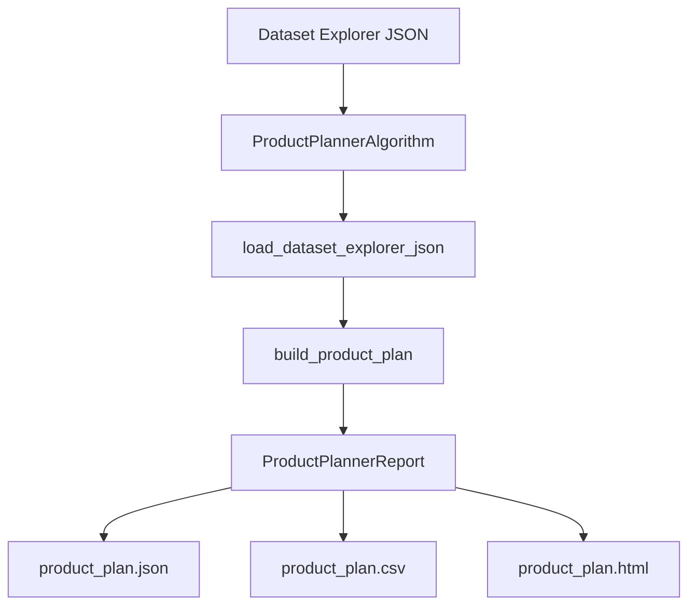
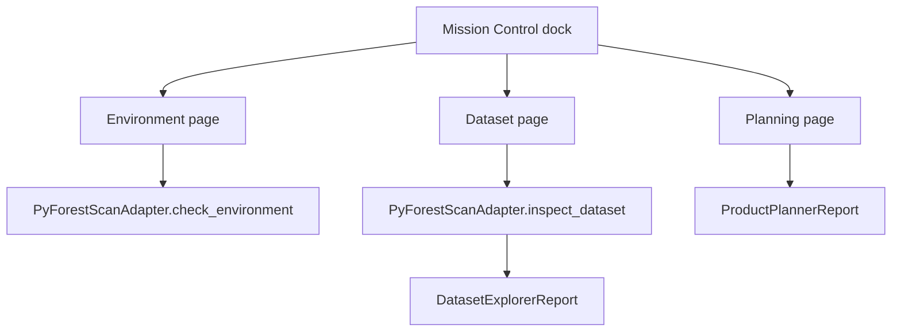

# Architecture

PyForestScan QGIS is structured as a thin QGIS-facing application layer around
PyForestScan.

## Architectural Boundaries

- QGIS Plugin Layer: plugin loading, metadata, resources, Processing provider
  registration, and QGIS UI integration.
- Processing Layer: QGIS Processing algorithm classes, parameters, outputs,
  feedback, cancellation, and context handling.
- Core Layer: plugin-owned validation, dependency checks, configuration,
  output naming, metadata writing, and adapter interfaces.
- PyForestScan Engine: external scientific computation library.

## Adapter Boundary

Phase 4 establishes `pyforestscan_qgis/core/adapter.py` as the only supported
route from future QGIS Processing algorithms into PyForestScan, PDAL, and related
scientific dependencies. The adapter owns environment checks, dataset validation,
metadata inspection, progress snapshots, structured logging, and plugin-owned
exceptions.

Processing algorithms should depend on immutable value objects from
`pyforestscan_qgis/core/types.py` and configuration objects from
`pyforestscan_qgis/core/config.py`. They should not import PyForestScan, PDAL,
rasterio, GDAL, or numpy directly unless an ADR explicitly changes this rule.

Current Phase 4 adapter capabilities are limited to validation and inspection.
Scientific product creation remains intentionally unimplemented.

## Dataset Explorer Workflow

Phase 5 adds the first complete user workflow while preserving the established
architecture. `DatasetExplorerAlgorithm` is a QGIS Processing shell that delegates
validation and inspection to `PyForestScanAdapter`, then delegates report
modeling and rendering to `pyforestscan_qgis/core/dataset_report.py`.

The workflow deliberately stops after inspection. It writes JSON, CSV, and HTML
planning outputs and reports product feasibility, but it does not call
PyForestScan calculation functions or create scientific products.

## Product Planner Workflow

Phase 6 adds `ProductPlannerAlgorithm` as a second guided workflow. The algorithm
reads the JSON produced by Dataset Explorer and delegates validation, estimates,
and report rendering to `pyforestscan_qgis/core/product_plan.py`.

Product Planner is still non-scientific. It estimates future output names and
planning metadata only; it does not call PyForestScan calculations, create
rasters, or mutate point-cloud data.

## Mission Control UI

Phase 7A introduces Mission Control as a dockable QGIS interface. Mission Control
coordinates current workflows through the adapter and core report/planner
modules. It does not directly import or call PyForestScan.

## Dependency Direction

Processing algorithms may depend on plugin core services. Core services may
depend on stable public APIs from PyForestScan once functional work begins.
PyForestScan must not depend on the plugin.

## Planned Package Layout

- `pyforestscan_qgis/processing/`: provider registration and Processing glue.
- `pyforestscan_qgis/algorithms/`: individual algorithm definitions.
- `pyforestscan_qgis/core/`: validation, dependency strategy, output metadata,
  and adapter boundaries.
- `pyforestscan_qgis/resources/`: QGIS resources and static assets.
- `pyforestscan_qgis/styles/`: QML styles and symbology presets.
- `pyforestscan_qgis/icons/`: icons for plugin and algorithms.

## Design Rules

- Keep PyForestScan calls behind small adapter functions or services.
- Keep algorithm classes focused on QGIS parameter and result handling.
- Prefer explicit parameter schemas over implicit defaults.
- Use QGIS feedback and cancellation APIs for long-running tasks.
- Treat output metadata as part of the product, not an afterthought.

