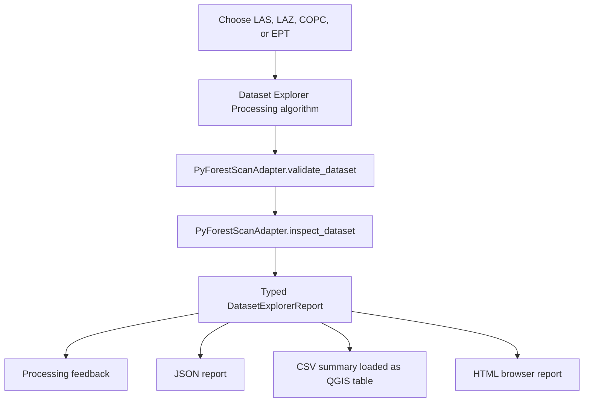
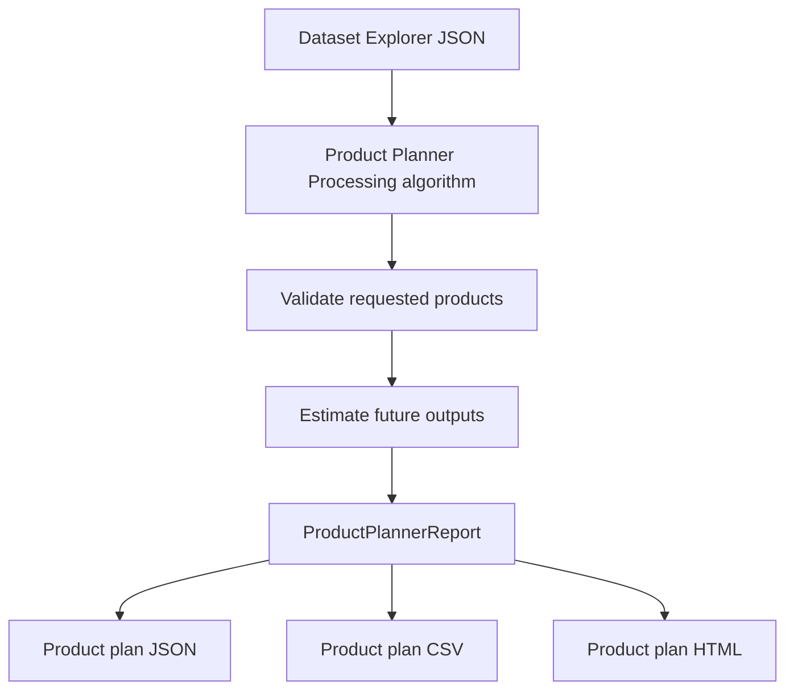
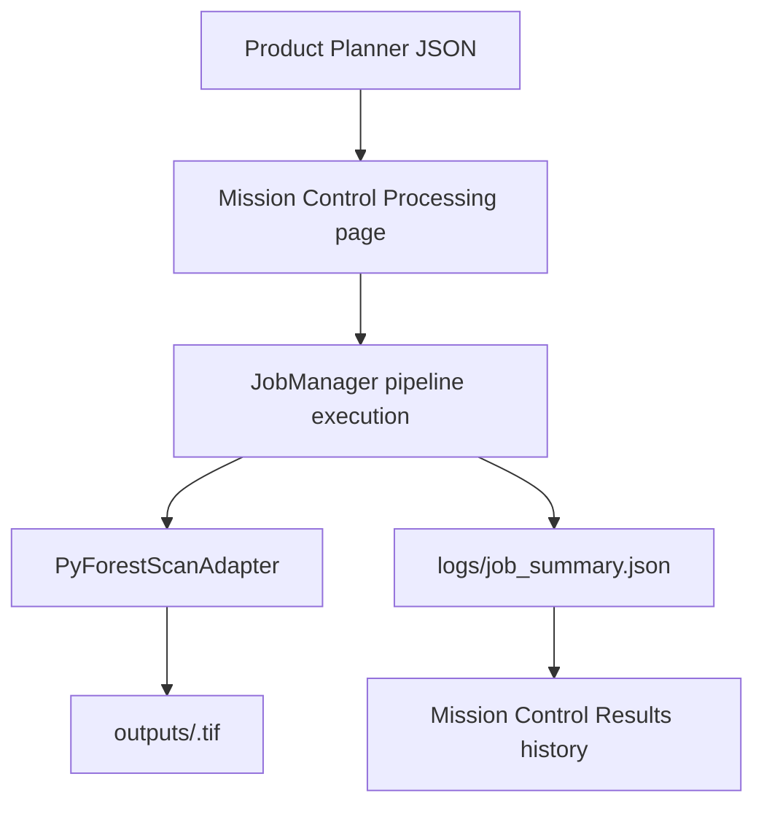

## Mission Control

Mission Control opens as a floating movable QGIS window by default and still can
be docked if your QGIS workspace supports it. It provides guided pages for the
current workflows:

- Home: versions, status, quick start, and recent activity.
- Environment: refresh dependency checks.
- Dataset: select a lidar dataset and output folder, inspect the dataset, and preview its spatial footprint.
- Planning: build a product plan from the active Dataset Explorer result.
- Processing: run implemented product jobs from the active Product Planner result.
- Results: open friendly Dataset Report, Product Plan, Job Summary, Output Folder,
  and Products links.
- Settings: choose a default output folder for Mission Control runs.

Mission Control creates a timestamped run folder and manages internal JSON/CSV
files automatically. Processing Toolbox algorithms remain available for advanced
users who want explicit file paths.

# User Guide


## Mission Control Run Folders

Mission Control hides internal JSON handoff files during the normal workflow.
Choose a lidar dataset and output folder on the Dataset page; the plugin creates
a run folder like this:

```text
<chosen_output_folder>/pyforestscan_runs/<YYYYMMDD_HHMMSS_datasetstem>/
```

Inside that folder, Mission Control stores reports, tables, logs, temporary
files, and an `outputs/` folder for generated products. If a run with the
same timestamp and dataset stem already exists, Mission Control adds a numeric
suffix to avoid overwriting it. The Results page
shows friendly links for Dataset Report, Product Plan, Job Summary, Output
Folder, and Products. Advanced details still expose JSON and CSV paths for
troubleshooting and reproducibility.

This guide describes current user-facing PyForestScan QGIS workflows: Dataset
Explorer, Product Planner, Mission Control run folders, CHM, Canopy Cover, PAD,
PAI, FHD, and Rumple summary processing.

## Dataset Explorer

Dataset Explorer is an inspection and planning workflow. It validates a lidar
dataset, inspects metadata and point structure through the adapter layer, and
writes reports that explain which future PyForestScan products appear feasible.

It does not generate CHM, PAI, PAD, FHD, canopy cover, rumple, rasters, vectors,
or PyForestScan scientific products.

### Supported Inputs

- LAS: `.las`
- LAZ: `.laz`
- COPC: `.copc` and `.copc.laz`
- EPT: local `ept.json`

### Workflow



### Outputs

Dataset Explorer produces three files. The CSV and HTML paths are optional in the
Processing dialog; when left blank, they are generated automatically beside the
JSON report.

| Output | Description |
| --- | --- |
| JSON report | Structured machine-readable report containing dataset metadata, geometry, point statistics, warnings, product feasibility, and recommended actions. |
| CSV summary | Long-form table with `section`, `name`, `value`, `status`, and `message` columns. The plugin attempts to add this CSV to the active QGIS project as a table. |
| HTML report | Professional browser-readable report with dataset metadata, bounds, charts, warnings, supported products, and recommended next actions. |
| Processing feedback | In-dialog summary, warnings, and product feasibility messages. |

### Warnings

Dataset Explorer reports planning warnings for:

- Unknown CRS.
- Missing classification dimension or unavailable classification counts.
- Missing ground class 2.
- Missing vegetation classes 3, 4, or 5.
- Missing `HeightAboveGround` or `Z` dimensions.
- Missing RGB color.
- Missing GPS time.
- Missing intensity.
- Unsupported or unknown point format.
- Very low estimated point density.

### Product Feasibility

Supported products are reported as planning statuses, not generated outputs:

- `Available`: the inspected dataset already exposes enough evidence for a
  future product workflow.
- `Warning`: the product appears feasible, but required preparation or metadata
  review is needed.
- `Unavailable`: required information is missing from the inspected dataset.

Phase 5 reports feasibility for:

- Canopy Height Model (CHM)
- Plant Area Index (PAI)
- Plant Area Density (PAD)
- Foliage Height Diversity (FHD)
- Canopy Cover
- Rumple Index

### Screenshot Placeholders

Screenshots will be captured during QGIS release testing and stored under
`docs/images/`. Planned screenshots:

- Dataset Explorer in the QGIS Processing Toolbox.
- Dataset Explorer parameter dialog.
- Processing feedback report.
- CSV summary loaded as a QGIS table.
- HTML report opened in a browser.


## Dataset Footprint Preview

After Dataset Explorer finishes, the Dataset page shows a Spatial Preview built
from the inspected XY bounds. It reports CRS, coordinate extent, approximate area,
center point, and warnings. Use `Add Footprint Layer` to add a transparent
rectangle named `PyForestScan Footprint - <dataset stem>` to QGIS, or `Zoom to
Footprint` to zoom the main QGIS map canvas. If CRS is unknown, Mission Control
warns clearly and disables automatic zoom because map reprojection cannot be
trusted.

The preview uses the rectangular bounds reported by Dataset Explorer; it is not a
convex hull or exact point-cloud coverage mask.

## Product Planner

Product Planner is a planning workflow that reads a Dataset Explorer JSON report
and helps users decide which products should be generated in a future processing
phase. It validates selected products against Dataset Explorer feasibility
results, estimates planned output names, records grid and height-bin settings,
and writes JSON, CSV, and HTML plan reports.

It does not run PyForestScan calculations and does not create rasters.

### Inputs

- Dataset Explorer JSON report.
- Desired products: CHM, PAI, PAD, FHD, Canopy Cover, and Rumple.
- Output folder for the plan and future products.
- Grid resolution.
- CHM interpolation method.
- CHM valid-region interpolation toggle.
- CHM clean-edges toggle.
- CHM output filename.
- Optional height bin size.
- Optional plan title and notes.

### Workflow



### Outputs

Product Planner writes these files inside the selected output folder:

| Output | Description |
| --- | --- |
| `product_plan.json` | Structured plan with requested products, readiness status, warnings, estimates, planned output paths, and `processing_executed: false`. |
| `product_plan.csv` | Long-form table for review, audit, and future automation. |
| `product_plan.html` | Browser-readable planning report with requested products, warnings, estimated outputs, and next actions. |

### Product Statuses

- `Ready`: Dataset Explorer marked the product available.
- `Needs review`: Dataset Explorer marked the product as feasible with warnings.
- `Blocked`: Dataset Explorer marked the product unavailable or did not report it.

## Product Job Execution

The Mission Control Processing page starts an implemented product job from the
active Product Planner report. Users do not need to browse for
`product_plan.json`; Mission Control uses the current run folder automatically.
The job validates the plan, runs implemented product pipelines through the
adapter, writes selected GeoTIFF outputs in `outputs/`, and writes
`logs/job_summary.json`.

CHM, Canopy Cover, PAD, PAI, FHD, and Rumple are implemented for
single-dataset workflows. Rumple writes a scalar CSV summary rather than a raster.

### Workflow



### Steps

1. Open Mission Control.
2. Go to Processing.
3. Confirm the current product plan is shown.
4. Select Start Processing Job.
5. Open Results to review the job history and friendly result links.

### CHM Parameters

- Grid resolution must be greater than zero.
- Interpolation can be `linear`, `nearest`, or `cubic`.
- Valid-region interpolation and clean-edges options are passed to
  `pyforestscan.calculate_chm`.
- Output filename must be a simple `.tif` or `.tiff` name.

### Canopy Cover Parameters

- Grid resolution must be greater than zero.
- Canopy height threshold must be zero or greater and is passed to
  `pyforestscan.calculate_canopy_cover` as `min_height`.
- Output filename must be a simple `.tif` or `.tiff` name.
- Vertical voxel height is fixed at `1.0` meter in this spike.

### PAD and PAI Parameters

- Grid resolution must be greater than zero.
- Height bin size must be greater than zero and controls the vertical voxel
  height used by PyForestScan.
- PAD output filename must be a simple `.tif` or `.tiff` name. PAD is written as
  a multi-band GeoTIFF, with one band per height bin.
- PAI output filename must be a simple `.tif` or `.tiff` name. PAI is written as
  a single-band GeoTIFF.


### FHD and Rumple Parameters

- FHD uses grid resolution and height bin size, and writes a single-band
  `.tif` or `.tiff` raster.
- Rumple uses grid resolution to build an internal CHM prerequisite, and writes
  a scalar `.csv` summary because PyForestScan 0.4.0 returns one rumple index
  value rather than a raster.
- Rumple output filename must be a simple `.csv` name.

### Canopy Cover QA

After a successful run, confirm the canopy cover raster opens in QGIS, values are
in the expected `0` to `1` range, CRS and extent align with the source dataset,
and a higher height threshold does not unexpectedly increase canopy cover.

### PAD and PAI QA

After a successful run, confirm PAI opens as a single-band raster, PAD opens as a
multi-band raster, CRS and extent align with the source dataset, values are
non-negative, and changing height bin size changes PAD banding as expected.


### FHD and Rumple QA

After a successful run, confirm FHD opens as a single-band raster, CRS and extent
align with the source dataset, and the Rumple CSV contains one `rumple_index`
row. Rumple is not loaded as a raster layer because it is scalar output.

### CHM QA

After a successful run, confirm the CHM opens in QGIS, the CRS and extent align
with the source dataset, values look reasonable, and edge artifacts are
acceptable for the selected interpolation options.

A successful summary includes `processing_executed: true`,
`scientific_outputs_created: true`, selected product `parameters`, and result
paths such as `chm_geotiff`, `canopy_cover_geotiff`, `pad_geotiff`,
`pai_geotiff`, `fhd_geotiff`, or `rumple_csv`. Jobs write both
`logs/job_summary.json` and `logs/job_summary.html`. Failed jobs still write
summary files with a clear error message. If one selected product fails, the
overall job is failed while successful product outputs remain recorded.
