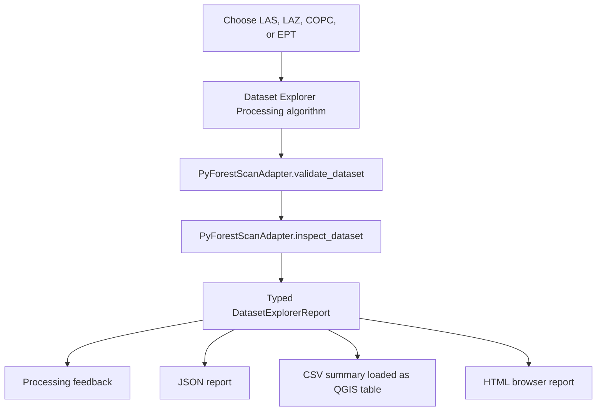
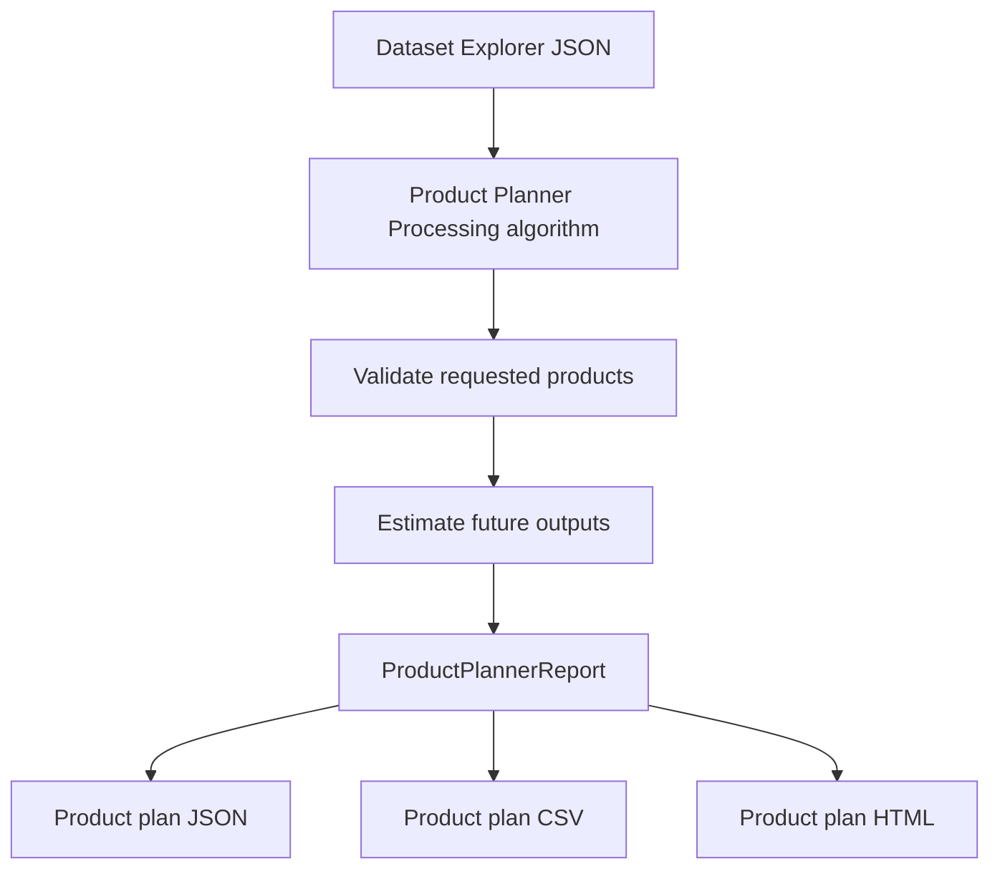
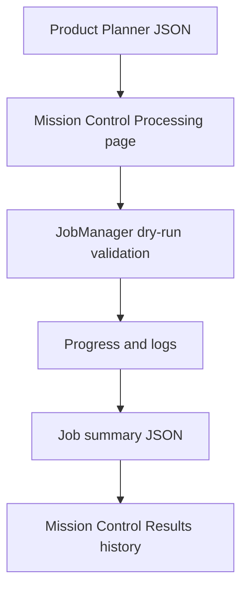

## Mission Control

Mission Control opens as a dockable QGIS panel and provides guided pages for the
current workflows:

- Home: versions, status, quick start, and recent activity.
- Environment: refresh dependency checks.
- Dataset: inspect a lidar dataset without writing outputs.
- Planning: build an in-memory product plan from the latest dataset inspection.
- Processing: run a dry-run job from a Product Planner JSON report and write a
  job summary JSON.
- Results: review dry-run job history and open existing JSON, CSV, or HTML reports.
- Settings: placeholder for future preferences.

Mission Control coordinates workflows only. Processing Toolbox algorithms remain
the report-producing path for Dataset Explorer and Product Planner.

# User Guide

This guide describes current user-facing PyForestScan QGIS workflows. Phase 5
implements the first complete workflow: Dataset Explorer.

## Dataset Explorer

Dataset Explorer is an inspection and planning workflow. It validates a lidar
dataset, inspects metadata and point structure through the adapter layer, and
writes reports that explain which future PyForestScan products appear feasible.

It does not generate CHM, PAI, PAD, FHD, canopy cover, rumple, rasters, vectors,
or PyForestScan scientific products.

### Supported Inputs

- LAS: `.las`
- LAZ: `.laz`
- COPC: `.copc` and `.copc.laz`
- EPT: local `ept.json`

### Workflow

### Outputs

Dataset Explorer produces three files. The CSV and HTML paths are optional in the
Processing dialog; when left blank, they are generated automatically beside the
JSON report.

| Output | Description |
| --- | --- |
| JSON report | Structured machine-readable report containing dataset metadata, geometry, point statistics, warnings, product feasibility, and recommended actions. |
| CSV summary | Long-form table with `section`, `name`, `value`, `status`, and `message` columns. The plugin attempts to add this CSV to the active QGIS project as a table. |
| HTML report | Professional browser-readable report with dataset metadata, bounds, charts, warnings, supported products, and recommended next actions. |
| Processing feedback | In-dialog summary, warnings, and product feasibility messages. |

### Warnings

Dataset Explorer reports planning warnings for:

- Unknown CRS.
- Missing classification dimension or unavailable classification counts.
- Missing ground class 2.
- Missing vegetation classes 3, 4, or 5.
- Missing `HeightAboveGround` or `Z` dimensions.
- Missing RGB color.
- Missing GPS time.
- Missing intensity.
- Unsupported or unknown point format.
- Very low estimated point density.

### Product Feasibility

Supported products are reported as planning statuses, not generated outputs:

- `Available`: the inspected dataset already exposes enough evidence for a
  future product workflow.
- `Warning`: the product appears feasible, but required preparation or metadata
  review is needed.
- `Unavailable`: required information is missing from the inspected dataset.

Phase 5 reports feasibility for:

- Canopy Height Model (CHM)
- Plant Area Index (PAI)
- Plant Area Density (PAD)
- Foliage Height Diversity (FHD)
- Canopy Cover
- Rumple Index

### Screenshot Placeholders

Screenshots will be captured during QGIS release testing and stored under
`docs/images/`. Planned screenshots:

- Dataset Explorer in the QGIS Processing Toolbox.
- Dataset Explorer parameter dialog.
- Processing feedback report.
- CSV summary loaded as a QGIS table.
- HTML report opened in a browser.

## Product Planner

Product Planner is a planning workflow that reads a Dataset Explorer JSON report
and helps users decide which products should be generated in a future processing
phase. It validates selected products against Dataset Explorer feasibility
results, estimates planned output names, records grid and height-bin settings,
and writes JSON, CSV, and HTML plan reports.

It does not run PyForestScan calculations and does not create rasters.

### Inputs

- Dataset Explorer JSON report.
- Desired products: CHM, PAI, PAD, FHD, Canopy Cover, and Rumple.
- Output folder for the plan and future products.
- Grid resolution.
- Optional height bin size.
- Optional plan title and notes.

### Workflow

### Outputs

Product Planner writes these files inside the selected output folder:

| Output | Description |
| --- | --- |
| `product_plan.json` | Structured plan with requested products, readiness status, warnings, estimates, planned output paths, and `processing_executed: false`. |
| `product_plan.csv` | Long-form table for review, audit, and future automation. |
| `product_plan.html` | Browser-readable planning report with requested products, warnings, estimated outputs, and next actions. |

### Product Statuses

- `Ready`: Dataset Explorer marked the product available.
- `Needs review`: Dataset Explorer marked the product as feasible with warnings.
- `Blocked`: Dataset Explorer marked the product unavailable or did not report it.

## Dry-Run Job Execution

The Mission Control Processing page can start a dry-run job from a Product
Planner JSON report. This validates the plan, simulates progress, and writes a
job summary JSON file to the selected output folder.

Dry-run jobs do not call PyForestScan scientific processing and do not create
CHM, PAI, PAD, FHD, canopy cover, rumple, raster, vector, or point-cloud outputs.

### Workflow

### Steps

1. Open Mission Control.
2. Go to Processing.
3. Choose a Product Planner JSON report.
4. Choose an output folder for the job summary.
5. Select Start Dry Run.
6. Open Results to review the job history and summary path.

The generated summary includes `processing_executed: false` and
`scientific_outputs_created: false` so dry-run artifacts are auditable.
