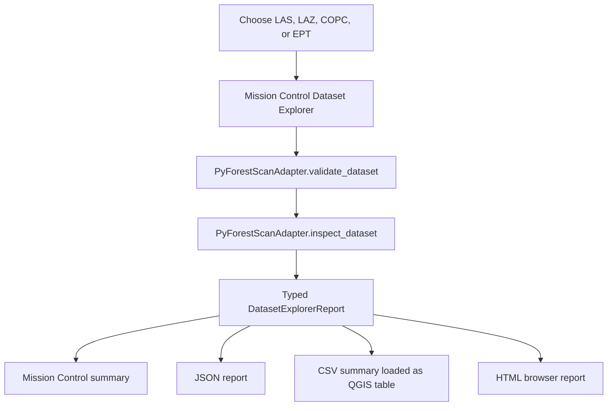
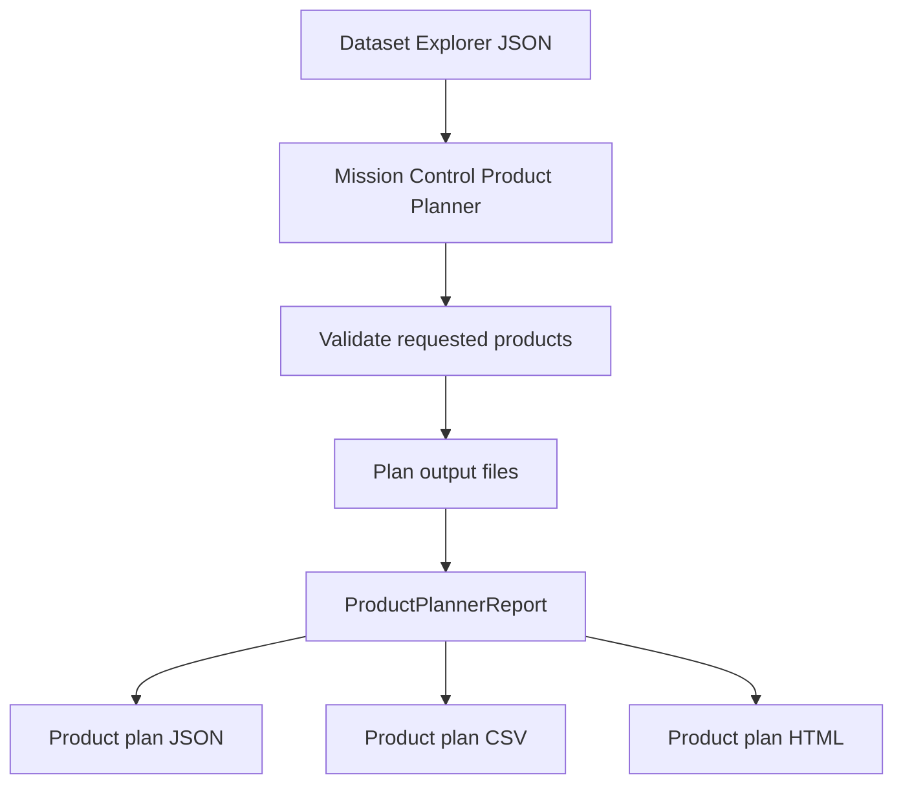
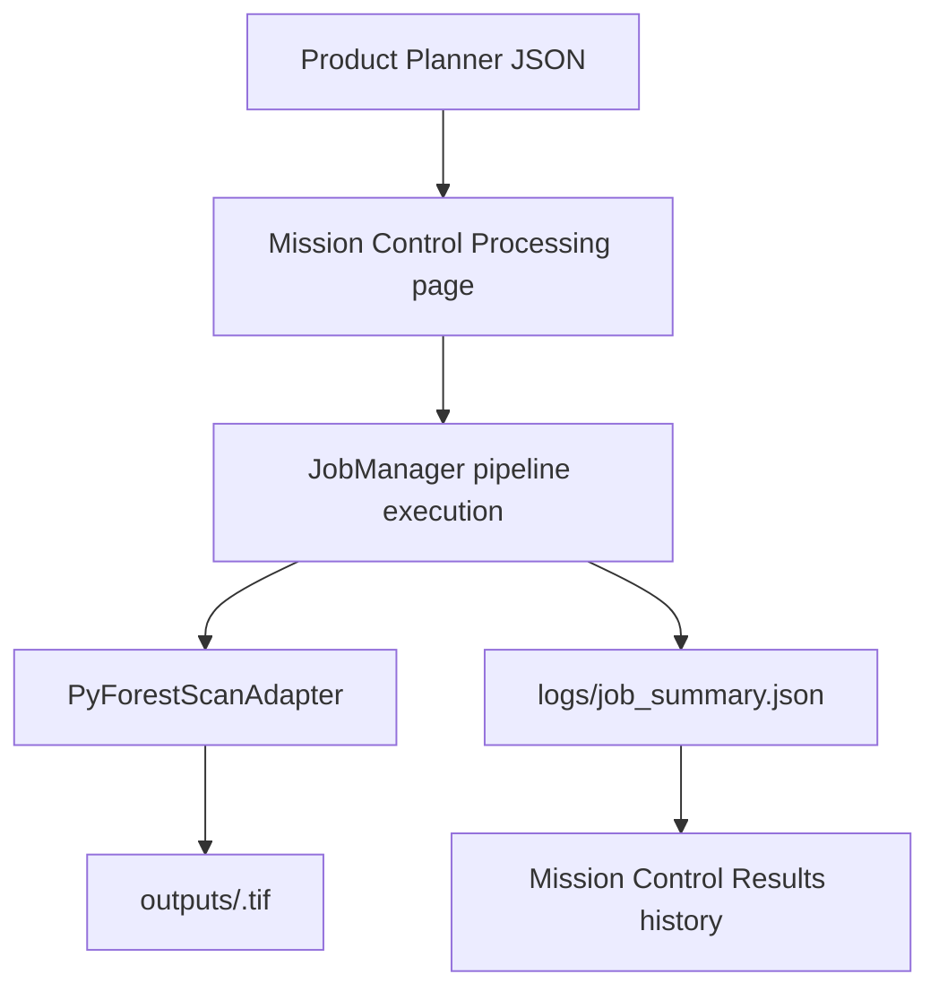

# PyForestScan QGIS User Guide

## Tools & Setup

The Processing Engine card is the normal setup entry point. It shows **Set Up** only when the managed engine is missing and **Repair** when attention is required; no action is shown when the engine is Ready. Advanced Settings keeps the output-folder and startup preferences visible. Troubleshooting is collapsed by default and provides a read-only recheck and consolidated diagnostics.

Click **Set Up** once when prompted. The plugin installs or repairs all supported processing components, verifies them, and changes the Processing Engine to **Ready** automatically. A separate Verify step is not required. If setup is needed from Process, use the inline action; your selected LiDAR, area, products, and output folder remain selected.

When **Processing Engine: Ready** is shown, normal Folder and Polygon products run in the isolated user-local engine, not QGIS Python. **Set Up** installs the complete supported product environment; **Repair** restores a failed contract. If the engine changes after selection, processing stops before job creation and keeps the current LiDAR, area, and product choices.

## Processing Engine

PyForestScan uses an isolated Processing Engine for point-cloud and raster work. When it is ready, Folder and Polygon processing do not require PyForestScan in QGIS Python. If setup or repair is needed, use the single action in **Tools & Setup**. The engine is stored in your user-local PyForestScan folder and does not modify QGIS Python or system Python.

Technical module names, managed-environment details, and setup logs are available under troubleshooting and are not normal workflow requirements.

Folder and Polygon Selection use the same products and automatic processing controls. Polygon Selection additionally requires trustworthy spatial alignment. If prompted, choose the repository CRS (or use the matching project CRS); Mission Control immediately retries source selection.

When unreferenced LiDAR coordinates strongly match the selected polygon, PyForestScan can process them as already expressed in the polygon CRS. Coordinates are not reprojected, and product metadata records the assumption. Tools & Setup offers Automatic, Ask, and Require explicit CRS policies.

## Phase 29B smart workflow

Mission Control stays closed when QGIS starts unless **Advanced Settings > Open Mission Control when QGIS starts** is enabled. Automatic is the normal processing profile; repository setup and spatial readiness are refreshed as needed, while specialist execution controls remain under Custom.

## Phase 29A adaptive layout

Mission Control adapts its visible controls to the current task. Repository maintenance, product-specific parameters, parallel worker settings, previous results, and backend troubleshooting appear only when relevant; the bottom strip continuously summarizes the current session.

## Mission Control

Mission Control opens as a large floating, movable QGIS window by default and
still can be docked if your QGIS workspace supports it. The sidebar is bounded
so the main page stack can use the full window, and each page uses one
predictable vertical scroll area. It provides guided pages for the current
workflows:

- Home: compact workflow dashboard with backend status, environment status, current dataset or batch context, last output folder, and Open Dataset / Start Batch / Continue Previous Session actions.
- Workspace: continue the last workspace, start a new workspace, reopen recent workspaces, view status/runs/timeline/outputs, edit notes, and reset workspace progress.
- Environment: refresh execution readiness, see PBM backend status first, and expand QGIS Python fallback or technical dependency details only when needed.
- Dataset: select a lidar dataset and output folder, use Analyze Dataset, refresh stale page state when needed, optionally extract an EPT subset, then review dataset summary and footprint details.
- Planning: build a product plan from the active Dataset Explorer result.
- Processing: run implemented product jobs from the active Product Planner result with the active execution backend shown up front.
- Batch: follow the three-step Discover Files, Preflight, and Run Batch flow. Parallel Safe and retry tuning remain available under Advanced Batch Options.
- Results: open friendly Dataset Report, Product Plan, Job Summary, Output Folder,
  and Products links.
- Settings: choose a default output folder for Mission Control runs.

Mission Control creates a timestamped run folder and manages internal JSON/CSV
files automatically.
The beta workflow is intentionally linear: check backend, select a dataset or batch folder, review the recommendation, choose products, run, and review outputs. Technical logs, fallback dependency rows, and internal report paths are collapsed by default. Empty downstream sections stay hidden until they have meaningful content. The visual language follows the [PyForestScan Design System](development/PYFORESTSCAN_DESIGN_SYSTEM.md): primary actions are visually distinct, statuses use approved badge wording, and troubleshooting controls stay secondary. Processing Toolbox tools remain available for expert users who want explicit file paths and PyForestScan parameter controls.

# User Guide


## Workspaces

Mission Control now keeps a local Workspace for each selected output root. A Workspace represents one analysis and stores resumable context in a hidden `.pyforestscan/` folder under the output folder. It records session state, recent datasets/reports, timeline events, processing history, notes, and workspace format version metadata.

Users do not manually save Workspaces. Mission Control auto-saves after major operations such as Dataset Explorer, Product Planner, processing completion, and batch completion. The Workspace page also provides a Save Notes button for `notes.md`. Workspace files are local and independent from the QGIS project. There is no cloud sync, account, or database.

Use Continue Last Workspace to reopen the most recent workspace, or Start New Workspace to create a new `.pyforestscan/` folder under a selected output folder. Recent Workspaces shows up to 10 entries and flags missing folders. The Timeline lists recent events in readable order, and Notes supports Markdown/plain text field notes. Clear / Reset Current Workspace resets progress and history for the active workspace without deleting generated output files.

## Mission Control Run Folders

Mission Control hides internal JSON handoff files during the normal workflow.
Choose a lidar dataset and output folder on the Dataset page; the plugin creates
a run folder like this:

```text
<chosen_output_folder>/pyforestscan_runs/<YYYYMMDD_HHMMSS_datasetstem>/
```

Inside that folder, Mission Control stores reports, tables, logs, temporary
files, and an `outputs/` folder for generated products. If a run with the
same timestamp and dataset stem already exists, Mission Control adds a numeric
suffix to avoid overwriting it. The Results page
shows friendly links for Dataset Report, Product Plan, Job Summary, Output
Folder, and Products. Run files and logs still expose JSON, CSV, HTML, and log paths for troubleshooting and reproducibility.

This guide describes current user-facing PyForestScan QGIS workflows: Dataset
Explorer, Product Planner, Mission Control run folders, CHM, Canopy Cover, PAD,
PAI, FHD, and Rumple summary processing.

## Backend Manager

Mission Control Settings includes the PyForestScan Backend Manager. It can verify the current backend state, preview the manifest-driven install transaction, show QGIS/backend compatibility, plan repairs, show structured logs, and display advanced module/version information.

Windows internal beta users can click **Install Backend** from Mission Control Settings after confirming that PBM will install into the user-local PyForestScan folder only. PBM does not modify QGIS Python, QGIS installation folders, PATH, shell profiles, system Python, or user environment variables. Linux and macOS install execution remains planned/experimental until smoke tested. When PBM verifies as Ready, Environment Check reports overall `READY`, shows PBM Backend as the active execution backend, and lists QGIS Python scientific packages as an optional fallback environment. Missing QGIS Python PyForestScan/PDAL are not blocking failures unless the user chooses QGIS-Python-only tools.

## Processing Toolbox Expert Tools

Expert users can run PyForestScan tools from QGIS Processing Toolbox under the `PyForestScan / Diagnostics`, `PyForestScan / Input / I/O`, `PyForestScan / Preprocessing / Filters`, `PyForestScan / Terrain`, and `PyForestScan / Metrics` groups. These tools expose explicit X/Y resolution, interpolation, voxel, height-range, Beer-Lambert, canopy-cover, rumple, and HAG/normalization controls. Mission Control remains the recommended guided workflow for normal use.

Toolbox raster outputs use the same loading/styling rules as Mission Control: CHM, Canopy Cover, PAI, FHD, DTM, Point Density, and Voxel Statistic load as grayscale when possible. PAD is an authoritative multiband height-bin volume and loads as a representative grayscale height slice by default. Optional PAD derivative rasters and height-band composites are visualizations, not replacements for PAD. Rumple writes a CSV summary because PyForestScan returns a scalar value.

The HAG/Normalize tool reads lidar with PyForestScan HAG support and can optionally write LAS/LAZ through PyForestScan `write_las`. It also exposes expert read options such as bounds, thinning radius, and crop polygon/WKT. It does not invent unsupported normalized output formats.

Extract EPT Subset appears under `PyForestScan / Input / I/O` and on the Dataset page. It reads an EPT `ept.json` source with optional bounds, polygon crop, thinning, reprojection, and HAG settings, then writes a user-controlled `.las` or `.laz` subset. See [EPT Subset Extraction](scientific/ept-subset-extraction.md).

Generate DTM creates a GeoTIFF from ground-classified points. Point Density writes a single-band GeoTIFF from `calculate_point_density` with explicit `per_area` and optional `cell_area` controls. Voxel Statistic writes a single-band GeoTIFF from `calculate_voxel_stat` with exact `dimension`, `stat`, and optional `z_index_range` controls. Preprocess Point Cloud writes LAS/LAZ after selected PyForestScan filter steps such as outlier cleaning, full SMRF ground classification, ground filtering, PointSourceId filtering, HAG, HAG range filtering, Poisson thinning, and voxel-grid downsampling.

## Dataset Explorer

Dataset Explorer is an inspection and planning workflow. It validates a lidar
dataset, inspects metadata and point structure through the adapter layer, and
writes reports that explain which PyForestScan products are supported or need review for the selected dataset.

It does not create product rasters; it prepares the inspection evidence used by planning, the Scientific Advisor, and processing.

### Supported Inputs

- LAS: `.las`
- LAZ: `.laz`
- COPC: `.copc` and `.copc.laz`
- EPT: local `ept.json`

### Workflow



### Outputs

Dataset Explorer produces three files. CSV and HTML reports are generated automatically in the active run folder.

| Output | Description |
| --- | --- |
| JSON report | Structured machine-readable report containing dataset metadata, geometry, point statistics, warnings, product feasibility, and recommended actions. |
| CSV summary | Long-form table with `section`, `name`, `value`, `status`, and `message` columns. The plugin attempts to add this CSV to the active QGIS project as a table. |
| HTML report | Professional browser-readable report with dataset metadata, bounds, charts, warnings, supported products, and recommended next actions. |
| Mission Control summary | In-dialog summary, warnings, and product feasibility messages. |

### Warnings

Dataset Explorer reports planning warnings for:

- Unknown CRS.
- Missing classification dimension or unavailable classification counts.
- Missing ground class 2.
- Missing vegetation classes 3, 4, or 5.
- Missing `HeightAboveGround` or `Z` dimensions.
- Missing RGB color.
- Missing GPS time.
- Missing intensity.
- Unsupported or unknown point format.
- Very low estimated point density.

### Product Feasibility

Supported products are reported as planning statuses, not generated outputs:

- `Available`: the inspected dataset already exposes enough evidence for the product workflow.
- `Warning`: the product appears feasible, but required preparation or metadata
  review is needed.
- `Unavailable`: required information is missing from the inspected dataset.

Dataset Explorer reports feasibility for:

- Canopy Height Model (CHM)
- Plant Area Index (PAI)
- Plant Area Density (PAD)
- Foliage Height Diversity (FHD)
- Canopy Cover
- Rumple Index

### Screenshot Placeholders

Screenshots will be captured during QGIS release testing and stored under
`docs/images/`. Planned screenshots:

- Dataset Explorer in the QGIS Processing Toolbox.
- Dataset Explorer parameter dialog.
- Mission Control summary report.
- CSV summary loaded as a QGIS table.
- HTML report opened in a browser.


## Dataset Footprint Preview

After Dataset Explorer finishes, the Dataset page shows a Spatial Preview built
from the inspected XY bounds. It reports CRS, coordinate extent, approximate area,
center point, and warnings. Use `Add Footprint Layer` to add a transparent
rectangle named `PyForestScan Footprint - <dataset stem>` to QGIS, or `Zoom to
Footprint` to zoom the main QGIS map canvas. If CRS is unknown, Mission Control
warns clearly and disables automatic zoom because map reprojection cannot be
trusted.

The preview uses the rectangular bounds reported by Dataset Explorer; it is not a
convex hull or exact point-cloud coverage mask.


## Scientific Advisor

Mission Control includes a Scientific Advisor page. After Dataset Explorer runs,
the Advisor automatically evaluates the active dataset with the deterministic
Knowledge Engine and displays dataset score, confidence, warnings, recommended
products, recommended parameters, scientific notes, next steps, QGIS tool
suggestions, and product explanation cards. The page is organized as vertical
card sections so the top recommendations, warnings, parameters, tools, product
explanations, and next steps can be read at the normal floating Mission Control
window size without horizontal resizing.

The Advisor can adopt practical parameter guidance into Product Planner, such as
a suggested CHM grid resolution, while keeping threshold caveats visible. After a
processing job completes, the Advisor lists completed products and recommends QA
steps such as inspecting Layer Styling, Histograms, CRS/extent alignment, and the
final job summary.

The Advisor starts with an executive summary: dataset readiness, best product to
consider, key warning, and suggested next action. Detailed scientific notes,
QGIS tool instructions, and product explanations are available in collapsed
sections so the default view stays focused.

## Product Planner

Product Planner is a planning workflow that reads a Dataset Explorer JSON report
and helps users decide which products to generate for the active dataset. Mission Control groups Planning controls into Dataset, Output, Product
Selection, Shared Parameters, and Run Summary sections by default. Product-
specific settings are available under Advanced Product Settings when users need
to override filenames, CHM interpolation, edge handling, or canopy-cover
thresholds. Product Planner validates selected products against Dataset Explorer
feasibility results, estimates planned output names, records grid and height-bin
settings, and writes JSON, CSV, and HTML plan reports.

It does not run PyForestScan calculations and does not create rasters.

### Inputs

- Dataset Explorer JSON report.
- Desired products: CHM, PAI, PAD, FHD, Canopy Cover, and Rumple.
- Output folder for the plan and generated products.
- Grid resolution.
- CHM interpolation method.
- CHM valid-region interpolation toggle.
- CHM clean-edges toggle.
- CHM output filename.
- Optional height bin size.
- Optional plan title and notes.

### Workflow



### Outputs

Product Planner writes these files inside the selected output folder:

| Output | Description |
| --- | --- |
| `product_plan.json` | Structured plan with requested products, readiness status, warnings, estimates, planned output paths, and `processing_executed: false`. |
| `product_plan.csv` | Long-form table for review, audit, and repeatable processing. |
| `product_plan.html` | Browser-readable planning report with requested products, warnings, estimated outputs, and next actions. |

### Product Statuses

- `Ready`: Dataset Explorer marked the product available.
- `Needs review`: Dataset Explorer marked the product as feasible with warnings.
- `Blocked`: Dataset Explorer marked the product unavailable or did not report it.


## Batch Processing

Use the Batch page when several lidar files need the same products and shared settings. Choose an input folder, decide whether to search subfolders, discover supported LAS, LAZ, COPC, COPC LAZ, and local EPT `ept.json` files, then select the files to run. Choose one output folder and one shared product/settings set.

Batch uses a three-step flow: run Preflight, run the batch, then review results. Batch runs files sequentially by default. Advanced users can choose Parallel safe mode, which uses a small capped worker count and guardrails. It creates a folder like:

```text
<output_folder>/pyforestscan_batch_<YYYYMMDD_HHMMSS>/
```

Each selected dataset receives its own run folder inside that batch folder, with the same `reports/`, `tables/`, `outputs/`, `logs/`, and `temp/` structure used by the single-file workflow. The batch also writes `batch_summary.json`, `batch_summary.csv`, and `batch_summary.html`. Failed files are recorded in the summary and the batch continues by default. Enable stop-on-error if the batch should stop after the first failed file. Use Retry Failed Files to queue failures again with the current shared settings. Pause and Cancel Remaining apply between files, not during an individual product calculation.

Generated outputs are not loaded into QGIS by default during batch processing. Enable Load generated outputs into QGIS only when the batch is small enough that adding many layers will not clutter or slow the project.

Parallel safe mode defaults to two workers and allows one to six workers. Values above two can increase memory, disk, and PDAL/PyForestScan pressure and require explicit warning acknowledgement. Large workloads require confirmation before parallel execution starts. Batch summaries report total files, completed, failed, skipped, total output count, and observed output storage. Batch processing reuses Dataset Explorer, Product Planner, JobManager, Pipeline, and Adapter services. It does not use separate scientific processing code.

## Product Job Execution

The Mission Control Processing page starts an implemented product job from the
active Product Planner report. Users do not need to browse for
`product_plan.json`; Mission Control uses the current run folder automatically.
The Processing page shows selected products, output folder, Processing Footprint,
current status, and the Run button by default. The footprint summarizes
estimated output storage, raster dimensions, raster bands, and large-job
warnings. Processing time is not predicted; it depends on machine, storage speed,
point density, and product selection. JSON paths, pipeline stages, and logs are
hidden under Technical Details. The job validates the plan, runs
implemented product pipelines through the adapter, writes selected GeoTIFF
outputs in `outputs/`, and writes `logs/job_summary.json` plus
`logs/job_summary.html`.

CHM, Canopy Cover, PAD, PAI, FHD, and Rumple are implemented for
single-dataset workflows. Rumple writes a scalar CSV summary rather than a raster.

CHM, Canopy Cover, PAI, and FHD are loaded into QGIS with grayscale styling by
default. PAD is multi-band and loads as an RGB composite using red band 5, green
band 3, and blue band 2 when those bands exist. Mission Control refreshes
provider statistics and applies explicit display ranges so a newly generated
raster should not appear blank merely because QGIS initially reported a `0` to
`0` range. The selected display settings are also recorded on the QGIS layer as
PyForestScan custom properties.

### Workflow



### Steps

1. Open Mission Control.
2. Go to Processing.
3. Confirm the current product plan is shown.
4. Select Start Processing Job.
5. Open Results to review the job history and friendly result links.

### CHM Parameters

- Grid resolution must be greater than zero.
- Interpolation can be `linear`, `nearest`, or `cubic`.
- Valid-region interpolation and clean-edges options are passed to
  `pyforestscan.calculate_chm`.
- Output filename must be a simple `.tif` or `.tiff` name.

### Canopy Cover Parameters

- Grid resolution must be greater than zero.
- Canopy height threshold must be zero or greater and is passed to
  `pyforestscan.calculate_canopy_cover` as `min_height`.
- Output filename must be a simple `.tif` or `.tiff` name.
- Vertical voxel height is fixed at `1.0` meter in this spike.

### PAD and PAI Parameters

- Grid resolution must be greater than zero.
- Height bin size must be greater than zero and controls the vertical voxel
  height used by PyForestScan.
- PAD output filename must be a simple `.tif` or `.tiff` name. PAD is written as
  a multi-band GeoTIFF, with one band per height bin. Mission Control initially
  displays PAD as an RGB composite: red band 5, green band 3, and blue band 2.
  If fewer than five bands exist, it uses the highest available RGB fallback
  where possible, or grayscale band 1 if there are fewer than three bands. Users
  can change bands later in QGIS Symbology.
- PAI output filename must be a simple `.tif` or `.tiff` name. PAI is written as
  a single-band GeoTIFF.


### FHD and Rumple Parameters

- FHD uses grid resolution and height bin size, and writes a single-band
  `.tif` or `.tiff` raster.
- Rumple uses grid resolution to build or reuse an internal CHM prerequisite, and writes
  a scalar `.csv` summary because PyForestScan returns one rumple index
  value rather than a raster.
- Rumple output filename must be a simple `.csv` name.


### Raster Display QA

After any raster product completes, confirm the auto-loaded QGIS layer has visible
contrast without removing and re-adding it manually. CHM, PAI, and FHD should use
an observed non-zero range when data are present. Canopy Cover should display in
a `0` to `1` range when provider statistics are unavailable. PAD should load as
`PyForestScan PAD height slice - <dataset>` using a representative grayscale
height slice from the full multiband PAD volume. Optional PAD derivative rasters
and height-band composites are labeled as derived visualizations. No generated
raster should receive a `0` to `0` display range unless the provider confirms the
raster is truly all zero.

### Canopy Cover QA

After a successful run, confirm the canopy cover raster opens in QGIS, values are
in the expected `0` to `1` range, CRS and extent align with the source dataset,
and a higher height threshold does not unexpectedly increase canopy cover.

### PAD and PAI QA

After a successful run, confirm PAI opens as a single-band grayscale raster, PAD
opens as a multi-band RGB composite using bands 5/3/2 when available, CRS and
extent align with the source dataset, values are non-negative, and changing
height bin size changes PAD banding as expected.


### FHD and Rumple QA

After a successful run, confirm FHD opens as a single-band raster, CRS and extent
align with the source dataset, and the Rumple CSV contains one `rumple_index`
row. Rumple is not loaded as a raster layer because it is scalar output.

### CHM QA

After a successful run, confirm the CHM opens in QGIS, the CRS and extent align
with the source dataset, values look reasonable, and edge artifacts are
acceptable for the selected interpolation options.

A successful summary includes `processing_executed: true`,
`scientific_outputs_created: true`, selected product `parameters`, and result
paths such as `chm_geotiff`, `canopy_cover_geotiff`, `pad_geotiff`,
`pai_geotiff`, `fhd_geotiff`, or `rumple_csv`. Jobs write both
`logs/job_summary.json` and `logs/job_summary.html`. Failed jobs still write
summary files with a clear error message. If one selected product fails, the
overall job is failed while successful product outputs remain recorded.

## Knowledge Engine

The deterministic Knowledge Engine powers the Scientific Advisor page. It explains dataset suitability, product choices, parameter starting points, scientific caveats, and relevant QGIS tools. Its threshold-based advice is configurable, marks calibration needs explicitly, and is guidance rather than a substitute for scientific review.


### Batch Preflight And Resume

Run Preflight before starting a batch. Preflight checks input files, output folder writability, environment readiness, selected products, disk free space, output conflicts, workload size, execution mode, and max workers. Blockers must be fixed. Warnings must be acknowledged before running.

Each batch writes `batch_manifest.json` in the batch folder before processing starts. The manifest is checkpointed after every file, along with `batch_summary.json`, `batch_summary.csv`, and `batch_summary.html`. If QGIS closes or a batch is cancelled, run Preflight again on the same output folder to resume. Completed files are skipped by default. Failed files can be retried. Successful outputs are not overwritten unless overwrite existing outputs is enabled.


### External Worker Mode

External worker mode is disabled. Manual validation showed that QGIS GUI Python can open multiple QGIS application windows instead of headless worker jobs. Use Sequential for safest execution or Parallel Safe for bounded in-process speedups. External workers will remain unavailable until a true headless Python launcher is proven.


## PyForestScan Backend Manager

Mission Control Settings includes a PyForestScan Backend Manager section. It can show backend status, installed and manifest versions, plugin compatibility, dependency summaries, storage paths, QGIS compatibility, structured logs, repair plans, and the manifest-driven install preview.

On Windows internal beta builds, Mission Control labels the button **Install Backend** and requires an explicit confirmation dialog before starting. The installer runs in a background Qt worker where possible, shows estimated staged progress, current stage/action, elapsed time, and the latest message, and keeps technical logs under Advanced / Troubleshooting. It downloads Micromamba, verifies the checksum when a pinned checksum is available, extracts safely, creates the backend environment from the manifest/spec, verifies Python/imports/executables, promotes the backend, and writes READY config.

Preview Install Plan shows where the user-local backend will be installed, which manifest packages are included, which platform was detected, transaction stages, warnings, verification steps, rollback/repair notes, and offline-install placeholders. Repair shows guidance and logs; update/remove execution remains planned.

PBM will not modify QGIS Python, QGIS install folders, system Python, global user site-packages, or user environment variables. QGIS 3.x is the supported target. QGIS 4.x compatibility checks are defensive and must be tested when QGIS 4.x is available. Environment Check now separates QGIS / Plugin Runtime, PBM Managed Backend, Execution Readiness, QGIS Python fallback environment, and Recommended Next Step. Dataset Explorer local LAS/LAZ/COPC inspection plus CHM, Canopy Cover, PAD, PAI, FHD, Rumple, DTM, Point Density, and Voxel Statistic are routed through PBM when ready. Height Above Ground point-cloud export and Preprocess Point Cloud still require QGIS Python dependencies until routed.


## Phase 28H Adaptive Scale and Compact Workspace

For normal work, remain on **Process**: choose LiDAR data and area, select products and output, then select **Process LiDAR**. The current result and QGIS loading actions appear on the same page. Backend, guidance, preferences, and advanced tools are under **Tools & Setup**.
# Phase 30D processing behavior

Prerun warnings describe conditions that deserve attention but do not require a blanket acknowledgement. A blocker names the failed product requirement and the next action. Scheduling and loading of current primary raster outputs are automatic; Custom processing exposes only an upper worker limit. Unknown-CRS standalone outputs retain an undefined CRS and must not be spatially combined until the CRS is resolved.
# Automatic coordinate systems

PyForestScan checks embedded metadata, trusted sidecars, saved assignments, repository consensus, and an exact matching QGIS layer. Usually no CRS control appears. Standalone CHM/Rumple can process valid existing-HAG data as **Source coordinates** when no real CRS is known. Polygon workflows instead ask for one coordinate-system assignment because alignment cannot be guessed safely.

For standalone CHM/Rumple with missing units, the default is a clearly recorded metres assumption. This keeps Prerun ready and does not assign a CRS. Tools & Setup can change the fallback to international feet, US survey feet, or require explicit assignment. Assign the correct CRS before polygon or map alignment.
