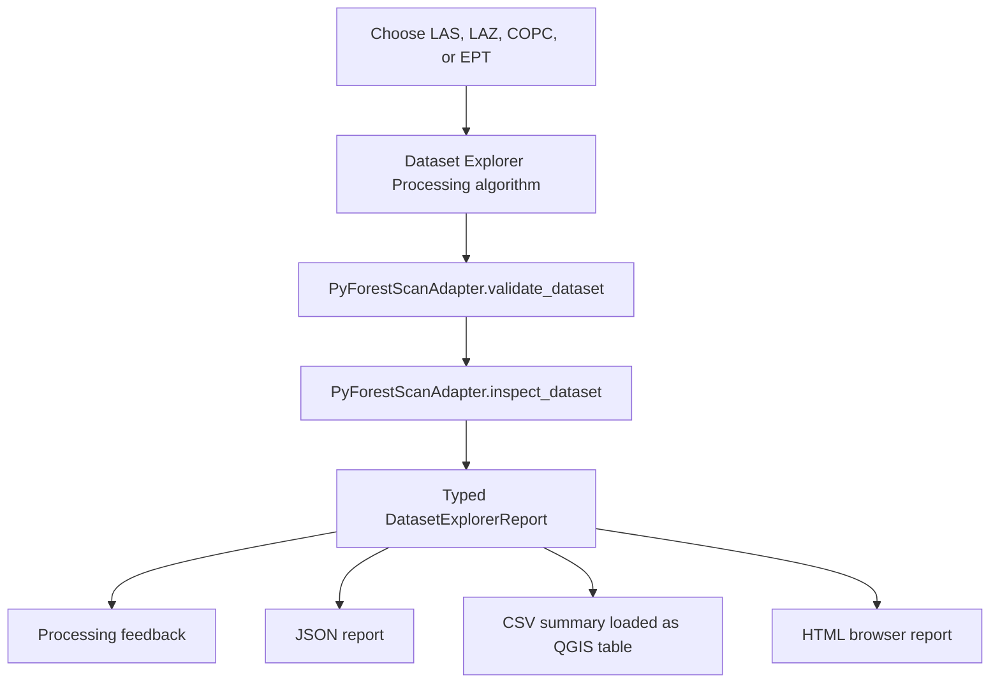
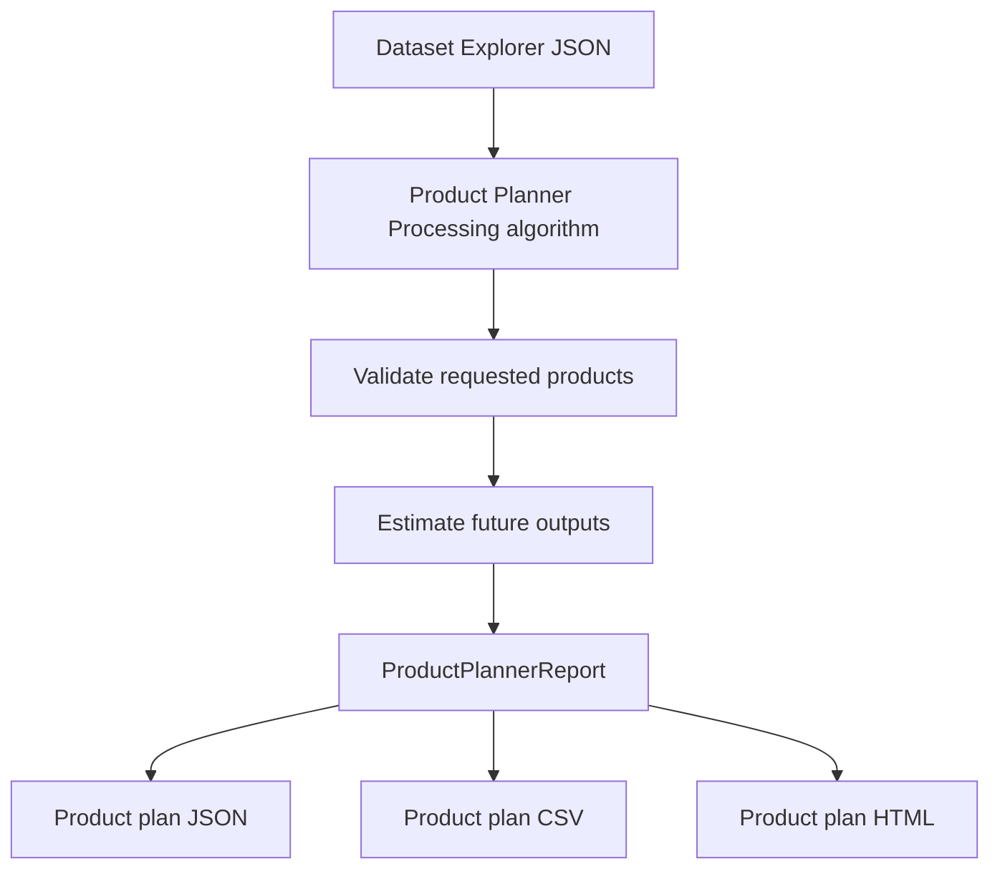
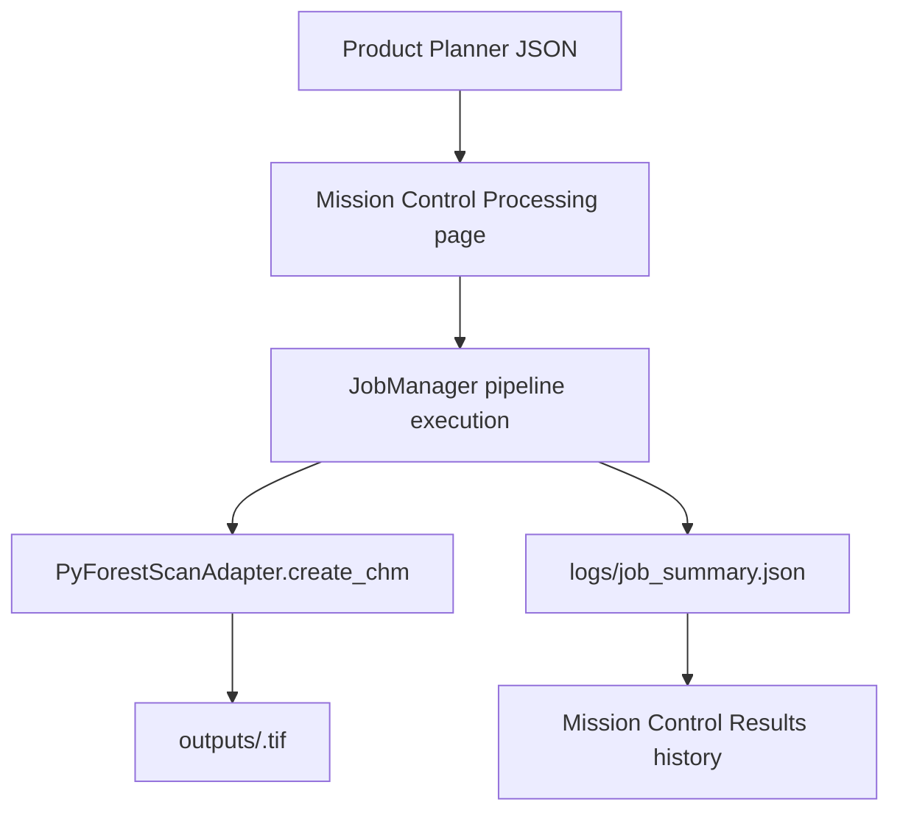

## Mission Control

Mission Control opens as a dockable QGIS panel and provides guided pages for the
current workflows:

- Home: versions, status, quick start, and recent activity.
- Environment: refresh dependency checks.
- Dataset: select a lidar dataset and output folder, then inspect the dataset.
- Planning: build a product plan from the active Dataset Explorer result.
- Processing: run a CHM job from the active Product Planner result.
- Results: open friendly Dataset Report, Product Plan, Job Summary, Output Folder,
  and Products links.
- Settings: choose a default output folder for Mission Control runs.

Mission Control creates a timestamped run folder and manages internal JSON/CSV
files automatically. Processing Toolbox algorithms remain available for advanced
users who want explicit file paths.

# User Guide


## Mission Control Run Folders

Mission Control hides internal JSON handoff files during the normal workflow.
Choose a lidar dataset and output folder on the Dataset page; the plugin creates
a run folder like this:

```text
<chosen_output_folder>/pyforestscan_runs/<YYYYMMDD_HHMMSS_datasetstem>/
```

Inside that folder, Mission Control stores reports, tables, logs, temporary
files, and an `outputs/` folder for CHM and future products. If a run with the
same timestamp and dataset stem already exists, Mission Control adds a numeric
suffix to avoid overwriting it. The Results page
shows friendly links for Dataset Report, Product Plan, Job Summary, Output
Folder, and Products. Advanced details still expose JSON and CSV paths for
troubleshooting and reproducibility.

This guide describes current user-facing PyForestScan QGIS workflows: Dataset
Explorer, Product Planner, Mission Control run folders, and CHM-only processing.

## Dataset Explorer

Dataset Explorer is an inspection and planning workflow. It validates a lidar
dataset, inspects metadata and point structure through the adapter layer, and
writes reports that explain which future PyForestScan products appear feasible.

It does not generate CHM, PAI, PAD, FHD, canopy cover, rumple, rasters, vectors,
or PyForestScan scientific products.

### Supported Inputs

- LAS: `.las`
- LAZ: `.laz`
- COPC: `.copc` and `.copc.laz`
- EPT: local `ept.json`

### Workflow



### Outputs

Dataset Explorer produces three files. The CSV and HTML paths are optional in the
Processing dialog; when left blank, they are generated automatically beside the
JSON report.

| Output | Description |
| --- | --- |
| JSON report | Structured machine-readable report containing dataset metadata, geometry, point statistics, warnings, product feasibility, and recommended actions. |
| CSV summary | Long-form table with `section`, `name`, `value`, `status`, and `message` columns. The plugin attempts to add this CSV to the active QGIS project as a table. |
| HTML report | Professional browser-readable report with dataset metadata, bounds, charts, warnings, supported products, and recommended next actions. |
| Processing feedback | In-dialog summary, warnings, and product feasibility messages. |

### Warnings

Dataset Explorer reports planning warnings for:

- Unknown CRS.
- Missing classification dimension or unavailable classification counts.
- Missing ground class 2.
- Missing vegetation classes 3, 4, or 5.
- Missing `HeightAboveGround` or `Z` dimensions.
- Missing RGB color.
- Missing GPS time.
- Missing intensity.
- Unsupported or unknown point format.
- Very low estimated point density.

### Product Feasibility

Supported products are reported as planning statuses, not generated outputs:

- `Available`: the inspected dataset already exposes enough evidence for a
  future product workflow.
- `Warning`: the product appears feasible, but required preparation or metadata
  review is needed.
- `Unavailable`: required information is missing from the inspected dataset.

Phase 5 reports feasibility for:

- Canopy Height Model (CHM)
- Plant Area Index (PAI)
- Plant Area Density (PAD)
- Foliage Height Diversity (FHD)
- Canopy Cover
- Rumple Index

### Screenshot Placeholders

Screenshots will be captured during QGIS release testing and stored under
`docs/images/`. Planned screenshots:

- Dataset Explorer in the QGIS Processing Toolbox.
- Dataset Explorer parameter dialog.
- Processing feedback report.
- CSV summary loaded as a QGIS table.
- HTML report opened in a browser.

## Product Planner

Product Planner is a planning workflow that reads a Dataset Explorer JSON report
and helps users decide which products should be generated in a future processing
phase. It validates selected products against Dataset Explorer feasibility
results, estimates planned output names, records grid and height-bin settings,
and writes JSON, CSV, and HTML plan reports.

It does not run PyForestScan calculations and does not create rasters.

### Inputs

- Dataset Explorer JSON report.
- Desired products: CHM, PAI, PAD, FHD, Canopy Cover, and Rumple.
- Output folder for the plan and future products.
- Grid resolution.
- CHM interpolation method.
- CHM valid-region interpolation toggle.
- CHM clean-edges toggle.
- CHM output filename.
- Optional height bin size.
- Optional plan title and notes.

### Workflow



### Outputs

Product Planner writes these files inside the selected output folder:

| Output | Description |
| --- | --- |
| `product_plan.json` | Structured plan with requested products, readiness status, warnings, estimates, planned output paths, and `processing_executed: false`. |
| `product_plan.csv` | Long-form table for review, audit, and future automation. |
| `product_plan.html` | Browser-readable planning report with requested products, warnings, estimated outputs, and next actions. |

### Product Statuses

- `Ready`: Dataset Explorer marked the product available.
- `Needs review`: Dataset Explorer marked the product as feasible with warnings.
- `Blocked`: Dataset Explorer marked the product unavailable or did not report it.

## CHM Job Execution

The Mission Control Processing page starts a CHM job from the active Product
Planner report. Users do not need to browse for `product_plan.json`; Mission
Control uses the current run folder automatically. The job validates the plan,
runs the CHM pipeline through the adapter, writes the selected CHM GeoTIFF in
`outputs/`, and writes `logs/job_summary.json`.

Only CHM is implemented. PAI, PAD, FHD, canopy cover, and rumple remain future
products and do not create rasters.

### Workflow



### Steps

1. Open Mission Control.
2. Go to Processing.
3. Confirm the current product plan is shown.
4. Select Start CHM Job.
5. Open Results to review the job history and friendly result links.

### CHM Parameters

- Grid resolution must be greater than zero.
- Interpolation can be `linear`, `nearest`, or `cubic`.
- Valid-region interpolation and clean-edges options are passed to
  `pyforestscan.calculate_chm`.
- Output filename must be a simple `.tif` or `.tiff` name.

### CHM QA

After a successful run, confirm the CHM opens in QGIS, the CRS and extent align
with the source dataset, values look reasonable, and edge artifacts are
acceptable for the selected interpolation options.

A successful CHM summary includes `processing_executed: true`,
`scientific_outputs_created: true`, selected CHM `parameters`, and a
`chm_geotiff` result path. Failed jobs still write `logs/job_summary.json` with
a clear error message.
