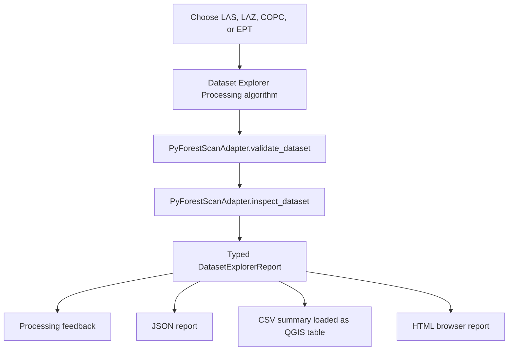

# User Guide

This guide describes current user-facing PyForestScan QGIS workflows. Phase 5
implements the first complete workflow: Dataset Explorer.

## Dataset Explorer

Dataset Explorer is an inspection and planning workflow. It validates a lidar
dataset, inspects metadata and point structure through the adapter layer, and
writes reports that explain which future PyForestScan products appear feasible.

It does not generate CHM, PAI, PAD, FHD, canopy cover, rumple, rasters, vectors,
or PyForestScan scientific products.

### Supported Inputs

- LAS: `.las`
- LAZ: `.laz`
- COPC: `.copc` and `.copc.laz`
- EPT: local `ept.json`

### Workflow

### Outputs

Dataset Explorer produces three files. The CSV and HTML paths are optional in the
Processing dialog; when left blank, they are generated automatically beside the
JSON report.

| Output | Description |
| --- | --- |
| JSON report | Structured machine-readable report containing dataset metadata, geometry, point statistics, warnings, product feasibility, and recommended actions. |
| CSV summary | Long-form table with `section`, `name`, `value`, `status`, and `message` columns. The plugin attempts to add this CSV to the active QGIS project as a table. |
| HTML report | Professional browser-readable report with dataset metadata, bounds, charts, warnings, supported products, and recommended next actions. |
| Processing feedback | In-dialog summary, warnings, and product feasibility messages. |

### Warnings

Dataset Explorer reports planning warnings for:

- Unknown CRS.
- Missing classification dimension or unavailable classification counts.
- Missing ground class 2.
- Missing vegetation classes 3, 4, or 5.
- Missing `HeightAboveGround` or `Z` dimensions.
- Missing RGB color.
- Missing GPS time.
- Missing intensity.
- Unsupported or unknown point format.
- Very low estimated point density.

### Product Feasibility

Supported products are reported as planning statuses, not generated outputs:

- `Available`: the inspected dataset already exposes enough evidence for a
  future product workflow.
- `Warning`: the product appears feasible, but required preparation or metadata
  review is needed.
- `Unavailable`: required information is missing from the inspected dataset.

Phase 5 reports feasibility for:

- Canopy Height Model (CHM)
- Plant Area Index (PAI)
- Plant Area Density (PAD)
- Foliage Height Diversity (FHD)
- Canopy Cover
- Rumple Index

### Screenshot Placeholders

Screenshots will be captured during QGIS release testing and stored under
`docs/images/`. Planned screenshots:

- Dataset Explorer in the QGIS Processing Toolbox.
- Dataset Explorer parameter dialog.
- Processing feedback report.
- CSV summary loaded as a QGIS table.
- HTML report opened in a browser.
