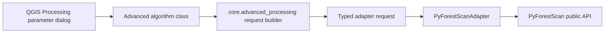

# PyForestScan Advanced Toolbox Map

The Advanced Toolbox is the expert surface for PyForestScan capabilities. Guided Mission Control remains simplified and unchanged.

## QGIS Toolbox Groups

| Group | Algorithms | Purpose |
| --- | --- | --- |
| `PyForestScan / Advanced / Input / I/O` | Generate Height Above Ground / Normalize Heights | Expert `read_lidar` HAG, DTM-backed HAG, bounds/thinning/crop/reproject, optional LAS/LAZ write. |
| `PyForestScan / Advanced / Preprocessing / Filters` | Advanced Point Cloud Preprocess / Filters | Public PyForestScan filters plus `write_las`: outlier cleaning, full SMRF ground classification, ground filtering, PointSourceId filtering, HAG, HAG range, Poisson, voxel downsample. |
| `PyForestScan / Advanced / Terrain` | Advanced DTM | Ground selection/classification and `generate_dtm`; DTM GeoTIFF with NoData. |
| `PyForestScan / Advanced / Metrics` | Advanced CHM, PAD, PAI, Canopy Cover, FHD, Rumple, Point Density, Voxel Statistic | Expert metric generation with product-specific PyForestScan parameters. |

## Adapter Path

Algorithm classes never import PyForestScan directly. They parse QGIS parameters, construct typed request objects, and call the adapter.

## Implemented Expert Tools

| Tool | Primary PyForestScan functions | Outputs |
| --- | --- | --- |
| Advanced CHM | `read_lidar`, `calculate_chm`, `create_geotiff` | GeoTIFF |
| Advanced PAD | `read_lidar`, `assign_voxels`, `calculate_pad` | Multi-band GeoTIFF |
| Advanced PAI | `assign_voxels`, `calculate_pad`, `calculate_pai`, `create_geotiff` | GeoTIFF |
| Advanced Canopy Cover | `assign_voxels`, `calculate_pad`, `calculate_canopy_cover`, `create_geotiff` | GeoTIFF |
| Advanced FHD | `assign_voxels`, `calculate_fhd`, `create_geotiff` | GeoTIFF |
| Advanced Rumple | `calculate_chm`, `calculate_rumple` | CSV scalar summary |
| Advanced Point Density | `assign_voxels`, `calculate_point_density`, `create_geotiff` | GeoTIFF |
| Advanced Voxel Statistic | `calculate_voxel_stat`, `create_geotiff` | GeoTIFF |
| Advanced DTM | `classify_ground_points`, `filter_select_ground`, `generate_dtm`, `create_geotiff` | GeoTIFF |
| HAG / Normalize | `read_lidar`, `write_las` | Optional LAS/LAZ |
| Point Cloud Preprocess / Filters | `remove_outliers_and_clean`, `classify_ground_points`, `filter_ground`, `filter_select_ground`, `filter_pointsourceid`, `add_height_above_ground`, `filter_hag`, `downsample_poisson`, `downsample_voxel`, `write_las` | LAS/LAZ |

## Deferred Tool Families

| Proposed family | Status | Reason |
| --- | --- | --- |
| Large Data / Tiling: Process EPT With Tiles | Deferred | `process_with_tiles` owns tiling, progress, output naming, skip-existing behavior, and warnings. It needs a dedicated QGIS-safe wrapper before exposure. |
| Visualization / Exports: Plot 2D, Plot Metric, Plot PAD | Deferred / not applicable | QGIS-native map canvas, layer styling, raster histograms, layouts, and exported rasters are better primary UX than matplotlib plots. |
| Input / I/O standalone CRS and polygon utilities | Deferred | QGIS already has CRS and vector-layer providers; exposing these as isolated algorithms would add clutter without a complete workflow. |
| LAS in-memory tiling utility | Deferred | Memory-heavy workflow needs preflight, resumability, output summaries, and QA. |
