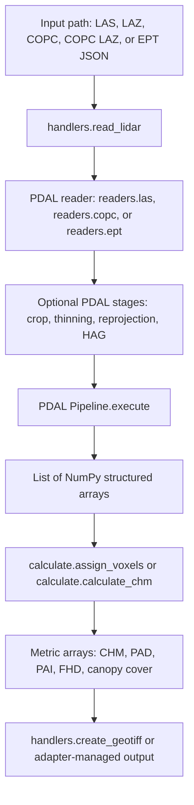
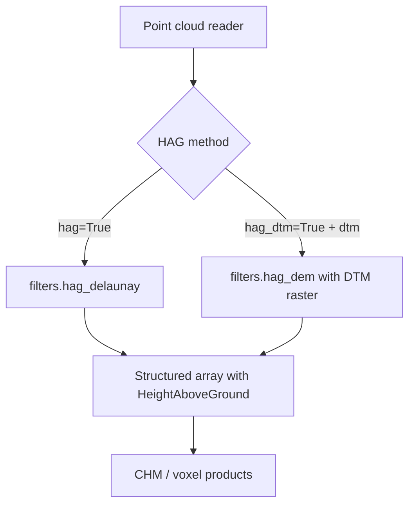
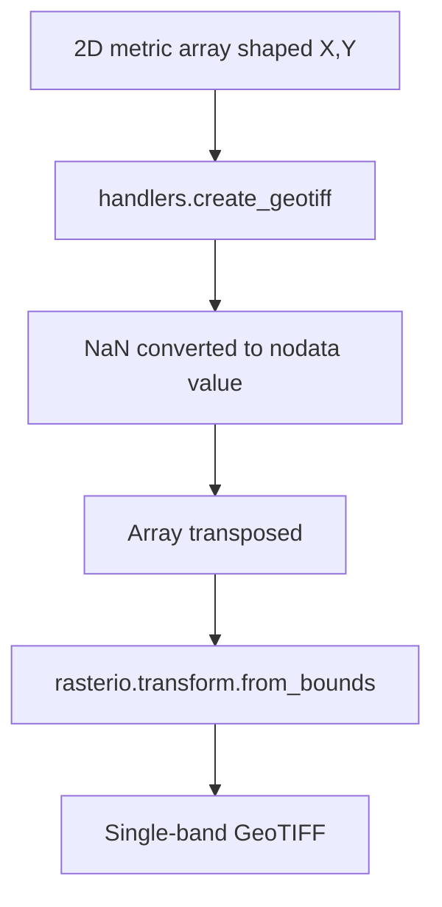
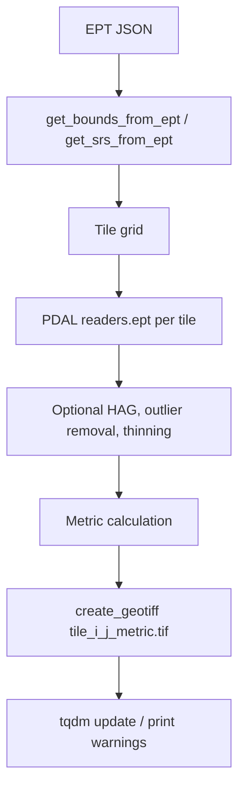

# PyForestScan Data Flow

PyForestScan `0.4.0` is function-oriented. It does not expose a project object.
The plugin must build a QGIS-side workflow around point-cloud reads, NumPy array
processing, and raster/vector outputs.

## Main Point Cloud Data Flow

## Reader Selection

`handlers.read_lidar(input_file, srs, ...)` selects readers from filename:

| Input | Reader | Notes |
| --- | --- | --- |
| `.las` | `readers.las` | Local file only. |
| `.laz` | `readers.las` | Local file only. |
| `.copc` | `readers.copc` | Local file only. |
| `.copc.laz` | `readers.copc` | Local file only. |
| `ept.json` | `readers.ept` | Local file or URL. Bounds are only attached for EPT. |

URL handling exists for the initial `input_file` existence check and EPT JSON
metadata helpers. LAS/LAZ/COPC URL behavior should not be assumed for QGIS until
explicitly tested.

## HAG Data Flow

Height above ground is not computed by NumPy code. It is created by PDAL stages:

`hag` and `hag_dtm` are mutually exclusive. `hag_dtm=True` requires a `.tif` DTM.

## Polygon Clipping

`read_lidar(..., crop_poly=True, poly=...)` accepts either:

- WKT beginning with `POLYGON` or `MULTIPOLYGON`.
- A vector file path readable by GeoPandas.

When a vector file contains a `MultiPolygon`, PyForestScan keeps only the first
polygon geometry. CRS is returned by `load_polygon_from_file`, but the current
`read_lidar` implementation does not validate vector CRS against the point cloud
CRS before applying the PDAL crop stage. The QGIS adapter should validate and, if
needed, transform polygons before passing WKT.

## Raster Output Flow

QGIS should own output paths and layer loading. PyForestScan's `create_geotiff`
can write rasters, but the adapter should wrap it to ensure metadata,
consistent nodata, style application, and error reporting.

## Tiled EPT Flow

`process.process_with_tiles` implements a high-level EPT-only tiling workflow:

This workflow is not yet a clean QGIS integration point because it writes many
files, owns progress with `tqdm`, and emits warnings via `print`.

## Progress and Logging

PyForestScan does not expose a logging interface. Observed behavior:

- Most calculation functions are silent and return arrays.
- Errors are raised as Python exceptions.
- `process_with_tiles` uses `tqdm` for progress and `print` for warnings.
- `tile_las_in_memory` prints tile creation messages.

The plugin adapter must translate progress to `QgsProcessingFeedback` and should
avoid direct use of PyForestScan functions that print or own progress.
