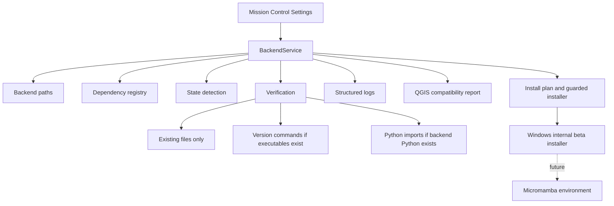

# PyForestScan Backend Manager Architecture

The PyForestScan Backend Manager (PBM) is the planned backend dependency management subsystem for PyForestScan QGIS. PBM keeps the plugin lightweight while preparing a user-local backend runtime for PyForestScan, PDAL, GDAL, rasterio, numpy, and future scientific modules.

Phase 22A provided architecture, typed models, path resolution, dependency registry, verification, logs, service boundaries, and Settings UI status. Phase 22B added dry-run install planning, an environment specification, Micromamba bootstrap placeholders, and QGIS compatibility reporting. Phase 22C added controlled installer mechanics with staging and rollback. Phase 23C enables Windows internal beta backend installation after confirmation. PBM still must not alter QGIS Python, QGIS install folders, global environment variables, or claim scientific work uses the managed backend unless the workflow is explicitly routed through PBM.

## Goals

- Keep QGIS Python and the QGIS installation untouched.
- Avoid administrator privileges.
- Store backend files in a user-local application directory.
- Make dependency management registry-driven rather than hardcoded around one tool.
- Prepare future guided installation without changing current processing behavior.

## Backend Locations

| Platform | Backend root |
| --- | --- |
| Windows | `%LOCALAPPDATA%/PyForestScan/backend/` |
| Linux | `~/.local/share/PyForestScan/backend/` |
| macOS | `~/Library/Application Support/PyForestScan/backend/` |

## Architecture

## Service Boundaries

- `pyforestscan_qgis/core/backend/` is plain Python and QGIS-free.
- Mission Control may display backend status, compatibility status, verification details, and dry-run install plans.
- PBM must not install into QGIS Python.
- PBM must not modify QGIS install folders or system environment variables.
- Current product execution remains on the existing adapter/PyForestScan path until a later phase explicitly switches execution to the managed backend.

## Core Package

- `paths.py`: cross-platform backend path contract.
- `models.py`: typed status, config, registry, dependency, verification, operation, and log records.
- `registry.py`: initial required dependencies and optional future modules.
- `channels.py`: package channel policy for dry-run planning.
- `environment_spec.py`: registry-driven managed environment specification.
- `bootstrap.py`: Micromamba bootstrap artifact placeholders.
- `install_plan.py`: dry-run install, verification, rollback, and offline plan formatting.
- `state.py`: filesystem-only state detection.
- `config.py`: `backend.json` serialization helpers.
- `verification.py`: placeholder-safe checks and report formatting.
- `logging.py`: compact structured log helpers.
- `service.py`: BackendService facade used by UI and future orchestration.
- `exceptions.py`: plugin-owned backend exceptions.
