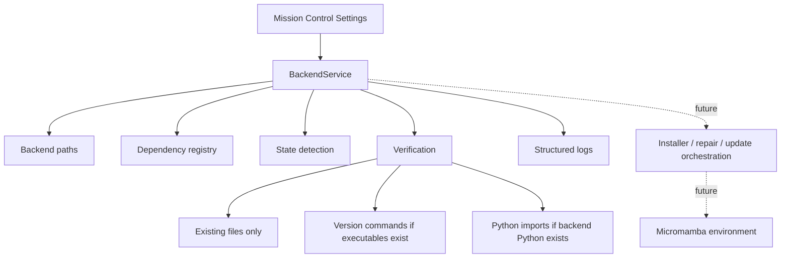

# PyForestScan Backend Manager Architecture

The PyForestScan Backend Manager (PBM) is the planned backend dependency management subsystem for PyForestScan QGIS. PBM keeps the plugin lightweight while preparing a user-local backend runtime for PyForestScan, PDAL, GDAL, rasterio, numpy, and future scientific modules.

Phase 22A provides architecture, typed models, path resolution, dependency registry, verification, logs, service boundaries, and Settings UI status. It does not download, install, repair, update, remove, or execute scientific work through the managed backend.

## Goals

- Keep QGIS Python and the QGIS installation untouched.
- Avoid administrator privileges.
- Store backend files in a user-local application directory.
- Make dependency management registry-driven rather than hardcoded around one tool.
- Prepare future guided installation without changing current processing behavior.

## Backend Locations

| Platform | Backend root |
| --- | --- |
| Windows | `%LOCALAPPDATA%/PyForestScan/backend/` |
| Linux | `~/.local/share/PyForestScan/backend/` |
| macOS | `~/Library/Application Support/PyForestScan/backend/` |

## Architecture

## Service Boundaries

- `pyforestscan_qgis/core/backend/` is plain Python and QGIS-free.
- Mission Control may display backend status and invoke safe service methods.
- PBM must not install into QGIS Python.
- PBM must not modify QGIS install folders or system environment variables.
- Current product execution remains on the existing adapter/PyForestScan path until a later phase explicitly switches execution to the managed backend.

## Core Package

- `paths.py`: cross-platform backend path contract.
- `models.py`: typed status, config, registry, dependency, verification, operation, and log records.
- `registry.py`: initial required dependencies and optional future modules.
- `state.py`: filesystem-only state detection.
- `config.py`: `backend.json` serialization helpers.
- `verification.py`: placeholder-safe checks and report formatting.
- `logging.py`: compact structured log helpers.
- `service.py`: BackendService facade used by UI and future orchestration.
- `exceptions.py`: plugin-owned backend exceptions.
