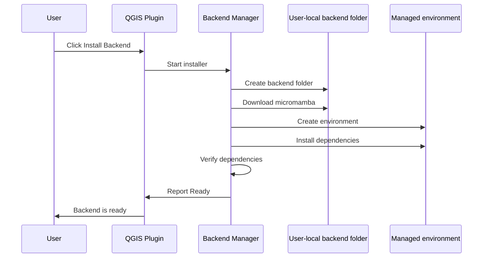

# PBM Installation Workflow

This page describes the target installation workflow. Phase 23C enables the controlled installer for Windows internal beta builds after explicit user confirmation; Linux/macOS remain planned until tested.

## Target User Workflow

## Phase 23C Behavior

- Detect planned backend paths.
- Detect whether `backend.json`, micromamba, backend environment, and backend Python exist.
- Run version commands only when executables already exist.
- Run Python import checks only when backend Python already exists.
- Return guarded-operation results for install and planned-operation results for repair, update, and remove.
- Preview the install plan without mutating files.
- Refuse real install actions unless the build/platform availability guard allows execution and the user confirms the install.
- On supported internal beta builds, use `downloads/`, `staging/`, `env/`, and `logs/` below the user-local backend root.
- Roll back staging files on failed download, checksum, extraction, environment creation, or verification.
- Report QGIS compatibility for current QGIS 3.x and defensive QGIS 4.x readiness.
- Show clear UI text that Windows internal beta installation is available after confirmation and untested platforms remain planned/experimental.

## Future Installer Requirements

- Download into a cache/downloads folder under the backend root.
- Verify downloaded artifacts before execution.
- Create the environment without administrator privileges.
- Never install packages into QGIS Python.
- Never modify the QGIS installation.
- Never modify user environment variables.
- Write compact logs for install, verify, update, and remove operations.
- Recover cleanly from partial installs and support repair.
