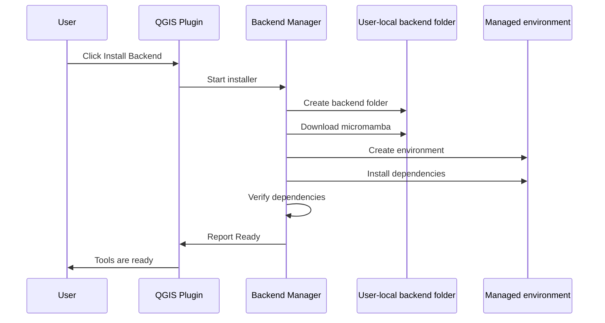

# PBM Installation Workflow

This page describes the target installation workflow. Phase 22A does not implement installation.

## Target User Workflow

## Phase 22A Behavior

- Detect planned backend paths.
- Detect whether `backend.json`, micromamba, backend environment, and backend Python exist.
- Run version commands only when executables already exist.
- Run Python import checks only when backend Python already exists.
- Return planned-operation results for install, repair, update, and remove.
- Show clear UI text that installation is planned, not active.

## Future Installer Requirements

- Download into a cache/downloads folder under the backend root.
- Verify downloaded artifacts before execution.
- Create the environment without administrator privileges.
- Never install packages into QGIS Python.
- Never modify the QGIS installation.
- Write compact logs for install, verify, update, and remove operations.
- Recover cleanly from partial installs and support repair.
