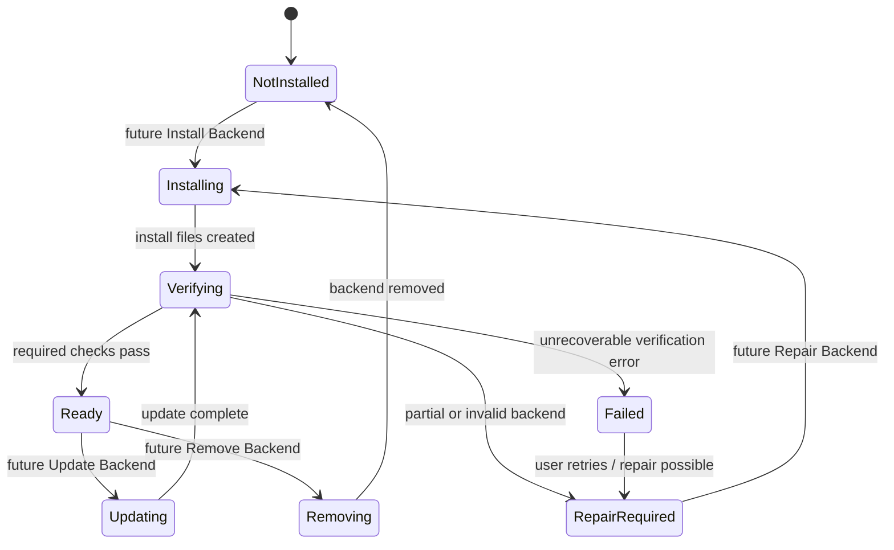

# PBM State Machine

PBM uses an explicit backend state machine so users and developers can understand what is safe to do next.

## States

| State | Meaning in Phase 22D |
| --- | --- |
| Not Installed | Backend root or required files are absent. This is expected before PBM installation exists. |
| Installing | Reserved for future installer orchestration. |
| Verifying | Reserved for active verification workflows. |
| Ready | Config reports ready and required backend files/dependencies verify. |
| Repair Required | Partial backend files, unreadable config, or missing required dependencies were detected. |
| Updating | Reserved for future update orchestration. |
| Removing | Reserved for future removal orchestration. |
| Failed | Reserved for failed backend operations. |

Phase 23C can report states, verify existing files, preview manifest-driven installation, report QGIS compatibility, plan repairs, write structured logs, and run guarded transactional installer mechanics for Windows internal beta builds after confirmation. Linux/macOS installer execution, repair execution beyond retry guidance, update, remove, and broad backend processing execution remain planned.
