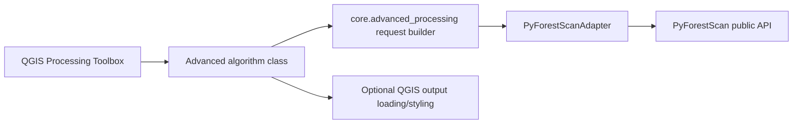

# Advanced Processing Toolbox

Phase 20A adds expert-oriented Processing Toolbox algorithms under `PyForestScan / Advanced`. Guided Mission Control remains the default workflow and is not cluttered with advanced controls.

## Architecture

Processing algorithm classes do not import PyForestScan. They parse QGIS parameters, build typed request objects, call the adapter, and optionally load/style outputs.

## Algorithms
## Phase 20B Coverage Additions

Phase 20B adds Advanced DTM and Advanced Point Cloud Preprocess / Filters, and expands HAG/Normalize with read-time bounds, thinning radius, and crop polygon options. The full coverage audit lives in `docs/api/PYFORESTSCAN_API_COVERAGE_MATRIX.md`.

### Advanced CHM

Parameters:

- Input LAS/LAZ/COPC/EPT
- Dataset CRS
- Output GeoTIFF
- X resolution
- Y resolution
- Interpolation: `none`, `nearest`, `linear`, `cubic`
- Interpolate valid region only
- Clean interpolation edges
- Add output to project

Adapter call: `create_chm(ChmRequest(...))`.

### Advanced PAD

Parameters:

- Input LAS/LAZ/COPC/EPT
- Dataset CRS
- Output multi-band GeoTIFF
- X resolution
- Y resolution
- Voxel height / height bin size
- Beer-Lambert constant
- Drop ground bin
- Add output to project

Adapter call: `create_pad(PadRequest(...))`. PAD is written as a multi-band GeoTIFF and uses the existing QGIS PAD RGB 5/3/2 styling when loaded.

### Advanced PAI

Parameters:

- Input LAS/LAZ/COPC/EPT
- Dataset CRS
- Output GeoTIFF
- X resolution
- Y resolution
- Voxel height
- Minimum height
- Optional maximum height
- Beer-Lambert constant for internal PAD
- Drop ground bin for internal PAD
- Add output to project

Adapter call: `create_pai(PaiRequest(...))`.

### Advanced Canopy Cover

Parameters:

- Input LAS/LAZ/COPC/EPT
- Dataset CRS
- Output GeoTIFF
- X resolution
- Y resolution
- Voxel height
- Minimum height / canopy threshold
- Optional maximum height
- Beer-Lambert constant for internal PAD
- Drop ground bin for internal PAD
- Extinction coefficient `k`
- Add output to project

Adapter call: `create_canopy_cover(CanopyCoverRequest(...))`.

### Advanced FHD

Parameters:

- Input LAS/LAZ/COPC/EPT
- Dataset CRS
- Output GeoTIFF
- X resolution
- Y resolution
- Voxel height
- Minimum height
- Optional maximum height
- Add output to project

Adapter call: `create_fhd(FhdRequest(...))`.

### Advanced Rumple

Parameters:

- Input LAS/LAZ/COPC/EPT
- Dataset CRS
- Output CSV
- CHM X resolution
- CHM Y resolution
- CHM interpolation
- Interpolate valid region only
- Clean interpolation edges
- Optional minimum height
- Add CSV to project as table

Adapter call: `create_rumple(RumpleRequest(...))`. Rumple is CSV because PyForestScan returns a scalar index.

### Advanced DTM

Parameters:

- Input LAS/LAZ/COPC/EPT
- Dataset CRS
- Output DTM GeoTIFF
- DTM resolution
- Optional ground classification before DTM
- NoData value
- Add output to project

Adapter call: `generate_dtm(DtmRequest(...))`. This workflow expects usable ground points. If the source is not already ground-classified, enable the classify-ground option and manually QA the result.

### Advanced Point Cloud Preprocess / Filters

Parameters:

- Input LAS/LAZ/COPC/EPT
- Dataset CRS
- Output LAS/LAZ
- Remove outliers and clean, with `mean_k` and multiplier
- Classify ground points
- Ground action: none, remove ground, select ground
- Add HeightAboveGround with Delaunay or DTM method
- Optional DTM GeoTIFF
- Filter by HAG range
- Optional Poisson thinning radius
- Optional voxel-grid downsampling cell and mode
- Output compression

Adapter call: `preprocess_point_cloud(PointCloudPreprocessRequest(...))`. This is the expert surface for PyForestScan filter wrappers and writes a real LAS/LAZ output via `write_las`.

### Generate Height Above Ground / Normalize Heights

Parameters:

- Input LAS/LAZ/COPC/EPT
- Dataset CRS
- Use DTM-backed HAG
- Optional DTM GeoTIFF
- Reproject to CRS while reading
- Optional normalized LAS/LAZ output
- Write compressed LAZ

Adapter call: `normalize_heights(HagNormalizationRequest(...))`. If an output path is supplied, the adapter calls `handlers.write_las`. If no output path is supplied, it reports HAG availability in memory and the limitation.

## Manual QGIS Test Checklist

1. Install the packaged plugin ZIP into QGIS.
2. Open Processing Toolbox and confirm a `PyForestScan / Advanced` group appears.
3. Run Advanced CHM on a small known dataset and confirm the GeoTIFF loads with grayscale styling.
4. Run Advanced PAD and confirm the output is a multi-band GeoTIFF loaded as PAD RGB 5/3/2 when enough bands exist.
5. Run Advanced PAI with a minimum height and optional maximum height; confirm a single-band GeoTIFF is written.
6. Run Advanced Canopy Cover with threshold and `k`; confirm values display as grayscale.
7. Run Advanced FHD and confirm output CRS/extent align with the input.
8. Run Advanced Rumple and confirm a CSV table is written and optionally loaded.
9. Run HAG/Normalize without output and confirm it reports the in-memory limitation.
10. Run HAG/Normalize with a LAS/LAZ output on a small dataset and confirm the output is written.
11. Reopen Mission Control and confirm guided single-file and batch workflows still work.

## Limitations

- Advanced algorithms are synchronous Processing algorithms. Very large datasets should still be tested carefully.
- No Mission Control controls were added for these expert options.
- HAG point-cloud rewriting depends on PyForestScan/PDAL preserving expected dimensions and metadata.
- Advanced algorithms do not provide tiling, multiprocessing, or external workers.
