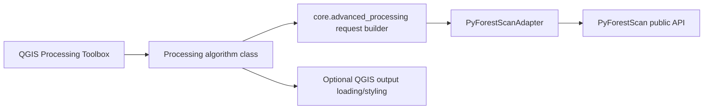

# Processing Toolbox Expert Tools

The Processing Toolbox exposes expert-oriented PyForestScan tools under workflow groups such as `PyForestScan / Diagnostics`, `PyForestScan / Input / I/O`, `PyForestScan / Preprocessing / Filters`, `PyForestScan / Terrain`, and `PyForestScan / Metrics`. Guided Mission Control remains the default workflow and is not cluttered with expert controls.

## Architecture

Processing algorithm classes do not import PyForestScan. They parse QGIS parameters, build typed request objects, call the adapter, and optionally load/style outputs.

## QGIS Processing Groups

Expert algorithms are grouped in QGIS as `Input / I/O`, `Preprocessing / Filters`, `Terrain`, and `Metrics` so expert users can follow the PyForestScan workflow order without cluttering Mission Control.

## Algorithms

### Extract EPT Subset

Group: `PyForestScan / Input / I/O`.

Parameters map directly to `pyforestscan.handlers.read_lidar(input_file, srs, bounds=None, thin_radius=None, hag=False, hag_dtm=False, dtm=None, crop_poly=False, poly=None, reproject=False)`, followed by `pyforestscan.handlers.write_las` to write `.las` or `.laz` output.

Parameters:

- `input_file` EPT `ept.json` source
- `srs` / CRS
- `bounds` as `xmin,xmax,ymin,ymax[,zmin,zmax]`
- `thin_radius`
- `hag` / `hag_dtm` with mutual exclusion
- `dtm` for DTM-backed HAG
- `crop_poly` and `poly` polygon WKT or polygon file
- `reproject`
- `output_las_laz`

Adapter call: `extract_lidar_subset(EptSubsetRequest(...))`. The PBM backend job type is `ept_subset_extract` when PBM is READY; QGIS Python remains the fallback only when PBM is unavailable and dependencies are present.

## Coverage Notes

Phase 20B added Generate DTM and Preprocess Point Cloud, and expanded HAG/Normalize with read-time bounds, thinning radius, and crop polygon options. Phase 20C added exact `calculate.py` parameter parity for Point Density and Voxel Statistic. Phase 20D added a full documentation/source inventory and closes safe filter-parameter gaps including full SMRF classification parameters, PointSourceId filtering, outlier `remove`, and HAG method `auto`. The full site inventory lives in `docs/api/PYFORESTSCAN_FULL_DOCS_INVENTORY.md`; the detailed parity matrix lives in `docs/api/PYFORESTSCAN_FUNCTION_PARAMETER_PARITY.md`.

### CHM

Parameters:

- Input LAS/LAZ/COPC/EPT
- Dataset CRS
- Output GeoTIFF
- X resolution
- Y resolution
- Interpolation: `none`, `nearest`, `linear`, `cubic`
- Interpolate valid region only
- Clean interpolation edges
- Add output to project

Adapter call: `create_chm(ChmRequest(...))`.

### PAD

Parameters:

- Input LAS/LAZ/COPC/EPT
- Dataset CRS
- Output multi-band GeoTIFF
- X resolution
- Y resolution
- Voxel height / height bin size
- Beer-Lambert constant
- Drop ground bin
- Add output to project

Adapter call: `create_pad(PadRequest(...))`. PAD is written as a multi-band GeoTIFF and uses the existing QGIS PAD RGB 5/3/2 styling when loaded.

### PAI

Parameters:

- Input LAS/LAZ/COPC/EPT
- Dataset CRS
- Output GeoTIFF
- X resolution
- Y resolution
- Voxel height
- Minimum height
- Optional maximum height
- Beer-Lambert constant for internal PAD
- Drop ground bin for internal PAD
- Add output to project

Adapter call: `create_pai(PaiRequest(...))`.

### Canopy Cover

Parameters:

- Input LAS/LAZ/COPC/EPT
- Dataset CRS
- Output GeoTIFF
- X resolution
- Y resolution
- Voxel height
- Minimum height / canopy threshold
- Optional maximum height
- Beer-Lambert constant for internal PAD
- Drop ground bin for internal PAD
- Extinction coefficient `k`
- Add output to project

Adapter call: `create_canopy_cover(CanopyCoverRequest(...))`.

### FHD

Parameters:

- Input LAS/LAZ/COPC/EPT
- Dataset CRS
- Output GeoTIFF
- X resolution
- Y resolution
- Voxel height
- Minimum height
- Optional maximum height
- Add output to project

Adapter call: `create_fhd(FhdRequest(...))`.

### Rumple

Parameters:

- Input LAS/LAZ/COPC/EPT
- Dataset CRS
- Output CSV
- CHM X resolution
- CHM Y resolution
- CHM interpolation
- Interpolate valid region only
- Clean interpolation edges
- Optional minimum height
- Add CSV to project as table

Adapter call: `create_rumple(RumpleRequest(...))`. Rumple is CSV because PyForestScan returns a scalar index.

### Generate DTM

Parameters:

- Input LAS/LAZ/COPC/EPT
- Dataset CRS
- Output DTM GeoTIFF
- DTM resolution
- Optional ground classification before DTM
- NoData value
- Add output to project

Adapter call: `generate_dtm(DtmRequest(...))`. This workflow expects usable ground points. If the source is not already ground-classified, enable the classify-ground option and manually QA the result.

### Point Density

Parameters:

- Input LAS/LAZ/COPC/EPT
- Dataset CRS
- Output Point Density GeoTIFF
- X resolution
- Y resolution
- `voxel_resolution Z / voxel height`
- `per_area`
- Optional `cell_area`
- Add output to project

Adapter call: `create_point_density(PointDensityRequest(...))`. The adapter reads HAG-enabled points, assigns voxels, calls `calculate_point_density`, and writes the returned 2D array as a GeoTIFF. If `cell_area` is omitted, the adapter uses X resolution multiplied by Y resolution when area-normalizing.

### Voxel Statistic

Parameters:

- Input LAS/LAZ/COPC/EPT
- Dataset CRS
- Output Voxel Statistic GeoTIFF
- X resolution
- Y resolution
- `voxel_resolution Z / voxel height`
- `dimension`
- `stat`: `mean`, `sum`, `count`, `min`, `max`, `median`, `std`
- Optional `z_index_range` minimum and maximum indexes
- Add output to project

Adapter call: `create_voxel_stat(VoxelStatRequest(...))`. The adapter validates that the requested dimension exists in the loaded point array and maps the optional index controls to PyForestScan's `z_index_range` tuple.

### Preprocess Point Cloud

Parameters:

- Input LAS/LAZ/COPC/EPT
- Dataset CRS
- Output LAS/LAZ
- Remove outliers and clean, with `mean_k` and multiplier
- Classify ground points
- Ground action: none, remove ground, select ground
- Add HeightAboveGround with Delaunay or DTM method
- Optional DTM GeoTIFF
- Filter by HAG range
- Optional Poisson thinning radius
- Optional voxel-grid downsampling cell and mode
- Output compression

Adapter call: `preprocess_point_cloud(PointCloudPreprocessRequest(...))`. This is the expert surface for PyForestScan filter wrappers and writes a real LAS/LAZ output via `write_las`.

### Normalize Heights

Parameters:

- Input LAS/LAZ/COPC/EPT
- Dataset CRS
- Use DTM-backed HAG
- Optional DTM GeoTIFF
- Reproject to CRS while reading
- Optional normalized LAS/LAZ output
- Write compressed LAZ

Adapter call: `normalize_heights(HagNormalizationRequest(...))`. If an output path is supplied, the adapter calls `handlers.write_las`. If no output path is supplied, it reports HAG availability in memory and the limitation.

## Manual QGIS Test Checklist

1. Install the packaged plugin ZIP into QGIS.
2. Open Processing Toolbox and confirm `PyForestScan / Diagnostics`, `PyForestScan / Input / I/O`, `PyForestScan / Preprocessing / Filters`, `PyForestScan / Terrain`, and `PyForestScan / Metrics` groups appear.
3. Run CHM on a small known dataset and confirm the GeoTIFF loads with grayscale styling.
4. Run PAD and confirm the output is a multi-band GeoTIFF loaded as PAD RGB 5/3/2 when enough bands exist.
5. Run PAI with a minimum height and optional maximum height; confirm a single-band GeoTIFF is written.
6. Run Canopy Cover with threshold and `k`; confirm values display as grayscale.
7. Run FHD and confirm output CRS/extent align with the input.
8. Run Rumple and confirm a CSV table is written and optionally loaded.
9. Run HAG/Normalize without output and confirm it reports the in-memory limitation.
10. Run HAG/Normalize with a LAS/LAZ output on a small dataset and confirm the output is written.
11. Run Point Density with `per_area` off and on; confirm a single-band GeoTIFF is written.
12. Run Voxel Statistic for a known dimension such as `Intensity` or `HeightAboveGround`; confirm invalid dimensions fail clearly.
13. Reopen Mission Control and confirm guided single-file and batch workflows still work.

## Limitations

- Advanced algorithms are synchronous Processing algorithms. Very large datasets should still be tested carefully.
- No Mission Control controls were added for these expert options.
- HAG point-cloud rewriting depends on PyForestScan/PDAL preserving expected dimensions and metadata.
- Full SMRF and filter parameters are exposed for experts; users should document scientific rationale for non-default settings in project notes or reports.
- Advanced algorithms do not provide tiling, multiprocessing, or external workers.
