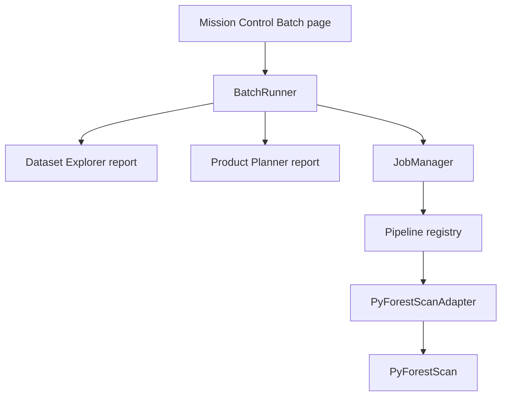

# Batch Processing v2

Batch Processing adds a folder-to-products workflow for users who need to run the same product plan across multiple lidar datasets without repeating the single-file Mission Control workflow by hand.

## Scope

Implemented:

- Discover LAS, LAZ, COPC, COPC LAZ, and local EPT `ept.json` files from an input folder.
- Optional recursive discovery.
- User selection of discovered files.
- One shared output root.
- One shared product/settings selection.
- Sequential processing only.
- One run folder per dataset.
- Batch JSON, CSV, and HTML summaries.
- Continue-on-error by default, with optional stop-on-error.
- Pause after the current file, cancel remaining files, and retry failed files from the UI.
- Optional output loading into QGIS, disabled by default for batch safety.
- Result filtering for all, completed, failed, and skipped files.
- Summary counts for total files, completed, failed, skipped, output count, and observed output storage.

Not implemented yet:

- Parallel workers.
- Folder monitoring.
- Batch project files.
- Per-file parameter overrides.
- Cross-file mosaicking or catalog products.

## Architecture

Batch workflows reuse the existing single-file stack instead of duplicating scientific processing logic.



Core modules:

- `pyforestscan_qgis/core/batch.py`: request models, discovered dataset records, batch folder creation, and per-dataset `RunContext` creation.
- `pyforestscan_qgis/core/batch_runner.py`: sequential orchestration over selected datasets.
- `pyforestscan_qgis/core/batch_results.py`: batch summary JSON, CSV, and HTML writers.

The batch runner does not call PyForestScan directly. It creates normal per-dataset run contexts, writes Dataset Explorer and Product Planner reports, then calls `JobManager.run_pipeline()` for each dataset.

## Output Layout

Batch outputs are written under the user-selected output root:

```text
<output_folder>/pyforestscan_batch_<YYYYMMDD_HHMMSS>/
  batch_summary.json
  batch_summary.csv
  batch_summary.html
  <dataset1>/
    reports/
    tables/
    outputs/
    logs/
    temp/
  <dataset2>/
    reports/
    tables/
    outputs/
    logs/
    temp/
```

If a batch folder or dataset run folder already exists, a numeric suffix is added rather than overwriting existing outputs.

## Failure Behavior

Each dataset is processed independently. A failed dataset records:

- dataset path
- run folder
- failed status
- error message
- any outputs produced before failure

By default the next selected dataset continues. If `stop_on_error` is enabled, the batch stops after the first failed dataset and writes the summary for datasets processed so far.

## Mission Control Behavior

The Batch page provides:

- input folder picker
- recursive discovery toggle
- selectable discovered file list
- shared output folder picker
- product selection
- shared grid/height-bin/canopy settings
- Processing Footprint summary text
- progress per file
- per-file status, products, progress, output folder, bounds, and messages
- result filtering
- pause after current file
- cancel remaining files
- retry failed files
- open batch output folder
- optional output loading into QGIS
- summary links on the Results page after completion

Raster products generated by batch jobs use the same QGIS result loading and styling path as single-file processing only when the user enables output loading. This is off by default to avoid overwhelming QGIS with many layers during large batches.

## Validation Notes

Batch v2 intentionally remains sequential and runs through the current QGIS UI process. Pause and cancel are checked between files, not in the middle of a PyForestScan product calculation. This keeps the implementation conservative while preserving clear records for completed, failed, and skipped files. Large batches may still make QGIS feel busy until a future asynchronous worker phase.
