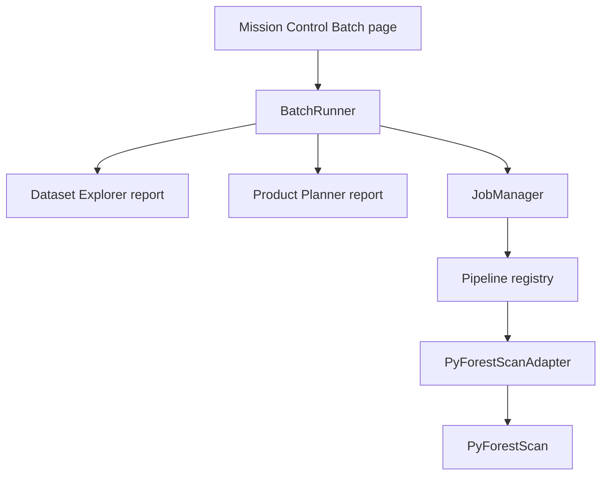

# Batch Processing v2

Batch Processing adds a folder-to-products workflow for users who need to run the same product plan across multiple lidar datasets without repeating the single-file Mission Control workflow by hand.

## Scope

Implemented:

- Discover LAS, LAZ, COPC, COPC LAZ, and local EPT `ept.json` files from an input folder.
- Optional recursive discovery.
- User selection of discovered files.
- One shared output root.
- One shared product/settings selection.
- Sequential processing by default, with explicit Parallel safe mode.
- One run folder per dataset.
- Batch JSON, CSV, and HTML summaries.
- Continue-on-error by default, with optional stop-on-error.
- Pause after the current file, cancel remaining files, and retry failed files from the UI.
- Max workers setting for Parallel safe mode, capped at 1-6 and defaulting to 2.
- Guardrails that block Parallel safe mode for larger workloads unless the user explicitly confirms.
- Optional output loading into QGIS, disabled by default for batch safety.
- Result filtering for all, completed, failed, and skipped files.
- Summary counts for total files, completed, failed, skipped, output count, and observed output storage.

Not implemented yet:

- Unbounded parallel workers.
- User-accessible process-based or external-subprocess workers. Phase 17F disables the experimental implementation until a true headless launcher is proven.
- Folder monitoring.
- Batch project files.
- Per-file parameter overrides.
- Cross-file mosaicking or catalog products.

## Architecture

Batch workflows reuse the existing single-file stack instead of duplicating scientific processing logic.



Core modules:

- `pyforestscan_qgis/core/batch.py`: request models, discovered dataset records, batch folder creation, and per-dataset `RunContext` creation.
- `pyforestscan_qgis/core/batch_runner.py`: sequential orchestration over selected datasets.
- `pyforestscan_qgis/core/batch_results.py`: batch summary JSON, CSV, and HTML writers.

The batch runner does not call PyForestScan directly. It creates normal per-dataset run contexts, writes Dataset Explorer and Product Planner reports, then calls `JobManager.run_pipeline()` for each dataset.

## Output Layout

Batch outputs are written under the user-selected output root:

```text
<output_folder>/pyforestscan_batch_<YYYYMMDD_HHMMSS>/
  batch_summary.json
  batch_summary.csv
  batch_summary.html
  <dataset1>/
    reports/
    tables/
    outputs/
    logs/
    temp/
  <dataset2>/
    reports/
    tables/
    outputs/
    logs/
    temp/
```

If a batch folder or dataset run folder already exists, a numeric suffix is added rather than overwriting existing outputs.

## Failure Behavior

Each dataset is processed independently. A failed dataset records:

- dataset path
- run folder
- failed status
- error message
- any outputs produced before failure

By default the next selected dataset continues. If `stop_on_error` is enabled, the batch stops after the first failed dataset and writes the summary for datasets processed so far.

## Mission Control Behavior

The Batch page provides:

- input folder picker
- recursive discovery toggle
- selectable discovered file list
- shared output folder picker
- product selection
- shared grid/height-bin/canopy settings
- Processing Footprint summary text
- progress per file
- per-file status, products, progress, output folder, bounds, and messages
- result filtering
- pause after current file
- cancel remaining files
- retry failed files
- open batch output folder
- optional output loading into QGIS
- summary links on the Results page after completion

Raster products generated by batch jobs use the same QGIS result loading and styling path as single-file processing only when the user enables output loading. This is off by default to avoid overwhelming QGIS with many layers during large batches.

## Validation Notes

Phase 17C keeps Sequential as the default and adds guarded Parallel safe mode. Mission Control starts the executor in a Qt worker thread so the main QGIS UI can keep repainting and accepting cancel/pause input. Parallel safe mode uses a bounded thread-pool executor with a fresh adapter per worker. This avoids running heavy work on the QGIS UI thread, but it deliberately avoids process-based workers until PyForestScan, PDAL, and QGIS environment behavior can be validated more deeply. Pause and cancel are checked between files, not in the middle of a PyForestScan product calculation. Summaries are still written for completed, failed, and skipped files.


## Parallel Safe Mode

Parallel safe mode is opt-in. The user must choose it explicitly and can set max workers from 1 to 6. The default is 2. Values above 2 show strong warnings because multiple PDAL/PyForestScan jobs can increase memory, CPU, and disk pressure. If the selected workload is large, the executor blocks Parallel safe mode until the user confirms that they have reviewed the warnings. Preflight recommends a conservative worker count based on file count and file/product workload.

The current implementation uses background Qt execution plus bounded Python worker threads rather than subprocesses. This is a conservative framework step: it protects the QGIS UI thread and provides a clear fallback to Sequential mode, while leaving process-based external workers for a future phase after platform-specific QGIS Python invocation is tested.


## Preflight And Resume

Phase 17D adds a required preflight step before execution. Preflight checks that selected input files exist, the output folder is writable, products are selected, worker limits are valid, the environment reports READY, disk free space is sufficient for a conservative storage estimate, and existing outputs will not be overwritten unexpectedly. Warnings are shown for large file counts, large product workloads, and Parallel safe mode resource risk.

Preflight creates or reuses a batch folder and points Mission Control to:

```text
<batch_folder>/batch_manifest.json
```

The manifest stores a stable batch id, per-file job ids, run folders, statuses, messages, and outputs. Batch summaries are rewritten after every completed, failed, skipped, or cancelled file:

```text
<batch_folder>/batch_summary.json
<batch_folder>/batch_summary.csv
<batch_folder>/batch_summary.html
```

If a manifest already exists, preflight treats the batch as resumable. Completed files are skipped by default, failed files can be retried, and successful outputs are not overwritten unless the user enables overwrite existing outputs. If all files are already complete, Run remains disabled and the user can review the existing results.

Disk-space estimates are conservative placeholders based on selected file count and products. They are intended as guardrails, not scientific output-size predictions, and should be calibrated with benchmark history in a future release.


## External Worker Mode

External worker mode is disabled in normal Mission Control use. Phase 17E proved the basic job-spec/result-file architecture, but manual validation showed that using QGIS GUI Python as the worker launcher can open multiple QGIS application windows instead of running headless jobs. That behavior is unsafe for users and can destabilize a desktop session.

The code is retained only as isolated developer research scaffolding. The executor and preflight layer block external mode unless the `PYFORESTSCAN_QGIS_ENABLE_EXTERNAL_WORKERS` developer flag is set. Do not set that flag for normal processing. QGIS GUI executables must never be used as worker Python. Future work must identify and validate a true headless Python launcher before external workers can return to the UI.
