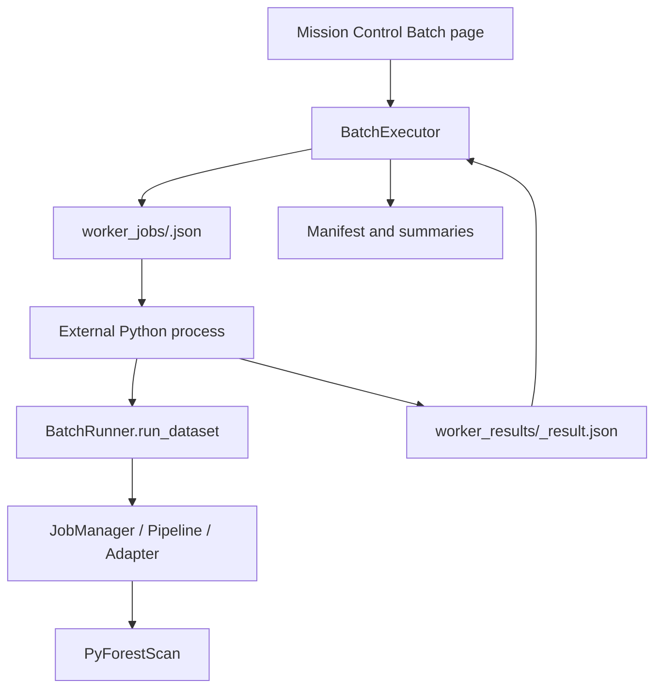

# External Worker Batch Execution

External worker mode is disabled as of Phase 17F. Phase 17E added a research implementation for batch subprocess workers, but manual validation showed that using QGIS GUI Python can launch full QGIS application windows instead of headless jobs. That is unsafe and must not be exposed to users.

## Current Status

External workers are not available from Mission Control and are blocked by core guardrails. The only way to reach the preserved code is an explicit developer research flag:

```text
PYFORESTSCAN_QGIS_ENABLE_EXTERNAL_WORKERS=1
```

Do not set this flag for production use or ordinary QGIS testing. It exists only so future maintainers can continue controlled launcher research. A valid future implementation must prove that the worker Python is truly headless and cannot open QGIS GUI windows.

QGIS GUI executables must never be used as worker Python.

## Research Execution Model



Mission Control remains the orchestrator. Each external process handles one dataset job, writes outputs into that dataset run folder, and serializes a worker result JSON. The QGIS process reads result JSON files and updates the manifest, summaries, and UI.

## Files

Worker specs are written to:

```text
<batch_folder>/worker_jobs/<job_id>.json
```

Worker results are written to:

```text
<batch_folder>/worker_results/<job_id>_result.json
```

The batch manifest and summaries remain authoritative:

```text
<batch_folder>/batch_manifest.json
<batch_folder>/batch_summary.json
<batch_folder>/batch_summary.csv
<batch_folder>/batch_summary.html
```

## Worker Entrypoint

The worker command is:

```bash
python -m pyforestscan_qgis.worker.run_job --spec <job_spec.json>
```

Readiness is checked with:

```bash
python -m pyforestscan_qgis.worker.run_job --check
```

Inside QGIS, this uses the Python executable available to the running process. On Windows/QGIS deployments this should be the same OSGeo4W/QGIS Python environment used by the plugin.

## Safety Defaults

- External worker mode is disabled in Mission Control.
- Core execution refuses external mode unless the developer flag is set.
- Preflight reports external mode as a blocker before running readiness commands.
- Sequential mode remains the safest default.
- Parallel Safe mode remains the supported faster local option.
- Generated output loading into QGIS remains off by default for batch processing.

## Limitations

The preserved external-worker code is local subprocess research only. It is not production functionality and does not implement network/distributed workers, cluster/HPC scheduling, or remote storage orchestration. Before external workers can be enabled again, the project needs a documented headless launcher, QGIS/OSGeo4W dependency validation, cancellation behavior validation, and manual testing that confirms no GUI windows are spawned.
