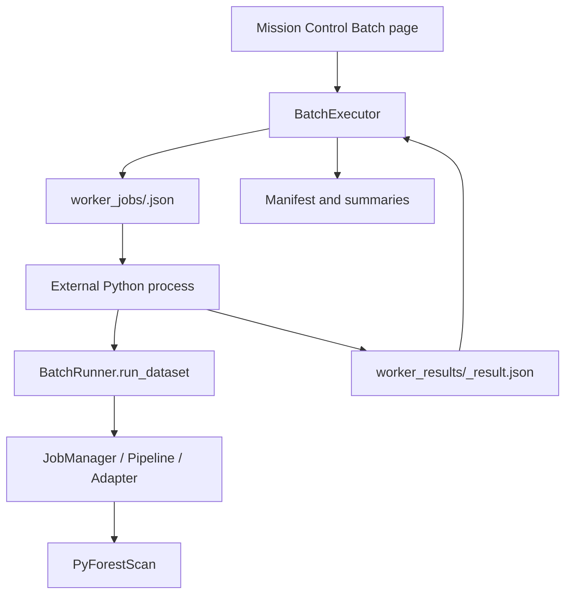

# External Worker Batch Execution

Phase 17E adds External worker mode for batch processing. The goal is to increase throughput without running heavy per-file PyForestScan work inside the QGIS UI process.

## Execution Model



Mission Control remains the orchestrator. Each external process handles one dataset job, writes outputs into that dataset run folder, and serializes a worker result JSON. The QGIS process reads result JSON files and updates the manifest, summaries, and UI.

## Files

Worker specs are written to:

```text
<batch_folder>/worker_jobs/<job_id>.json
```

Worker results are written to:

```text
<batch_folder>/worker_results/<job_id>_result.json
```

The batch manifest and summaries remain authoritative:

```text
<batch_folder>/batch_manifest.json
<batch_folder>/batch_summary.json
<batch_folder>/batch_summary.csv
<batch_folder>/batch_summary.html
```

## Worker Entrypoint

The worker command is:

```bash
python -m pyforestscan_qgis.worker.run_job --spec <job_spec.json>
```

Readiness is checked with:

```bash
python -m pyforestscan_qgis.worker.run_job --check
```

Inside QGIS, this uses the Python executable available to the running process. On Windows/QGIS deployments this should be the same OSGeo4W/QGIS Python environment used by the plugin.

## Safety Defaults

- External worker mode is not the default.
- Sequential mode remains the default.
- External worker max workers defaults to 2 through the shared Batch control.
- External mode allows up to 6 workers only with preflight and user confirmation.
- Generated output loading into QGIS remains off by default.
- Failed or crashed workers become failed file records and should not crash QGIS.
- Batch manifest and summaries are checkpointed after every worker result.

## Limitations

External workers are local subprocesses only. This phase does not implement network/distributed workers, cluster/HPC scheduling, or remote storage orchestration. Cancellation stops launching new jobs and asks active worker processes to terminate; it cannot guarantee immediate interruption inside a native PDAL/PyForestScan operation.
