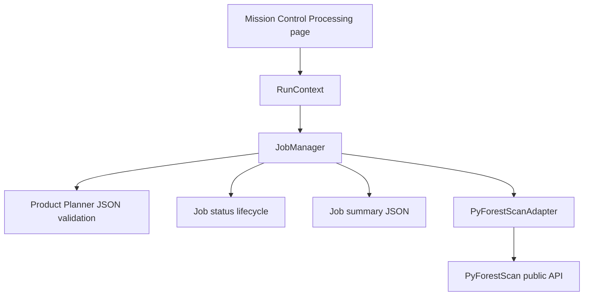

# Job Execution Framework

Phase 8A introduced the execution framework that scientific processing uses.
Phase 8C connected that framework to Mission Control run folders so users do not
manually manage Product Planner JSON files. Phase 10A added CHM processing, Phase 11A added Canopy Cover processing,
and Phase 13A added PAD and PAI processing. Dry-run validation remains available
for tests and advanced callers.

Processing mode calls PyForestScan only through the adapter boundary. CHM, Canopy Cover, PAD, and PAI can
create GeoTIFF outputs in `outputs/`; FHD, rumple, vectors, and point-cloud
outputs remain unimplemented.

## Architecture



The manager is plain Python and has no QGIS imports. Mission Control bridges its
job updates into Qt widgets through an event sink.

## Core Modules

- `pyforestscan_qgis/core/jobs.py`: immutable job records, status enum, progress,
  log, result, and request objects.
- `pyforestscan_qgis/core/job_manager.py`: job lifecycle, pipeline execution,
  cancellation request handling, result recording, and event emission.
- `pyforestscan_qgis/core/job_results.py`: JSON serialization and summary file
  writing.
- `pyforestscan_qgis/core/workspace.py`: Mission Control run-folder path model
  for reports, tables, outputs, logs, and temp files.

## Status Lifecycle

Supported statuses are:

- `pending`
- `validating`
- `running`
- `cancelling`
- `cancelled`
- `failed`
- `completed`

A normal dry-run moves through `pending`, `validating`, `running`, and
`completed`. Invalid plans move to `failed` and still write a summary JSON file.
Cancellation can be requested while a job is active; because Phase 8A dry-runs
are synchronous and intentionally fast, cancellation is best-effort but the core
manager already supports the status transition.

## Inputs

Execution accepts a Product Planner JSON report. The manager requires:

- A JSON object at the top level.
- `processing_executed` set to `false`.
- At least one requested product.
- Requested products must include a product identifier.
- Blocked products are rejected before execution simulation.

## Outputs

Dry-run execution writes only a job summary JSON. CHM processing writes both the
CHM GeoTIFF and the summary. Mission Control passes the active run context so
paths are written to:

- `outputs/<chm filename>.tif` for CHM jobs
- `outputs/<canopy cover filename>.tif` for Canopy Cover jobs
- `logs/job_summary.json` for all jobs

The summary includes job status, progress, logs, requested products, pipeline
results, result artifacts, and explicit flags. Successful product processing records
`processing_executed: true` and `scientific_outputs_created: true`.

## Error Handling

`JobExecutionError` is raised for invalid requests during explicit job creation.
During `run_dry_run` and `run_pipeline`, validation or processing failures are
captured into a failed `JobRecord` and written to a summary JSON file so users
have an auditable result.

## Future Extension

Future phases should add worker-based execution behind `JobManager` while
preserving the public job records and event sink. Scientific processing should
enter through the adapter boundary, not through Mission Control pages or QGIS
widgets directly.

## Mission Control Run Context

Mission Control stores all internal handoff files in a timestamped run folder:

```text
<chosen_output_folder>/pyforestscan_runs/<YYYYMMDD_HHMMSS_datasetstem>/
  reports/dataset_report.json
  reports/dataset_report.html
  tables/dataset_summary.csv
  reports/product_plan.json
  reports/product_plan.html
  tables/product_plan.csv
  logs/job_summary.json
  outputs/
  temp/
```

The Processing page uses `RunContext.product_plan_json` automatically. Users can
still inspect or override paths in Advanced details, but explicit JSON browsing
is no longer the primary workflow.

## Pipeline Execution

Phase 9A routes dry-run jobs through the processing pipeline framework. The job
manager loads one pipeline context per requested Product Planner item, executes
validation stages from the registered product pipeline, stores `PipelineResult`
objects on the job record, and writes them into `job_summary.json`.

Dry-run jobs still skip scientific and export stages. Processing jobs execute
only implemented stages. CHM, Canopy Cover, PAD, and PAI Generate Product and Export stages can produce GeoTIFFs in
`outputs/`; FHD and rumple remain skipped.
