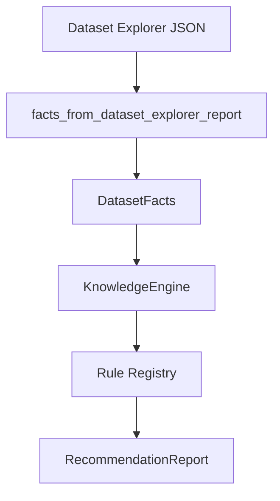

# Knowledge Engine Foundation

Phase 16A introduces a deterministic Knowledge Engine in
`pyforestscan_qgis/core/knowledge/`. It is not an AI system, does not call an
LLM, and does not run PyForestScan calculations. Its job is to turn Dataset
Explorer facts into transparent, structured recommendations.

## Architecture

The package is split by responsibility:

- `types.py`: immutable thresholds, facts, recommendations, parameters, and QGIS
  tool suggestions.
- `diagnostics.py`: normalization from Dataset Explorer JSON into `DatasetFacts`.
- `rules.py`: deterministic rule functions.
- `registry.py`: default rule registration order.
- `scoring.py`: transparent score and confidence helpers.
- `recommendation.py`: `RecommendationReport` and serialization.
- `engine.py`: public evaluation entry points.

## Scientific Transparency

The engine must not invent scientific truth. Every recommendation includes:

- severity
- category
- reason
- suggested action
- documentation link placeholder
- confidence
- calibration flag where relevant

Thresholds live in `KnowledgeConfig` as `KnowledgeThreshold` objects. Each
threshold records a value, unit, rationale, and whether calibration is required.
Defaults are seed planning values, not universal scientific rules.

## Default Thresholds

| Threshold | Default | Rationale | Calibration |
| --- | ---: | --- | --- |
| High density | 20 points per square map unit | Phase 16A seed example for considering finer CHM grids. | Required |
| Low density | 5 points per square map unit | Phase 16A seed example for avoiding overly fine rasterization. | Required |
| Fine CHM resolution | 0.5 map units | Candidate grid paired with high-density seed threshold. | Required |
| Conservative CHM resolution | 1.0 map units or larger | Candidate grid for lower-density datasets. | Required |
| Minimum rumple area | unset | No default area threshold is asserted. | Required before use |

The unset rumple area threshold is intentional. Rumple stability depends on
canopy structure, grid size, plot size, and study design. The engine records a
scientific note instead of silently warning from an invented number.

## Implemented Rule Families

- Product feasibility: converts Dataset Explorer `Available`, `Warning`, and
  `Unavailable` statuses into product recommendations.
- Density and CHM resolution: suggests a configurable starting grid resolution
  from density thresholds and explicitly marks calibration required.
- Height readiness: checks `HeightAboveGround` and `Z` dimensions.
- Classification: checks ground class 2 and vegetation classes 3, 4, and 5 when
  classification counts are available.
- CRS: warns for unknown CRS or likely geographic CRS because raster metrics
  normally need projected linear units.
- Rumple area: evaluates only when the user/project supplies a minimum area
  threshold.
- QGIS tools: suggests existing QGIS QA tools such as Layer Styling, Histogram,
  Processing Toolbox, Elevation Profile, 3D View, and Layout Manager.

## Report Output

`RecommendationReport` contains:

- `dataset_score`: 0 to 100, based only on deterministic warning/error severity.
- `confidence_stars`: 0 to 5, based on metadata completeness.
- `recommended_products`
- `recommended_parameters`
- `warnings`
- `suggested_next_actions`
- `scientific_notes`
- `qgis_tool_suggestions`
- `thresholds`

The score is an interface summary, not a scientific validation statistic. It is
intended to help users notice problems quickly, while the structured warnings and
notes remain the source of truth.

## Scope Boundary

Phase 16A does not change Product Planner, Mission Control, Processing
algorithms, PyForestScan adapter calculations, or output generation. Future
phases may surface the `RecommendationReport` in Mission Control after the user
experience is designed and manually validated.

## Future Calibration Work

Before recommendations are treated as production scientific defaults, the project
needs literature review or empirical calibration for at least:

- CHM resolution versus point density, canopy type, and acquisition design.
- PAD/PAI/FHD height-bin guidance.
- Canopy cover threshold interpretation by ecosystem.
- Rumple stability versus plot area, CHM resolution, and canopy roughness.
- Dataset size/runtime warning thresholds on supported QGIS platforms.
