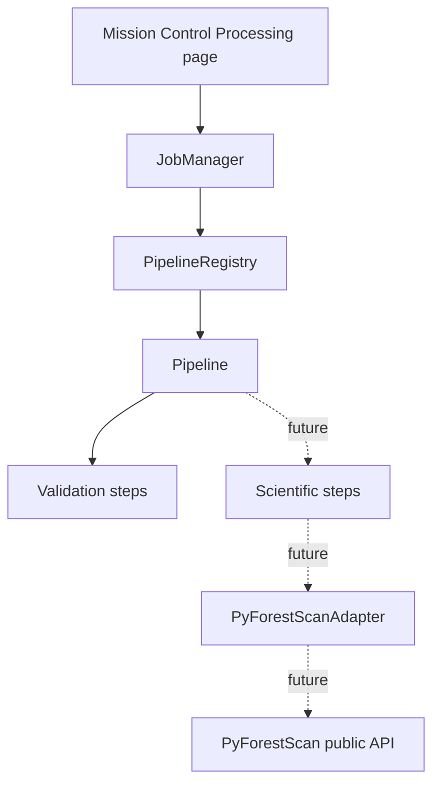

# Processing Pipeline Framework

Phase 9A introduced the processing pipeline framework. Phase 14A wires CHM,
Canopy Cover, PAD, PAI, FHD, and Rumple pipelines to the adapter for
single-dataset scientific outputs while keeping vector and point-cloud outputs
unimplemented.

## Purpose

The framework separates product orchestration from QGIS widgets, Processing
algorithm classes, and PyForestScan internals. Future product implementations
will plug scientific adapter calls into registered pipeline stages after those
workflows are designed and tested.

## Core Modules

- `pyforestscan_qgis/core/pipeline.py`: `Pipeline`, `PipelineRegistry`, default
  registry construction, and registered product identifiers.
- `pyforestscan_qgis/core/pipeline_steps.py`: `PipelineStep`, stage/kind enums,
  validation functions, and placeholder scientific/export steps.
- `pyforestscan_qgis/core/pipeline_context.py`: immutable context loaded from a
  Product Planner JSON report.
- `pyforestscan_qgis/core/pipeline_results.py`: pipeline and step result models
  plus JSON serialization helpers.
- `pyforestscan_qgis/core/pipeline_events.py`: structured event records emitted
  by pipeline steps.

## Stages

Registered product pipelines use this standard stage order:

1. Validate Dataset
2. Validate Environment
3. Validate CRS
4. Ground Check
5. Normalize Heights
6. Clip
7. Generate Product
8. Export

Dry-run jobs execute validation stages only. Processing jobs execute only stages
that have a product implementation. CHM can execute Generate Product through `PyForestScanAdapter.create_chm()`,
Canopy Cover through `PyForestScanAdapter.create_canopy_cover()`, PAD through
`PyForestScanAdapter.create_pad()`, PAI through
`PyForestScanAdapter.create_pai()`, FHD through `PyForestScanAdapter.create_fhd()`,
and Rumple through `PyForestScanAdapter.create_rumple()`. These products record export artifacts. Other
product scientific stages remain skipped, and direct calls to placeholder steps
still raise `NotImplementedError`.

## Job Manager Integration

Dry-run jobs now load pipeline contexts from the active Product Planner JSON and
execute registered validation pipelines for each requested product. Pipeline
results are stored on the `JobRecord` and serialized into `job_summary.json`.

A dry-run job still writes only the job summary. CHM, Canopy Cover, PAD, PAI, and FHD processing jobs write GeoTIFFs in
`outputs/`. Rumple writes a scalar CSV summary. All are recorded in the job
summary.

## Mission Control Integration

Mission Control Processing displays pipeline stages from the current job record.
Validation steps show pass, warning, or failure messages. Implemented scientific and export steps show pass/fail status. Unimplemented
future output families remain outside the registered major-product workflows.

## Scope Boundary

The pipeline framework is an orchestration contract. Product-specific science
must enter through the adapter boundary. QGIS UI pages and Processing algorithm
classes must not call PyForestScan functions directly.
