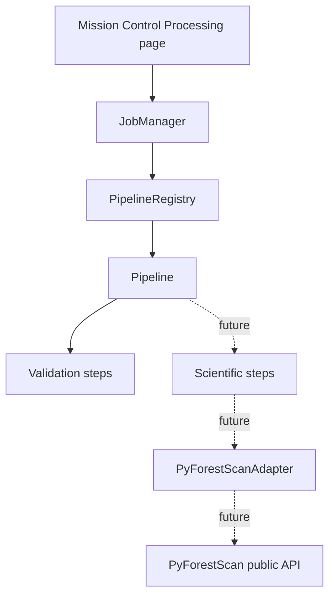

# Processing Pipeline Framework

Phase 9A introduces the processing pipeline framework that future scientific
product execution will use. It is orchestration only. It does not compute CHM,
PAI, PAD, FHD, canopy cover, rumple, rasters, vectors, or point-cloud outputs.

## Purpose

The framework separates product orchestration from QGIS widgets, Processing
algorithm classes, and PyForestScan internals. Future product implementations
will plug scientific adapter calls into registered pipeline stages after those
workflows are designed and tested.

## Core Modules

- `pyforestscan_qgis/core/pipeline.py`: `Pipeline`, `PipelineRegistry`, default
  registry construction, and registered product identifiers.
- `pyforestscan_qgis/core/pipeline_steps.py`: `PipelineStep`, stage/kind enums,
  validation functions, and placeholder scientific/export steps.
- `pyforestscan_qgis/core/pipeline_context.py`: immutable context loaded from a
  Product Planner JSON report.
- `pyforestscan_qgis/core/pipeline_results.py`: pipeline and step result models
  plus JSON serialization helpers.
- `pyforestscan_qgis/core/pipeline_events.py`: structured event records emitted
  by pipeline steps.

## Stages

Registered product pipelines use this standard stage order:

1. Validate Dataset
2. Validate Environment
3. Validate CRS
4. Ground Check
5. Normalize Heights
6. Clip
7. Generate Product
8. Export

Only validation stages execute in Phase 9A. Normalize Heights, Clip, Generate
Product, and Export are present as future stages. Calling those steps directly
raises `NotImplementedError`.

## Job Manager Integration

Dry-run jobs now load pipeline contexts from the active Product Planner JSON and
execute registered validation pipelines for each requested product. Pipeline
results are stored on the `JobRecord` and serialized into `job_summary.json`.

A dry-run job still writes only the job summary. It does not run PyForestScan
calculations and does not create scientific outputs.

## Mission Control Integration

Mission Control Processing displays pipeline stages from the current job record.
Validation steps show pass, warning, or failure messages. Future scientific and
export steps are shown as pending future work and are not executed.

## Scope Boundary

The pipeline framework is an orchestration contract. Product-specific science
must enter through the adapter boundary in later phases. QGIS UI pages and
Processing algorithm classes should not call PyForestScan functions directly.
