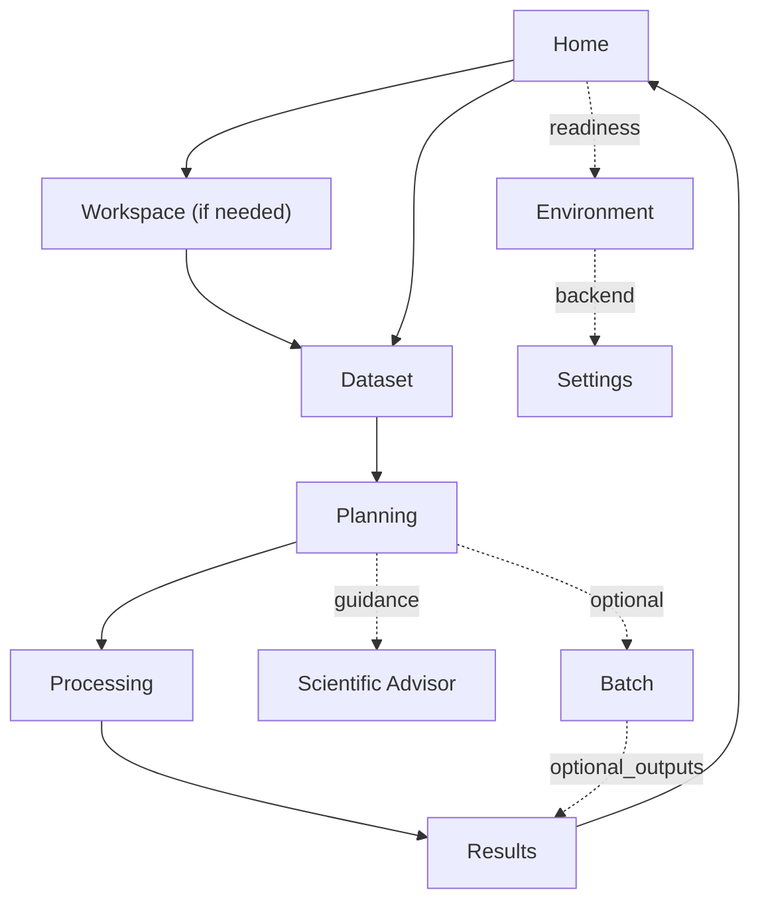

# PyForestScan Design System

Phase 29A establishes adaptive visibility as an implementation contract: empty collections collapse to one-line states, populated lists use bounded internal scrolling, form rows disappear when their controlling mode is inactive, and responsive status strips reduce detail before they wrap or clip.

The PyForestScan Design System is the permanent visual and interaction language for the QGIS plugin. It applies to Mission Control, PBM backend management, dialogs, notifications, Processing descriptions, release screenshots, and future modules.

This document is a design and information-architecture contract. It does not change algorithms, PyForestScan scientific behavior, PBM installation behavior, or the Advanced Processing Toolbox contract.

## Visual Philosophy

PyForestScan should feel modern, lightweight, scientific, professional, GIS-focused, and approachable. The interface should help a GIS user understand the next practical step without making them understand Python environments, internal JSON handoffs, or developer implementation detail.

Avoid developer utilities, dense forms in Guided Mode, wall-of-text interfaces, large empty panels, duplicate status blocks, and warnings that do not tell the user what to do next.

## Spacing System

Use a small, predictable spacing scale. Values are pixel intent for Qt layouts and documentation; implementation may map them to stylesheet variables or layout spacing constants.

| Token | Value | Use |
| --- | ---: | --- |
| Extra Small / `xs` | 4 | Tight icon/text gaps, compact status badges. |
| Small / `sm` | 8 | Related controls, table cell padding, button icon gaps. |
| Medium / `md` | 12 | Card internal padding, form row spacing. |
| Large / `lg` | 16 | Section spacing, major row groups, action rows. |
| Extra Large / `xl` | 24 | Page header separation and major workflow breaks. |

Cards should size to content. Do not reserve fixed vertical space for empty lists, placeholder panels, or technical logs.

## Typography Hierarchy

Do not redesign fonts. Use QGIS/Qt platform fonts and keep hierarchy consistent.

| Role | Intent |
| --- | --- |
| Page title | Names the current workflow step. Short, direct, one line when possible. |
| Section title | Groups one decision or one status area. |
| Card title | Labels a compact content unit. |
| Normal text | User-facing explanation or result summary. |
| Secondary text | Context, timestamps, paths only when useful. |
| Status text | Short state plus consequence, for example `PBM Backend: READY`. |
| Warning text | Actionable issue and next step. |
| Technical text | Hidden by default under Advanced, Technical Details, or Troubleshooting. |
| Code/log text | Monospace where available; never the primary UI. |

## Card System

Every card follows one structure:

1. Header.
2. Content.
3. Primary action, when the card owns an action.
4. Advanced, optional and collapsed by default.

Cards naturally resize. A card with no meaningful content should be hidden, not shown as an empty panel. Small text-only cards should use content-sized labels; reserve fixed-height text boxes and lists for genuinely scrollable content.

## Button Hierarchy

| Role | Examples | Use |
| --- | --- | --- |
| Primary | Continue, Continue to Planning, Continue to Processing, Run Processing, Run Batch, Install Backend | The one obvious next action. |
| Secondary | Open Batch, Open Output Folder, Load Outputs, Preview Install Plan | Useful follow-up or supportive action. |
| Neutral | Check Environment, Set Up Backend, Refresh Environment, Verify Backend, Browse | Safe utility action. |
| Danger | Delete Workspace, Clear Current Run, Cancel Remaining | Destructive or interrupting action. |

Order buttons as primary, secondary, neutral, then danger. Do not place danger actions next to the main path unless the user is already in a reset/cancel context.

## Status Badge System

Use these labels unless a domain-specific state is unavoidable.

| Label | Tone | Meaning |
| --- | --- | --- |
| READY | Success | The user can proceed. |
| RUNNING | Progress | Work is active. |
| WARNING | Warning | The user can proceed with care or should review. |
| FAILED | Danger | The current operation failed. |
| NOT CONFIGURED | Neutral | Setup is missing but no failure occurred. |
| DISABLED | Muted | Intentionally unavailable. |
| PLANNED | Planned | Future capability or dry-run-only behavior. |

Status text should state consequence: `READY - routed products can run through PBM` is better than `READY` alone.

## Icon Philosophy

Use icons to aid scanning, not as decoration.

| Area | Icon family intent |
| --- | --- |
| Processing | Run, progress, output, raster/table. |
| Workspace | Folder, history, note, resume. |
| Dataset | Point cloud, map extent, layer, footprint. |
| Backend | Package, shield, verification, repair. |
| Settings | Gear, folder, check. |
| Scientific | Leaf/canopy, chart, recommendation. |
| Batch | List, queue, preflight, checkpoint. |
| Results | Folder, layer load, report. |
| Diagnostics | Check, warning, log. |

Avoid icon overload. A toolbar or action row should not become a row of unexplained symbols. Phase 26A standardizes important Mission Control actions through QGIS theme icons first and Qt standard icons second; custom icons remain a last resort.

## Progress Indicators

Progress UI should show:

- Stage.
- Current task or package.
- Estimated progress where exact progress is unavailable.
- Elapsed time for long PBM or processing work.
- Latest concise message.
- Technical log behind Troubleshooting.

Use explicit wording such as `Step progress is estimated` when percentage is staged rather than measured.

Action buttons that start validation, dataset inspection, planning, processing, batch discovery/preflight, output loading, or backend verification should disable while the work is running and restore themselves after completion or failure. Primary UI should show the current stage or latest concise message; raw command output and detailed logs stay behind Advanced, Technical Details, or Troubleshooting.

## Empty States

Every empty page or section should have a short explanation and one primary action. Hide everything else.

Examples:

- Scientific Advisor: `Analyze a dataset to receive recommendations.`
- Results: `No outputs yet. Run processing to generate scientific products.`
- Workspace: `Open or create a workspace to begin.`
- Dataset: `No dataset selected. Select a LAS, LAZ, or COPC dataset to begin.`
- Planning: `Analyze a dataset before choosing products.`

## Expandable Sections

Technical information belongs under one of these collapsed labels:

- Advanced
- Technical Details
- Troubleshooting

Default state is collapsed. This includes Python paths, manifests, logs, environment variables, module registries, JSON paths, and debug output.

## Tables

Tables should use compact padding, clear headers, stable column order, selectable rows where an action depends on a row, and a concise empty state. Sorting is useful for batch files, results, diagnostics, and dependency lists; it should not obscure the primary action.

## Dialogs

Dialogs must have:

- Title.
- Purpose.
- Primary action.
- Cancel or Close.
- Optional Advanced section.

No dialog should present a wall of text. PBM install confirmation must plainly say that installation is user-local and does not modify QGIS Python, system Python, PATH, shell profiles, or QGIS folders.

## Notifications

Notifications are concise:

- Success: what completed and the next useful action.
- Warning: what needs review and whether the user can continue.
- Error: what failed and where to find repair/log details.
- Information: state change or completed background action.

Do not use notifications for generic advice that belongs in documentation. Avoid PASS/FAIL/WARN prefixes in user-facing UI; use the approved product wording behind the standard badge labels instead.

## Workflow Continuity

The expected guided flow is:

Primary single-dataset workflow pages use subtle completed/current/upcoming orientation and one concise Next Step card. Batch is optional and Scientific Advisor is support guidance, so neither is forced by default Continue routing. Readiness markers are small, professional markers beside existing status words. Every future module must either fit this path or be clearly placed in the Expert Processing Toolbox.

## Mission Control Principles

- Keep one obvious action.
- Show one next step on primary workflow pages.
- Keep Batch and Scientific Advisor outside the default Continue path. Batch may expose Standard File Batch and Polygon Area Processing modes when the user explicitly opens Batch.
- Use readiness markers only beside important readiness text.
- Hide technical details.
- Avoid duplicate status.
- Reduce scrolling.
- Keep users moving forward.
- Keep warnings actionable.
- Keep empty sections hidden.

## Processing Toolbox Philosophy

Mission Control is the guided workflow. The Processing Toolbox is the expert workflow.

Do not blur them. Mission Control should provide recommended defaults, sequencing, and user-friendly summaries. The Processing Toolbox should preserve parameter-rich controls, explicit inputs/outputs, and automation-friendly Processing behavior.

## PBM Philosophy

Backend management should remain mostly invisible. Users should not need to understand Python environments, Micromamba, package channels, or DLL paths. PBM should quietly make processing work, show progress while it runs, and expose technical logs only when troubleshooting.

## Future Module Guidance

Future integrations such as WhiteboxTools, Open3D, SAM, PyTorch, CloudCompare, Potree, AI-assisted workflows, and Change Detection must follow this system automatically:

- Place guided workflows in Mission Control only when they fit the core flow.
- Keep expert controls in the Processing Toolbox.
- Use the approved status labels and button hierarchy.
- Put installation/runtime complexity behind PBM-style readiness and troubleshooting surfaces.
- Keep screenshots and documentation consistent with the same visual language.

## Phase 24E UI Audit

| Surface | Finding | Recommendation |
| --- | --- | --- |
| Mission Control Home | Primary actions and dashboard language are now consistent. Phase 25C keeps Home compact with backend/environment readiness, dataset, workflow status, output folder, Continue, and Check Environment. | Keep version/recent activity collapsed. |
| Workspace | Empty sections are hidden after Phase 24D. | Keep reset/history controls secondary or collapsed. |
| Environment | PBM readiness is prominent and QGIS fallback detail is collapsed. | Continue using execution-readiness language rather than legacy dependency failure language. |
| Dataset | Analyze Dataset is the primary action. | Keep metadata/report paths out of the primary view. |
| Scientific Advisor | Empty recommendation/warning cards are hidden. | Keep detailed product explanations collapsed. |
| Planning | Some parameter density is inherent to product choice. | Keep advanced product settings collapsed and recommended defaults first. |
| Processing | Execution backend and progress are visible. | Keep logs, JSON paths, and pipeline stages in Technical Details. |
| Batch | Three-step flow is understandable. Phase 27F adds an explicit Standard File Batch / Polygon Area Processing mode choice. | Keep Parallel Safe available but secondary; keep polygon technical details behind preflight summaries. |
| Results | Generated outputs come first. | Keep internal reports/logs collapsed. |
| Settings / Backend | PBM controls are clear and detailed backend paths are collapsed. | Keep install/repair messaging user-local and non-technical. |
| Dialogs and popups | PBM confirmation is necessary and scoped. | Keep confirmations short with Advanced details only when needed. |
| Notifications | Existing messages are mostly concise. | Prefer consequence plus next step over raw exception text in primary UI. |
| Processing descriptions | Expert tools remain parameter-rich. | Do not make them mimic Guided Mode; keep help text precise. |
| Screenshots | Release screenshots are planned. | Capture screenshots that demonstrate the design system: dashboard, PBM ready, dataset footprint, advisor, processing, results, batch. |

## Implementation Notes

The QGIS-free design vocabulary lives in `pyforestscan_qgis/ui/ux_summary.py` and is covered by `tests/test_mission_control_ux.py`. Future UI components should reuse those labels or update the design system and tests in the same change.

## Information Controls

Use the standard small `i` information control for contextual help. It must have a tooltip, accessible name, keyboard focus, and a concise click detail where configured. Do not use the information icon as a substitute for clear labels.

## InfoBadge

The standard information control is a compact blue circular  with lowercase , hover state, focus state, tooltip, click detail, and accessible name. It uses Qt styling rather than external fonts or bitmap dependencies and must remain legible in compact dock layouts.

## Phase 28A productized workflow

Mission Control opens on **Batch** and shows the primary sidebar **Batch, Results, Scientific Advisor, Environment, Settings, Advanced Toolbox**. Home, Workspace, Dataset, Planning, and Processing remain internal compatibility pages. Normal processing uses **LiDAR Folder Selection** or **Polygon Selection**, then products, output folder, **Prerun Check**, and **Process**. Repository and spatial specialist controls are collapsed under Advanced sections.

## Stale and action feedback

Hide obsolete derived content immediately and show one compact updating message. Every visible action must change a view/state, open QGIS UI, show progress, or return an actionable result.

## Content sizing

Use content-sized group boxes and maximum heights for expanded technical reports. Do not use a large minimum height for an empty list or report. At most one workflow action should use the primary role in a state. QGIS theme icons remain preferred with Qt fallbacks.

## Phase 28H Adaptive Scale and Compact Workspace

Compact dock layouts target 420, 500, 620, and 800 px. SmartStatus provides one concise headline plus context; current-result actions appear in the same Process workspace.
