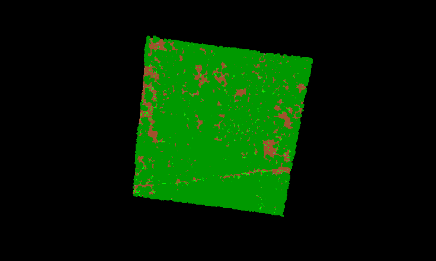

# Phase 34A3.1: viewer motion quality

Release state: **VIEWER_PERFORMANCE_EXPERIMENTAL**. No 0.3 release or Phase 34A4.
The reproduced budget-starvation defect is fixed; broader navigation and human
acceptance gates below remain open. Scientific Process, EPT processing concurrency,
selection authority, source files and export implementation are unchanged.

## Reproduction and root cause

Starting code: `ccdf2c6`. Exact reported source:
`D:/LiDAR_Temp/215000_2114500_g_h_c_h_unbuf_hag.laz`, 21,174,732 bytes,
2,287,408 points. Original SHA256 before/after preparation:
`0c688c22d42b0240c6cba19973087ee59606721289872a3f8237253548db34bb`.

This checkout rejects unindexed LAS/LAZ above 2,000,000 points before rendering.
That separate opening limitation is NOT disguised as a motion failure. The
existing Untwine qualification script produced a read-only COPC derivative of
all 2,287,408 points in 4.016 seconds, with 274,554,880 peak private bytes and
21,677,831 output bytes. The source hash and header count/bounds matched.
The test used the QGIS-owned Untwine executable with its matching DLL environment;
an initial wrong executable path and then missing-DLL launch were retained as
failed preparation attempts, not successful benchmarks. No installer was changed.

The unmodified policy multiplied the previous budget by 0.75 on every moving
telemetry sample, every 750 ms. It had no minimum. The renderer clamped the
result to 1,000, but the user's COPC root alone contains 177,426 points.
Potree admits complete nodes and stops traversal if the root exceeds the budget.
Consequently, motion drove the displayed cloud to **zero points**. Returning to
stationary state could not quickly recover from that collapsed budget.

Two contributing issues were confirmed in the bundled source:

- Assigning `cloud.minimumNodePixelSize` was overwritten by `viewer.minNodeSize`
  on every update. The supposed 2/6 setting did not control actual refinement;
  the measured effective threshold remained 30 pixels.
- The default material used FIXED point sizing at size 1. The cache limit also
  followed the collapsing draw budget, encouraging unnecessary eviction.

## Before/after evidence

The deterministic sequence is initial view, 30 seconds of orbit commands, settle,
bounded pan, bounded dolly/zoom and final refinement. It exercises the real
embedded renderer but is NOT human mouse acceptance. Continuous orbit reaches
the existing pitch clamp; this is not a comprehensive fly-through benchmark.
The comparable initial before/after runs use the same 750 ms telemetry cadence.
Final verification additionally exercises the later 250 ms feedback/profile path.

Windows 11 build 26200, QGIS 3.44.13, managed WebEngine/Potree, RTX 4090 via ANGLE
D3D11. Roughly 60 FPS below means smoothed animation-frame timing on this machine,
not a guarantee on all GPUs or a GPU timestamp measurement.

| Source | Points | Before orbit minimum | Corrected orbit minimum | Corrected mean frame ms | Before/after end-orbit screen occupancy |
| --- | ---: | ---: | ---: | ---: | --- |
| User LAZ, full COPC derivative | 2,287,408 | 0 | 472,162 | 16.67 | 0% / 22% |
| Olaa COPC | 104,819,538 | 0 | 484,833 | 16.67 | 0% / 11% |
| Network EPT | 110,008,858,527 | 0 | 471,588 | 16.67 | 0% / 11% |

Old runs also stayed at zero through pan/zoom/refinement. Corrected sampled
motion phases had no zero-point samples. Occupancy is the fraction of screenshot
samples brighter than the black background, every fourth pixel; it is diagnostic,
camera-dependent coverage, not scientific completeness or a pixel-perfect test.

Final 250 ms/profile-enabled reruns also had no empty motion samples:

| Final run | Orbit minimum | Final refined maximum | Peak private bytes | Peak working set |
| --- | ---: | ---: | ---: | ---: |
| User derivative | 428,859 | 593,609 | 1,076,850,688 | 1,159,131,136 |
| Olaa | 431,003 | 492,337 | 1,066,311,680 | 1,144,479,744 |
| EPT | 471,588 | 646,311 | 1,144,623,104 | 1,225,658,368 |

Startup samples before first-node arrival may be zero; they are not counted as
motion disappearance. Different feedback cadence and advisory warm-up explain
why final counts need not exactly equal the earlier comparative measurements.

The final 20,000-point raw LAZ fixture retained exactly 20,000 displayed points
and a 20,000-point budget throughout orbit, pan, zoom and refinement. Its source
SHA256 was unchanged. This locks the small-source no-unnecessary-thinning case.

Before, end of orbit:

After, same sequence:

## Quality invariants and policy

- A known root is an atomic admission requirement. The draw floor includes that
  root when the viewport/memory ceiling permits it. Available-memory caps still
  win if hardware cannot admit a root; such sources need separate qualification.
- Sources that fit the safe viewport/memory ceiling keep their complete budget
  even while moving or running slowly. Frustum/filter exclusions remain valid.
- TINY/SMALL/MEDIUM/LARGE/MASSIVE_INDEXED are reported separately. These are
  diagnostic classes, not claims that compressed file size measures GPU cost.
- Motion targets a fraction of a viewport-aware ceiling; it no longer recursively
  shrinks the previous budget. Changes above the structural floor are limited to
  approximately 8% per update. Slow frames decrease gradually, never below the floor.
- Continuous camera speed uses radius-normalized translation, rotation and dolly
  deltas. Tiny jitter is ignored; 180 ms stable-camera debounce avoids flickering
  status. Camera angles are wrapped when calculating velocity.
- Node-pixel thresholds move gradually between 12 and 18, with a 0.15-pixel
  deadband. This is global threshold hysteresis, NOT a new per-node SSE algorithm.
  Potree's minimum projected-node radius is not conventional maximum geometric SSE.
- Existing parent-first traversal is preserved. Visible parents/ancestors are
  protected from our cache eviction adapter. True LRU order is maintained.
- Recently visible nodes get a one-second retention interval unless residency
  exceeds 125% of the stable cache limit. Unlike before, motion does not collapse
  the cache limit with the draw budget. Stress eviction remains a separate gate.
- Existing adaptive octree/projection point sizing is enabled, clamped to 2-5
  pixels, scale 1. EDL remains disabled; no unmeasured default EDL cost is introduced.
- Automatic is default. Performance/Balanced/High Detail are optional within the
  collapsed display panel and persist with saved sessions. Presets do not change
  filters, selection identity or scientific processing.
- A graphics-device/runtime/policy-keyed advisory profile records comfortable
  observed points and frame time. It expires after 30 days; all reused values
  still pass current source, viewport and memory ceilings. No GPU capacity is
  inferred from total system RAM. Driver details are included when WebGL exposes them.

The initial viewport was 323,840 pixels; its floor was 323,840 points and ceiling
647,680. Normal orbit targeted about 485,760. These are tested experimental
guardrails, not universal measured hardware limits. Slower-machine tuning remains.

## Streaming, cache and diagnostics

LAS/LAZ still use the existing read-only COPC cache. Large unindexed preparation,
coarse-first opening and background hot-swap are not newly implemented. The
generated QA derivative is usable, but it is not automatic product integration.
Existing source hash/cache identity contracts remain separate from edit journals.

The bundled COPC/EPT loaders already decode in Web Workers and limit tree-node
GPU conversion to two nodes per frame. Normal loader concurrency stays four,
reduced to two under high memory pressure. Directional prefetch is not enabled;
viewer concurrency remains independent of scientific worker concurrency.
The measured EPT run requested 82 point nodes and one hierarchy page, reading
11,821,566 bytes, not the entire repository.

Diagnostics expose draw budget/floor, actual resident-visible point totals,
visible/resident/loading nodes, LOD depths, effective node threshold, point size,
frame time/FPS, normalized camera speed, resident points, JS heap, system RAM
pressure, cache evictions, points/megapixel, clipping planes, transforms and
transport byte/request counts. Actual GPU byte allocation/upload backlog and
per-request latency are unavailable and are not invented. The reported decode
queue includes combined loading/decode activity, not separate stage timings.

WebGL context-loss/restoration handlers show a recovery status without touching
the journal. Deliberate GPU reset qualification remains pending; renderer-child
termination/reload was exercised by the editor canary.

## Memory and coordinate audit

| Corrected initial run | Peak process-tree private bytes | Peak process-tree working set |
| --- | ---: | ---: |
| User derivative | 1,074,012,160 | 1,158,950,912 |
| Olaa | 977,215,488 | 1,054,711,808 |
| EPT | 1,116,565,504 | 1,194,004,480 |

These are short-run sampled peaks, not hard GPU/OS memory limits. System pressure
is sampled once per second with the native read-only Windows API. High pressure
tightens residency and loader concurrency; visible parents remain protected.
No low-memory/OOM stress qualification is claimed.

Prior full Olaa export evidence: private peak 277,512,192 bytes, working set
6,258,659,328 bytes, disk-backed staging 5,974,713,666 bytes. The existing exporter
maps its staging file and PDAL consumes those pages; low private commitment plus
the mapping size explains why working set is much larger. Exact OS per-page
attribution was not newly measured, and file-backed resident pages still consume
RAM. There is no evidence here of a 6.26 GB private heap leak. Export was not
rewritten or advertised as a 278 MB total-memory operation.

Measured scale is [1, 1, 1]. Local node-coordinate buffers and existing world
transforms were retained, including Hawaii projected coordinates. Padded octree
cubes are not the actual Z extent and must not be mistaken for vertical
exaggeration. No new CRS or unit conversion was introduced.

## Validation and remaining gates

Python regressions cover floors, repeated motion, small sources, smooth changes,
velocity, memory caps, viewport sizes, source classes and presets. Executable JS
tests cover jitter, debounce, global threshold deadband, parent retention,
recent-cache retention/pressure override and point-size clamps. Real editor
canaries protect authoritative selection, overlays, undo/redo, export, renderer
recovery and Process handoff. A managed edited-cloud CHM passed unchanged.

An initial Qt6 LAZ canary hit the existing runtime-change launch guard before
rendering. That failed attempt is retained; a fresh indexed-fixture retry passed.
No launch checks were weakened. Full validation and packaged results accompany
the final artifact report.

Final source suite: 1,096 tests passed with 10 platform/dependency skips.
Compilation, undefined-name validation, docs links and JS policy tests passed.
Help lint reports no missing used topic and 37 existing unused-topic advisories.

Remaining before performance-beta / Phase 34A4:

1. Human continuous orbit/pan/repeated zoom on the user cloud, Olaa and EPT.
2. Deep dense-region fly-through, zoom-out eviction and revisit stress, beyond
   the bounded camera path used here; quantify cold/warm requests and latency.
3. Low-end GPU, memory-pressure stress and deliberate WebGL reset recovery.
4. Automatic out-of-core large raw LAS/LAZ opening, safe coarse-first view and
   cache hot-swap; the existing two-million-point guard remains in force.
5. True per-node promotion/demotion hysteresis, directional prefetch and measured
   upload-byte control if further evidence demonstrates a need. Current global
   hysteresis and existing two-node upload limit are not mislabeled as these.
6. Verify a 100-300 ms first visible refinement bound across real network/GPU
   conditions; 250 ms telemetry alone does not prove that latency guarantee.
7. Broader overlay-density/overdraw, EDL trade-off and cross-platform qualification.

## Reproducing evidence

Use the selected QGIS Python to run `scripts/testing/qgis_viewer_motion_quality.py`
with `--source` and a NEW `--output-dir`. It records source hash when bounded,
telemetry, owned process-tree memory and renderer screenshots. `--plugin-root`
selects an extracted package/baseline without installing it. The old archive
needed the unchanged deployed `viewer_runtime.json` bytes restored because git
archive normalized its line endings; dependency checks were not bypassed.

Run `scripts/testing/summarize_viewer_motion.py <evidence-root>` with QGIS Python
for phase summaries and occupancy. Run `node scripts/testing/viewer_render_policy_test.cjs`
for the pure renderer-policy tests.

Retained local evidence root:
`C:/Users/Milo/Documents/PyForestScan-QGIS/artifacts/phase34a3_1`.
Comparable sets: `indexed-before`, `indexed-after`, `olaa-before-retry`,
`olaa-after`, `ept-before`, `ept-after`. Final-policy reruns are labeled `*-final`.
Human QA is explicitly NOT_EXECUTED until the user reports actual interaction.
