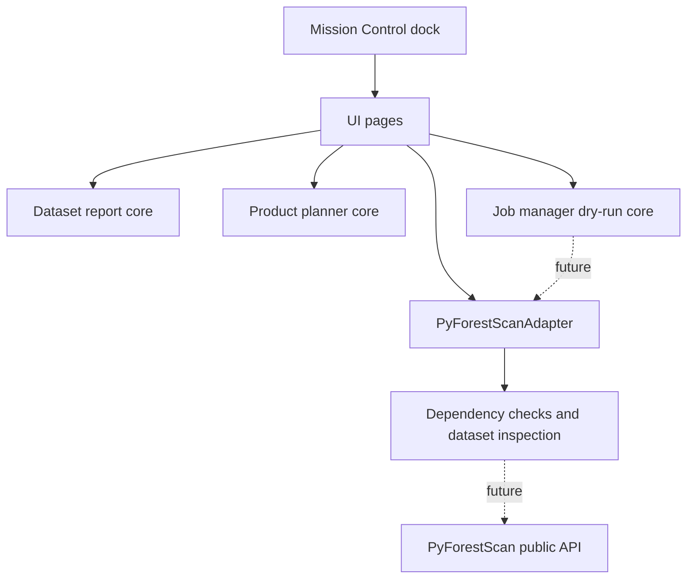
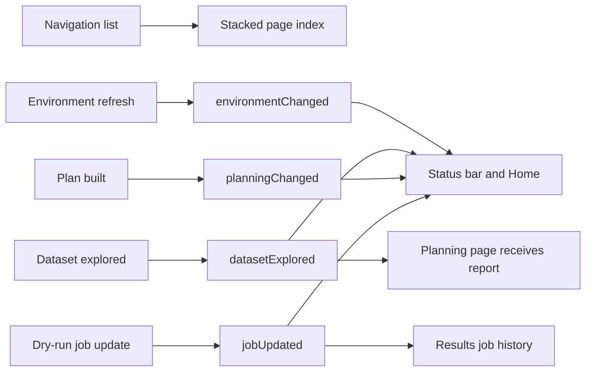

# Mission Control

Mission Control is the dockable graphical operating environment for PyForestScan
QGIS. It coordinates the workflows already implemented in the plugin while
leaving Processing algorithms available for advanced and automated use.

Mission Control does not call PyForestScan directly. It uses plugin core services
and the adapter boundary.

## Pages

- Home: plugin version, PyForestScan version, environment status, latest dataset,
  latest project, recent activity, quick start, and documentation access.
- Environment: adapter-backed runtime checks for QGIS, Python, PyForestScan,
  PDAL, GDAL, rasterio, and numpy.
- Dataset: choose LAS, LAZ, COPC, or EPT and run in-memory Dataset Explorer
  inspection. No report files or scientific outputs are generated from this page.
- Planning: in-memory Product Planner using the latest Dataset Explorer report.
  No product execution is performed.
- Processing: start a dry-run job from Product Planner JSON, view progress, and
  write a job summary JSON without scientific processing.
- Results: view dry-run job history and open JSON, CSV, or HTML reports.
- Settings: placeholder for default output folder, logging, and future
  preferences.

## UI Architecture

- `pyforestscan_qgis/ui/forms/mission_control.ui`: Qt Designer shell for the
  dock header, sidebar, page stack, and status bar.
- `pyforestscan_qgis/ui/mission_control.py`: dock controller and signal wiring.
- `pyforestscan_qgis/ui/pages.py`: modular page widgets.
- `pyforestscan_qgis/ui/state.py`: plain-Python immutable Mission Control state.

## Signal And Slot Architecture

## Scope Boundary

Mission Control coordinates current workflows only. The Processing page is a
dry-run execution shell that validates Product Planner JSON and writes job
summaries. It does not implement CHM, PAI, PAD, FHD, canopy cover, rumple,
raster generation, or PyForestScan scientific calculations.
