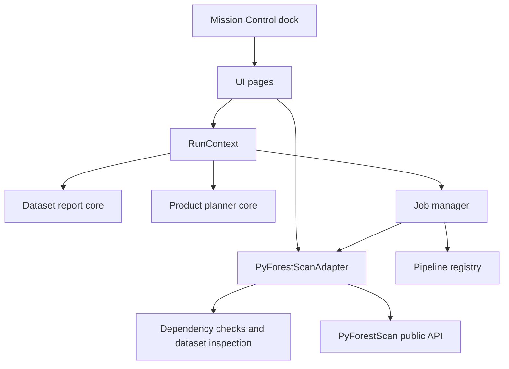
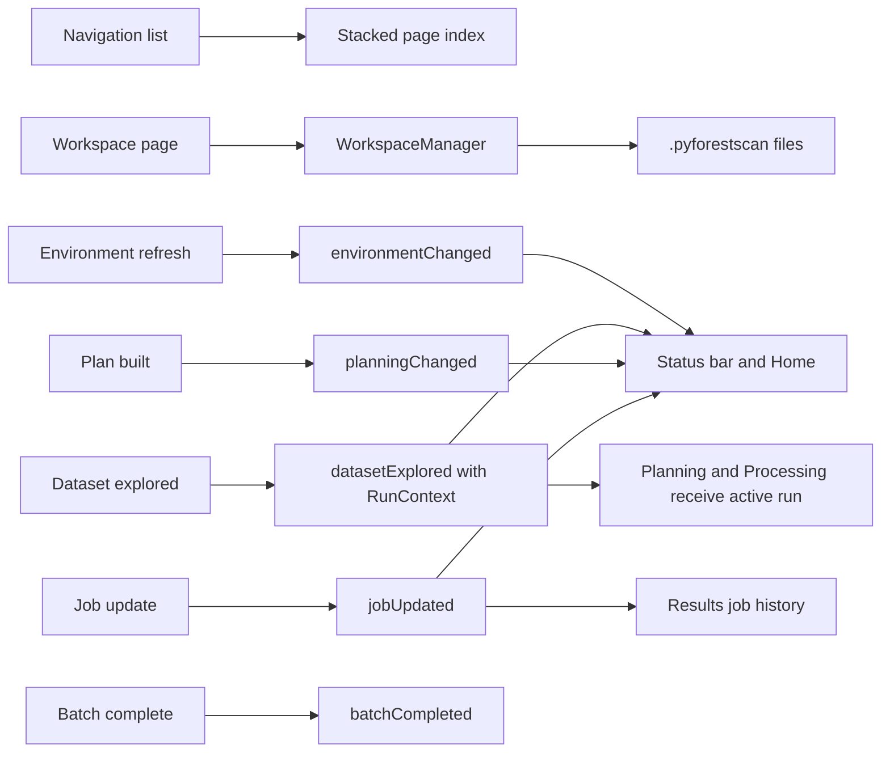

# Mission Control

Mission Control is the floating-by-default, dockable graphical operating environment for PyForestScan
QGIS. It opens as a large application-style window by default and keeps a
bounded navigation sidebar so the main page stack can use the full available
workspace. It coordinates the workflows already implemented in the plugin while
leaving Processing algorithms available for advanced and automated use.

Mission Control does not call PyForestScan directly. It uses plugin core services
and the adapter boundary.

## Pages

- Home: compact workflow dashboard with backend status, environment status,
  current dataset or batch context, last output folder, next action guidance, and
  primary Open Dataset / Start Batch / Continue Previous Session actions. Version
  details and recent activity are collapsed by default.
- Workspace: welcome/resume surface with Resume Workspace, Start New
  Workspace, Recent Workspaces, status, recent runs, key output links, timeline,
  notes, and reset controls collapsed under Troubleshooting.
- Environment: execution-readiness summary with PBM backend status first,
  active execution backend, a Refresh action, and an Open Backend Settings action.
  QGIS Python fallback checks and technical dependency details are collapsed by default.
- Scientific Advisor: deterministic Knowledge Engine guidance after Dataset Explorer, including warnings, product explanations, parameter suggestions, and QGIS QA tools.
- Dataset: choose LAS, LAZ, COPC, or EPT plus an output folder, analyze the dataset, create the active
  run folder, show a compact dataset summary and spatial footprint preview,
  keep dimensions/report paths under Technical Metadata, add the footprint to
  QGIS, and zoom the main map canvas.
- Planning: Product Planner uses the active Dataset Explorer report, keeps the
  normal product/settings path first, and collapses output-folder overrides under
  Advanced Output Folder. No product execution is performed.
- Processing: start implemented product jobs from the active Product Planner
  report, view selected products, output folder, Processing Footprint, current status,
  and progress by default. Product Plan JSON paths, pipeline stages, and logs are
  available under Technical Details.
- Batch: discover multiple LAS, LAZ, COPC, and EPT datasets from a folder, select
  files, apply one shared product plan/settings set, process them sequentially
  by default or through guarded Parallel safe mode, filter results, retry
  failures, cancel remaining files, and optionally load generated outputs into
  QGIS.
- Results: show a compact teaching empty state until outputs exist, then make
  Open Output Folder and Load Outputs dominant, with raw paths under Run files
  and logs.
- Settings: default output folder for Mission Control runs.

## UI Architecture

The Qt shell sets a production-oriented minimum size and Mission Control applies
runtime stretch factors so the page stack expands horizontally and vertically.
Each page uses one full-width vertical scroll area; individual pages should avoid
adding nested scroll areas unless there is a specific interaction reason.

Mission Control follows the permanent [Mission Control UX Standard](../development/MISSION_CONTROL_UX_STANDARD.md): one primary action per page, no empty sections, collapsed technical details, concise empty states, and consistent workflow terminology. Visual hierarchy, status badges, dialogs, notifications, tables, icons, and future module integration follow the [PyForestScan Design System](../development/PYFORESTSCAN_DESIGN_SYSTEM.md). Phase 24F applies that system with shared spacing tokens, button role styling, status-badge tones, compact empty states, and calmer Backend/Processing/Batch/Results layouts. Phase 25A tightens workflow continuity by collapsing rarely used reset/output/backend details and keeping empty states compact; see the [Visual Polish Audit](../development/VISUAL_POLISH_AUDIT.md).

- `pyforestscan_qgis/ui/forms/mission_control.ui`: Qt Designer shell for the
  dock header, sidebar, page stack, and status bar.
- `pyforestscan_qgis/ui/mission_control.py`: dock controller and signal wiring.
- `pyforestscan_qgis/ui/pages.py`: modular page widgets.
- `pyforestscan_qgis/ui/qgis_footprint.py`: Dataset footprint preview creation,
  in-memory footprint layer integration, and main-canvas zoom helpers.
- `pyforestscan_qgis/ui/state.py`: plain-Python immutable Mission Control state.
- `pyforestscan_qgis/core/workspace/`: QGIS-free workspace package containing run-folder context, workspace persistence, session/state/history/timeline/notes models, and display helpers.

## Signal And Slot Architecture

## Scope Boundary

Mission Control coordinates current workflows only. Dataset footprint preview uses
QGIS APIs only in the UI layer; core adapter and report code remain QGIS-free.
The run folder is not a required `.pfs` project file. The Processing page runs the active Product
Planner JSON through JobManager and the pipeline registry. CHM, Canopy Cover, PAD, PAI, FHD, and Rumple are implemented through the adapter for single-dataset workflows. Raster outputs are loaded with product-aware default styling: CHM, Canopy Cover, PAI, and FHD use grayscale, while PAD uses its documented RGB band composite. Users can restyle layers manually in QGIS.

## Workspace Welcome And Resume

The Workspace page turns the local `.pyforestscan/` folder into a user-facing
resume experience. Continue Last Workspace opens the newest recorded workspace,
Start New Workspace creates a workspace in a chosen output folder, and Recent
Workspaces lists up to 10 known entries with missing paths marked clearly.

Workspace status, current step, completion percentage, recent runs, key output
links, timeline events, and notes are shown as normal application content rather
than raw JSON. Technical files remain hidden unless users open the run folder or
inspect workspace files manually. Reset clears workspace progress/history in a
controlled way and does not delete generated rasters, reports, or batch outputs.

## Scientific Advisor Integration

The Scientific Advisor page consumes `RecommendationReport` objects from
`core/knowledge`. QGIS tool guidance stays in the UI layer and is shown as
concise next-action text by default. Version-dependent QGIS tool instructions are
kept in collapsed details, while direct buttons are limited to actions that are
useful in the current run context, such as opening the output folder.

The Advisor starts with an Executive Summary: dataset readiness, best product to
consider, key warning, and suggested next action. Detailed QGIS tool
instructions, scientific notes, and product explanations are collapsed by
default so users see the next useful decision before deeper rationale.

## Planning Layout

The Planning page is grouped into Dataset, Product Selection, Shared
Parameters, Advanced Output Folder, Advanced Product Settings, and Run Summary
sections. Product-specific filenames, output overrides, and CHM / Canopy Cover
controls are collapsed by default because the recommended/shared settings are
enough for the normal workflow.

## Processing Footprint

Mission Control does not predict runtime in the primary UI. The Processing page
explicitly shows the active execution backend. For the internal beta, PBM is the preferred backend when READY; QGIS Python remains a fallback for workflows that have not been routed.

instead displays a Processing Footprint based on Product Planner raster
dimensions, selected products, height-bin count, and a conservative float32
assumption of 4 bytes per raster cell. CHM, Canopy Cover, PAI, and FHD count as
one raster band each. PAD uses the planned height-bin count as its band count.
Rumple is shown as minimal CSV/table storage. Runtime remains a caveat because it
depends on machine, storage speed, point density, compression, and product
selection.

## Batch Processing

Mission Control includes a Batch page for sequential folder-to-products workflows. Users choose an input folder, optional recursive discovery, selected files, one output folder, products, and shared settings. Batch v1 creates one `pyforestscan_batch_<timestamp>` folder and one normal run folder per selected dataset. Each dataset reuses Dataset Explorer, Product Planner, JobManager, the pipeline registry, and the adapter boundary. Failures are recorded per file and do not stop the whole batch unless the user enables stop-on-error. Batch summary JSON, CSV, and HTML files are shown in Results after completion.

## UX Streamlining

The Home page is intentionally a workflow dashboard rather than a documentation landing page. The former Open Documentation button was removed from Home because it competed with the primary actions. Users start work through Start Single Dataset or Start Batch, while technical paths and internal files remain collapsed on their respective pages.

Batch v2 keeps the default workflow focused on the choices users need: input folder, selected files, output folder, products, shared settings, and run controls. Internal reports remain available through Results and run-folder summaries.

## Batch Execution Modes

Batch defaults to Sequential. Parallel Safe mode is explicit, capped at six workers, and defaults to two workers. Values above two and larger workloads show warnings and require confirmation before parallel execution starts. The Batch page starts execution in a Qt worker thread so the Mission Control window remains responsive where practical. Generated output loading remains off by default.

## Batch Preflight And Resume UI

The Batch page uses a three-step flow: Discover Files, Preflight, and Run Batch / Review Results. The Run button stays disabled until preflight passes. If preflight reports warnings, the user must explicitly acknowledge them before running. Preflight shows ready status, blockers, warnings, estimated output storage, free disk space, files to process, completed files, skipped files, retry files, manifest path, execution mode, and max workers.

When `batch_manifest.json` exists, Mission Control exposes Resume Batch. Completed files are skipped by default and failed files can be retried with the current shared settings.

## External Worker Mode

External Worker mode is disabled and is not selectable in Mission Control. Manual validation showed that QGIS GUI Python can launch full QGIS application windows instead of headless jobs. The preserved external-worker code is future research only and is blocked by core guardrails unless an explicit developer flag is set outside normal use.
