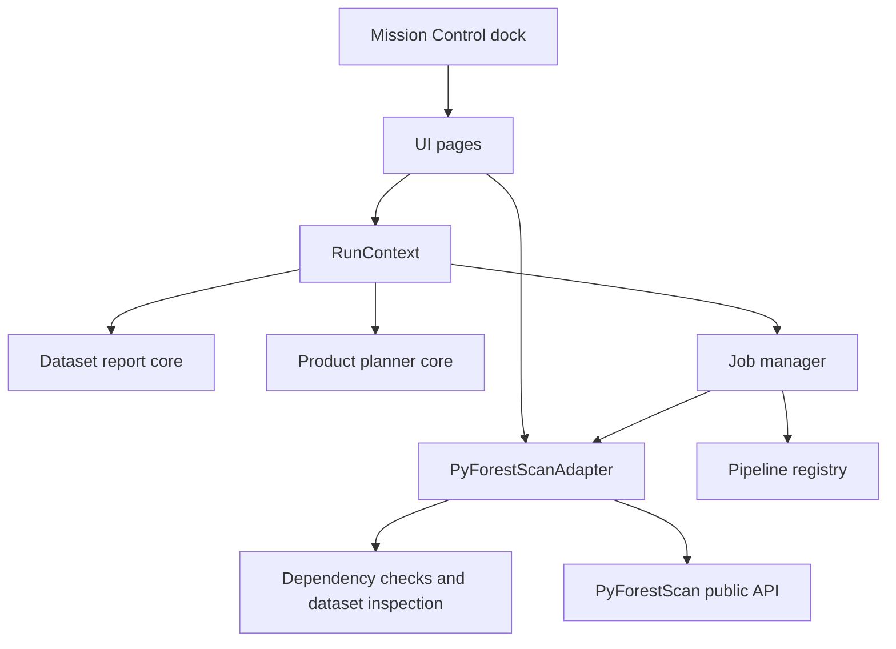
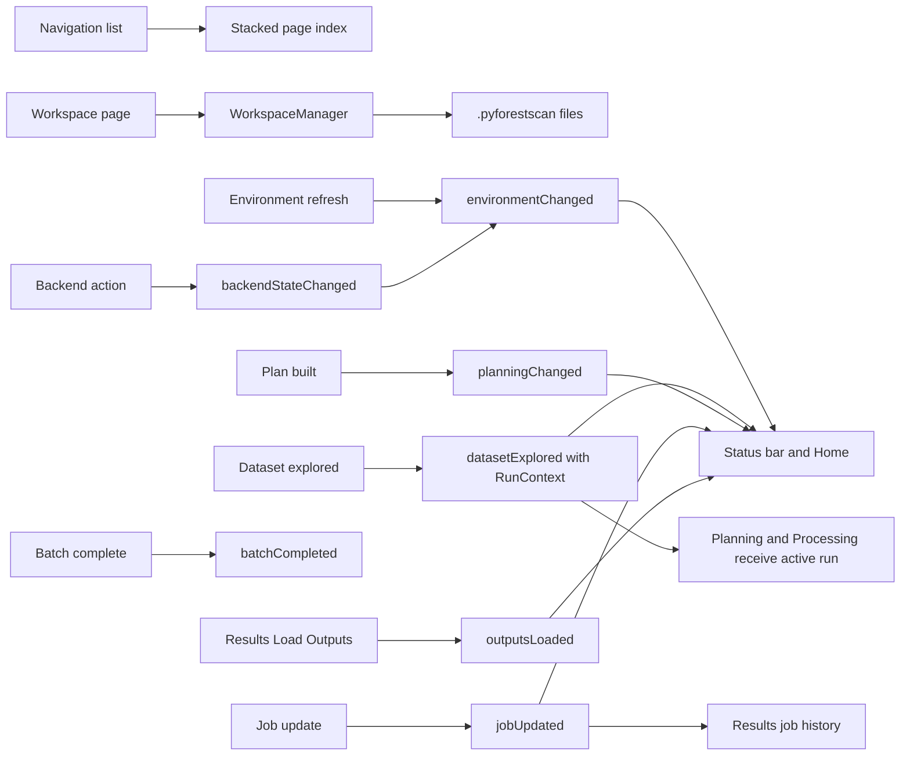

# Mission Control

After Processing Engine Setup or Repair, Mission Control refreshes all status surfaces and automatically rebuilds an existing Prerun with the new runtime identity. Repository, polygon, and product selections are preserved.

Normal Tools & Setup shows one Processing Engine card and one Set Up/Repair action. Recheck and technical backend information are collapsed under Troubleshooting. Process shows a compact Set Up/Repair action in place, preserves selections, and refreshes automatically through `processingEngineStateChanged`.

The normal setup surface presents one Processing Engine state: Ready, Checking, Setup required, Needs repair, Update required, or Failed. Setup verifies automatically. Technical PBM terminology, module contracts, and logs remain under troubleshooting. Process validates readiness before preserving a job token or creating batch work.

## Processing Engine status

Mission Control presents one Processing Engine state: Ready, Checking, Setup required, Updating, Repair required, Incompatible, or Failed. Normal setup exposes one state-dependent action. Detailed PBM controls, dependency probes, protocol identity, and logs belong under troubleshooting.

Polygon and Folder processing use the same engine verifier immediately before launch. An incomplete engine blocks the launch before a scientific batch attempt is created.

Polygon Selection asks for a coordinate system only when the repository cannot identify one. Choosing a CRS writes a shared repository assignment, reruns Prerun Check, and leaves source files untouched. Successful review stays compact; provenance is available in Technical Details.

For strongly compatible unreferenced LiDAR, the default advanced preference automatically uses the polygon coordinate system and displays a non-blocking assumed-reference warning. Technical views distinguish raw overlap, alignment, and final selection.

Prerun preparation remains concise, for example **Height normalization will be generated automatically**. Ground samples, parameters, provenance, and recommendations remain in technical output rather than the primary workflow.

Batch Process automatically refreshes missing readiness when clicked; Run Detailed Check remains available for review but is not required. Automatic is the normal profile. Execution mode appears only for Custom, and Maximum Workers appears only for Custom + Parallel as an adaptive upper bound. Primary output loading defaults on. Software determines parallel safety.

Phase 29B reduces normal decisions: repository paths refresh automatically, one Prepare Repository action owns normal setup, spatial actions refresh their required plan on demand, Automatic is the default profile, and detailed execution controls appear only under Custom. Mission Control no longer opens at QGIS startup unless enabled in Advanced Settings. See the [Phase 29B Workflow Simplification Audit](../development/PHASE_29B_WORKFLOW_SIMPLIFICATION_AUDIT.md).

Phase 29A makes the two retained workspaces content-driven: empty file and report surfaces stay compact, populated lists cap at six visible rows, product and concurrency controls follow current selections, backend maintenance stays under troubleshooting, and the live footer reports only current-session state. See the [Phase 29A Productization UI Audit](../development/PHASE_29A_PRODUCTIZATION_UI_AUDIT.md).

Safe EPT progress uses work-unit language such as `2 complete, 3 failed, 5 of 120 attempted, 115 not started`. Scientific pauses and native crashes are distinct states; normal mode does not expose raw Windows exception codes.

Mission Control is the floating-by-default, dockable graphical operating environment for PyForestScan
QGIS. It opens as a large application-style window by default and keeps a
bounded navigation sidebar so the main page stack can use the full available
workspace. It coordinates the workflows already implemented in the plugin while
leaving Processing algorithms available for advanced and automated use.

Mission Control does not call PyForestScan directly. It uses plugin core services
and the adapter boundary.

## Pages

The primary sidebar order is Batch, Results, Scientific Advisor, Environment,
Settings, and Advanced Toolbox. Batch is the startup workspace. Advanced
Toolbox opens the existing QGIS Processing Toolbox.

- Batch: the primary workspace. Choose **LiDAR Folder Selection** or **Polygon
  Selection**, select data, products, and an output folder, run the **Prerun
  Check**, then process. Automatic repository, CRS, strategy, and concurrency
  decisions are the default; specialist controls are collapsed.
- Results: generated products first, followed by Open Output Folder and Load
  into QGIS. Processing summaries and diagnostics are collapsed.
- Scientific Advisor: optional Knowledge Engine guidance. It is never required
  before processing.
- Environment: PBM readiness and active execution backend first. QGIS Python
  fallback and technical dependency details are collapsed.
- Settings: user defaults and PBM backend controls. Technical logs remain
  collapsed.
- Advanced Toolbox: opens the existing parameter-rich Processing Toolbox.

Home, Workspace, Dataset, Planning, and Processing remain internal compatibility
pages. Their state, services, and signal wiring are preserved, but they are not
shown in primary navigation.

## UI Architecture

The Qt shell sets a production-oriented minimum size and Mission Control applies
runtime stretch factors so the page stack expands horizontally and vertically.
Each page uses one full-width vertical scroll area; individual pages should avoid
adding nested scroll areas unless there is a specific interaction reason.

Mission Control follows the permanent [Mission Control UX Standard](../development/MISSION_CONTROL_UX_STANDARD.md): one primary action per page, no empty sections, collapsed technical details, concise empty states, and consistent workflow terminology. Visual hierarchy, status badges, dialogs, notifications, tables, icons, and future module integration follow the [PyForestScan Design System](../development/PYFORESTSCAN_DESIGN_SYSTEM.md). Phase 24F applies that system with shared spacing tokens, button role styling, status-badge tones, compact empty states, and calmer Backend/Processing/Batch/Results layouts. Phase 25A tightens workflow continuity by collapsing rarely used reset/output/backend details and keeping empty states compact. Phase 25B adds guided workflow continuity with subtle step indicators and one Next Step card on each primary workflow page. Phase 25C corrects the default route to Home -> Workspace if needed -> Dataset -> Planning -> Processing -> Results, keeps Batch optional, keeps Scientific Advisor as support guidance, and adds subtle readiness markers beside existing readiness text. Phase 25D makes Results output loading functional and tightens content-driven card sizing. Phase 26A adds the first product-readiness audit: native action icon intents, calmer backend copy, status wording consistency, and developer terminology kept under advanced/troubleshooting disclosure; see the [Visual Polish Audit](../development/VISUAL_POLISH_AUDIT.md) and [Product Readiness Audit I](../development/PRODUCT_READINESS_AUDIT_I.md). Phase 26B standardizes action lifecycle behavior so Environment, Dataset, Planning, Processing, Batch, Results, and Backend actions disable while running, show concise progress, refresh dependent pages automatically, and surface completion/failure via QGIS message-bar notifications. Phase 26C adds a shared current-session Project Summary so Home, Workspace, Processing, Results, and Scientific Advisor agree on the active dataset, output folder, generated products, loaded products, processing state, backend/environment state, last run time, and project CRS when available.

- `pyforestscan_qgis/ui/forms/mission_control.ui`: Qt Designer shell for the
  dock header, sidebar, page stack, and status bar.
- `pyforestscan_qgis/ui/mission_control.py`: dock controller and signal wiring.
- `pyforestscan_qgis/ui/pages.py`: modular page widgets.
- `pyforestscan_qgis/ui/qgis_footprint.py`: Dataset footprint preview creation,
  in-memory footprint layer integration, and main-canvas zoom helpers.
- `pyforestscan_qgis/ui/state.py`: plain-Python immutable Mission Control state.
- `pyforestscan_qgis/core/workspace/`: QGIS-free workspace package containing run-folder context, workspace persistence, session/state/history/timeline/notes models, and display helpers.

## Internal Workflow Compatibility

The legacy single-dataset path remains available internally as Home -> Workspace if needed -> Dataset -> Planning -> Processing -> Results. Home summarizes backend/environment readiness, selected data, workflow status, and output location, then uses Continue to move to the next incomplete step. If readiness is not established, Continue and Check Environment route to Environment. Dataset routes to Planning, Planning routes to Processing, and Processing completion points to Results. Batch is optional and is never inserted into the default Continue path. Scientific Advisor is support guidance and is not required before Processing.

Mission Control keeps pages synchronized as the workflow changes. Choosing a new dataset clears stale Planning, Processing, Advisor, and Results content until Dataset Explorer runs again. Backend verification or install completion refreshes Environment and Home. Processing completion updates Results and Home, and Load Outputs records a concise result message without exposing raw logs in the primary UI.

The current-session Project Summary is in-memory only. It is not a history database, autosave system, or cross-computer persistence layer. It tracks what has happened in the active Mission Control session: dataset type/path, workspace/output folder, generated products, loaded products, processing state, backend/environment state, last processing time, and QGIS project CRS when QGIS exposes it. Results uses this to separate Generated Products, Loaded Products, Available Products, and Missing Requested Products; Processing uses it to show products that already exist before rerun.

## Signal And Slot Architecture

## Scope Boundary

Mission Control coordinates current workflows only. Dataset footprint preview uses
QGIS APIs only in the UI layer; core adapter and report code remain QGIS-free.
The run folder is not a required `.pfs` project file. The Processing page runs the active Product
Planner JSON through JobManager and the pipeline registry. CHM, Canopy Cover, PAD, PAI, FHD, and Rumple are implemented through the adapter for single-dataset workflows. Raster outputs are loaded with product-aware default styling: single-band rasters use grayscale, and PAD uses a representative grayscale height slice from the authoritative multiband volume. Optional PAD composites are labeled as derived height-band visualizations. Users can restyle layers manually in QGIS.

## Workspace Welcome And Resume

The Workspace page turns the local `.pyforestscan/` folder into a user-facing
resume experience. Continue Last Workspace opens the newest recorded workspace,
Start New Workspace creates a workspace in a chosen output folder, and Recent
Workspaces lists up to 10 known entries with missing paths marked clearly.

Workspace status, current step, completion percentage, recent runs, key output
links, timeline events, and notes are shown as normal application content rather
than raw JSON. Technical files remain hidden unless users open the run folder or
inspect workspace files manually. Reset clears workspace progress/history in a
controlled way and does not delete generated rasters, reports, or batch outputs.

## Scientific Advisor Integration

The Scientific Advisor page consumes `RecommendationReport` objects from
`core/knowledge`. QGIS tool guidance stays in the UI layer and is shown as
concise next-action text by default. Version-dependent QGIS tool instructions are
kept in collapsed details, while direct buttons are limited to actions that are
useful in the current run context, such as opening the output folder.

The Advisor starts with an Executive Summary: dataset readiness, best product to
consider, key warning, and suggested next action. Detailed QGIS tool
instructions, scientific notes, and product explanations are collapsed by
default so users see the next useful decision before deeper rationale.

## Planning Layout

The Planning page is grouped into Dataset, Product Selection, Shared
Parameters, Advanced Output Folder, Advanced Product Settings, and Run Summary
sections. Product-specific filenames, output overrides, and CHM / Canopy Cover
controls are collapsed by default because the recommended/shared settings are
enough for the normal workflow.

## Processing Footprint

Mission Control does not predict runtime in the primary UI. The Processing page
explicitly shows the active execution backend. For the internal beta, PBM is the preferred backend when READY; QGIS Python remains a fallback for workflows that have not been routed.

instead displays a Processing Footprint based on Product Planner raster
dimensions, selected products, height-bin count, and a conservative float32
assumption of 4 bytes per raster cell. CHM, Canopy Cover, PAI, and FHD count as
one raster band each. PAD uses the planned height-bin count as its band count.
Rumple is shown as minimal CSV/table storage. Runtime remains a caveat because it
depends on machine, storage speed, point density, compression, and product
selection.

## Batch Processing

Mission Control includes a Batch page for folder-to-products workflows. Standard File Batch lets users choose an input folder, optional recursive discovery, selected files, one output folder, products, and shared settings. Polygon Area Processing lets users choose or paste a LiDAR repository path without scanning it, run bounded Quick Probe, explicitly build/update/resume its catalog, choose a polygon source, output folder, and products; preflight queries intersecting catalog records, execution stages clipped LAZ inputs, masks supported rasters outside the exact polygon, and the normal Batch executor processes those staged files. Batch creates one `pyforestscan_batch_<timestamp>` folder and one normal run folder per selected dataset or clipped source. Each dataset reuses Dataset Explorer, Product Planner, JobManager, the pipeline registry, and the adapter boundary. Failures are recorded per file and do not stop the whole batch unless the user enables stop-on-error. Batch summary JSON, CSV, and HTML files are shown in Results after completion.

## UX Streamlining

The Home page is intentionally a workflow overview rather than a documentation landing page. It shows only backend/environment readiness, selected dataset, workflow status, current output folder, Continue, and Check Environment. Continue routes to Environment when readiness needs attention, then Dataset, Planning, Processing, or Results as the run progresses. Technical paths and internal files remain collapsed on their respective pages.

Batch keeps the default Standard File Batch workflow focused on the choices users need: input folder, selected files, output folder, products, shared settings, and run controls. Polygon Area Processing adds a separate mode for catalog-backed LiDAR repository plus polygon source workflows so Dataset remains a single-dataset page. Internal reports remain available through Results and run-folder summaries.

## Batch Execution Modes

Batch defaults to Sequential. Parallel Safe mode is explicit, capped at six workers, and defaults to two workers. Values above two and larger workloads show warnings and require confirmation before parallel execution starts. The Batch page starts execution in a Qt worker thread so the Mission Control window remains responsive where practical. Generated output loading remains off by default.

## Batch Preflight And Resume UI

The Batch page uses a three-step flow: Discover Files, Preflight, and Run Batch / Review Results. The Run button stays disabled until preflight passes. If preflight reports warnings, the user must explicitly acknowledge them before running. Preflight shows ready status, blockers, warnings, estimated output storage, free disk space, files to process, completed files, skipped files, retry files, manifest path, execution mode, and max workers.

When `batch_manifest.json` exists, Mission Control exposes Resume Batch. Completed files are skipped by default and failed files can be retried with the current shared settings.

## External Worker Mode

External Worker mode is disabled and is not selectable in Mission Control. Manual validation showed that QGIS GUI Python can launch full QGIS application windows instead of headless jobs. The preserved external-worker code is future research only and is blocked by core guardrails unless an explicit developer flag is set outside normal use.

## Batch Adaptive Indexing Controls

In **Batch > Polygon Area Processing**, users can preview repository indexing before heavy catalog work:

- **Detect Best Indexing Strategy** shows the selected strategy, reason, cost, expected accuracy, files avoided, and warnings.
- **Build Relevant Index** uses the detected low-cost path where supported, such as existing indexes or native EPT/COPC registration.
- **Build Complete Repository Index** starts the durable full catalog build/update path.

The strategy panel is informational and bounded; it must not start a deep scan by itself.

## Polygon Area Processing Help And Terminology

The Batch page now uses **Prepare Repository** and **Automatic Setup (Recommended)** as the guided path. Technical indexing strategy names are hidden from the default guided labels. Contextual help buttons explain LiDAR Repository, Polygon source, and Repository setup method.

Preflight shows compact execution readiness: repository type, logical inputs, backend status, workload, estimated points, output, warnings, and expandable-style technical diagnostics.

## Phase 27K Polygon And Help Updates

Polygon Area Processing now distinguishes geometry content from backend vector paths. PBM materializes the clipping polygon in the job workspace and PyForestScan receives a real GeoPackage or GeoJSON path. The Batch page uses central InfoBadge topics for repository, polygon source, and setup method help.

## Phase 27L processing validation

The Processing page includes **Validate Processing Request**. It explains the PBM request-validation gate that checks backend API compatibility, EPT metadata, bounds syntax, polygon input, CRS, and output writability before product execution.

## Phase 27M Results And Polygon Outputs

Results can read `generated_outputs.json` registries from Standard Batch and Polygon Area Processing. Load Generated Outputs adds final masked rasters or supported tables to QGIS, skips duplicates, and leaves unmasked intermediates hidden from the primary result list.

## Phase 27N Polygon Guided Review

Polygon preflight now shows a concise review with plan status, LiDAR data type, logical inputs, processing capacity, final clipping, warnings, and blockers. The full preflight text remains under Technical Report.

## Phase 27O Notes

Repository discovery, catalog identity, catalog integrity, repair, source-view, coverage-model, diagnostic-export, and repository action-state services now back Polygon Area Processing setup. Broken catalogs are reported as catalog repair/readiness issues instead of generic no-coverage results. The RTree contract is `id, xmin, xmax, ymin, ymax`; EPSG:6635 overlap fixtures cover the observed polygon envelope regression.

## Phase 27P Notes

Catalog health now separates embedded CRS from effective CRS. A bounded LAS/LAZ catalog with all source CRS values missing is `CRS Assignment Required`, not healthy, and polygon preflight does not report true no coverage until comparable CRS metadata exists. Repository CRS override metadata is explicit and reversible. Live QGIS coverage/zoom services now require actual layer insertion or canvas extent changes before reporting success.

## Phase 28A productized workflow

Mission Control opens on **Batch** and shows the primary sidebar **Batch, Results, Scientific Advisor, Environment, Settings, Advanced Toolbox**. Home, Workspace, Dataset, Planning, and Processing remain internal compatibility pages. Normal processing uses **LiDAR Folder Selection** or **Polygon Selection**, then products, output folder, **Prerun Check**, and **Process**. Repository and spatial specialist controls are collapsed under Advanced sections.

## Retained-page synchronization

Batch selections update Results context and Scientific Advisor automatically. Advanced Toolbox opens or focuses QGIS Processing and also shows provider registration, algorithm count, groups, and refresh feedback.

## Compact retained interface

Batch follows Processing Mode -> LiDAR Data/Processing Area -> Products -> Output Folder -> Prerun Check -> Process. Results hides output actions until products exist. Advisor, Environment, Settings, and Advanced Toolbox keep technical details collapsed by default.

## Processing reliability
Mission Control displays current LiDAR and area selection rather than a historical dataset. Every workflow-defining Process control contributes to the current input identity. Changing that identity invalidates Prerun Check, Advisor guidance, progress, and current output references. Results load only explicitly registered outputs from a completed current attempt and never discover outputs by scanning folders. Session reset preserves files, PBM, catalogs, preferences, and previous-run history.

Run-defining controls are disabled while processing owns the active job. Pause, cancellation, progress, and troubleshooting controls remain available where supported.
## Large-job progress
CHM progress reports stage, completed/total areas, active/failed units, elapsed time, and ETA only after stable throughput.

## Phase 28G Exact Polygon Completion

Polygon prerun summaries distinguish candidate, required, and skipped areas. Recovery and progress use durable counts; no starting work-unit selector is exposed.

## Phase 28H Adaptive Scale and Compact Workspace

Mission Control now has two visible destinations: Process and Tools & Setup. Process combines the former Batch and Results workflow; internal legacy pages preserve capability without primary navigation clutter.
# Terminal Recovery

Processing controls are restored after every terminal outcome. A hidden-by-default Refresh Status action can repair a stale UI projection without deleting outputs or cancelling work. QGIS layer-loading failure is reported separately from successful scientific processing.
# Phase 30D Process workspace

The Process workspace uses automatic scheduling and automatic current-job output loading. Normal Prerun Check shows inputs, output, storage, blockers, and warnings without scheduler internals. Advanced retains processing profile, conflict/recovery controls, and applicable polygon finalization controls; no global warning acknowledgement is shown.
# Phase 30E CRS presentation

Resolved CRS remains quiet. Source-local standalone processing may show **Source coordinates**. Spatial ambiguity presents one compact assignment action; technical evidence stays in diagnostics.

When coordinate units are the sole blocker, Process shows **Preparation needs one detail** with metres/feet, file/repository scope, and Continue. Users may instead choose a CRS or explicitly use the project CRS. Tools & Setup contains collapsed **LiDAR Spatial Reference** management. Assignment never reprojects coordinates.

With the default Phase 31C policy, eligible standalone CHM/Rumple no longer show that intervention: Prerun is ready with a concise source-coordinate fallback warning. The compact assignment action appears only when policy requires explicit assignment or geography is required. No global warning acknowledgement is used.
