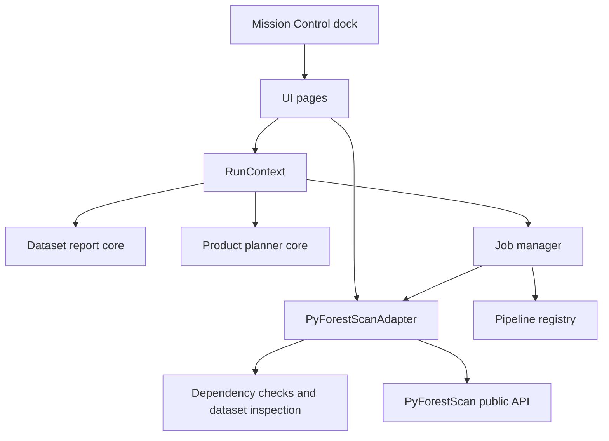
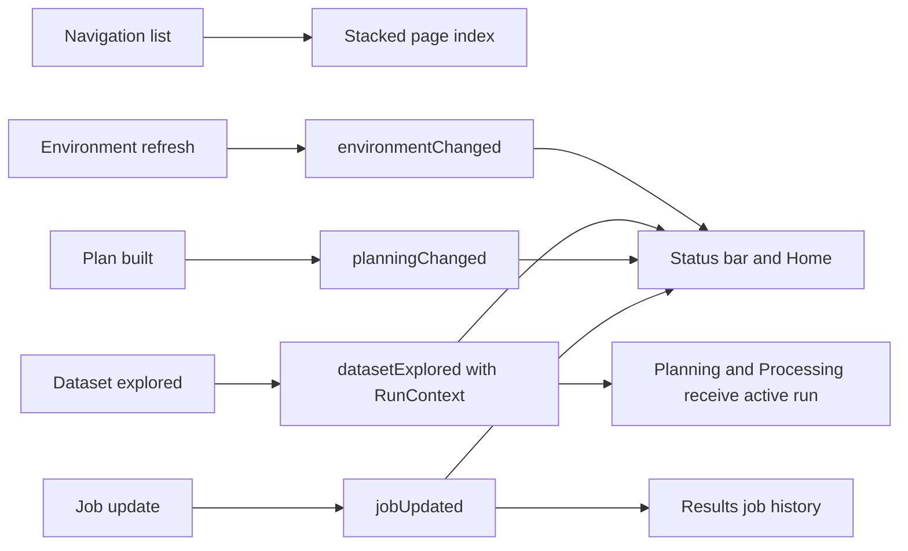

# Mission Control

Mission Control is the floating-by-default, dockable graphical operating environment for PyForestScan
QGIS. It coordinates the workflows already implemented in the plugin while
leaving Processing algorithms available for advanced and automated use.

Mission Control does not call PyForestScan directly. It uses plugin core services
and the adapter boundary.

## Pages

- Home: plugin version, PyForestScan version, environment status, latest dataset,
  latest project, recent activity, quick start, and documentation access.
- Environment: adapter-backed runtime checks for QGIS, Python, PyForestScan,
  PDAL, GDAL, rasterio, and numpy.
- Scientific Advisor: deterministic Knowledge Engine guidance after Dataset Explorer, including warnings, product explanations, parameter suggestions, and QGIS QA tools.
- Dataset: choose LAS, LAZ, COPC, or EPT plus an output folder, create the active
  run folder, write Dataset Explorer reports, show a spatial footprint preview,
  add the footprint to QGIS, and zoom the main map canvas.
- Planning: Product Planner uses the active Dataset Explorer report and writes
  plan reports into the run folder. No product execution is performed.
- Processing: start implemented product jobs from the active Product Planner
  report, view progress, inspect pipeline stages, write GeoTIFF outputs under
  `outputs/`, and write `logs/job_summary.json` plus `logs/job_summary.html`.
- Results: view friendly Dataset Report, Product Plan, Job Summary, Output
  Folder, and Products links, with raw paths under Advanced details.
- Settings: default output folder, logging placeholder, and future preferences.

## UI Architecture

- `pyforestscan_qgis/ui/forms/mission_control.ui`: Qt Designer shell for the
  dock header, sidebar, page stack, and status bar.
- `pyforestscan_qgis/ui/mission_control.py`: dock controller and signal wiring.
- `pyforestscan_qgis/ui/pages.py`: modular page widgets.
- `pyforestscan_qgis/ui/qgis_footprint.py`: Dataset footprint preview creation,
  in-memory footprint layer integration, and main-canvas zoom helpers.
- `pyforestscan_qgis/ui/state.py`: plain-Python immutable Mission Control state.
- `pyforestscan_qgis/core/workspace.py`: run-folder path model shared by Mission Control pages.

## Signal And Slot Architecture

## Scope Boundary

Mission Control coordinates current workflows only. Dataset footprint preview uses
QGIS APIs only in the UI layer; core adapter and report code remain QGIS-free.
The run folder is not a required `.pfs` project file. The Processing page runs the active Product
Planner JSON through JobManager and the pipeline registry. CHM, Canopy Cover, PAD, PAI, FHD, and Rumple are implemented through the adapter for single-dataset workflows. Raster outputs are loaded with product-aware default styling: CHM, Canopy Cover, PAI, and FHD use grayscale, while PAD uses its documented RGB band composite. Users can restyle layers manually in QGIS.

## Scientific Advisor Integration

The Scientific Advisor page consumes `RecommendationReport` objects from
`core/knowledge`. QGIS actions stay in the UI layer: Processing Toolbox opening,
selected-layer properties, selected-layer zoom, and output-folder opening are all
best-effort UI actions with text fallbacks.
