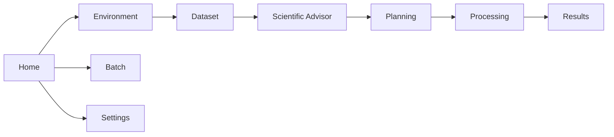

# Mission Control Screen Flow

## Home

Shows the workflow dashboard: environment status, active dataset, batch status, next recommended action, recent run folder, and primary Start Single Dataset / Start Batch actions. Version details are collapsed.

## Environment

Runs adapter-backed environment checks and displays status rows for Python, QGIS, PyForestScan, PDAL, GDAL, rasterio, and numpy.

## Dataset

Chooses a supported dataset and output folder, creates the active run folder, writes Dataset Explorer reports, and displays point count, bounds, CRS, density, warnings, available products, and spatial footprint preview.

## Scientific Advisor

Shows deterministic dataset readiness, key warnings, recommended products, recommended parameters, QGIS next actions, scientific notes, and product explanations. Detailed rationale is collapsed by default.

## Planning

Uses the current Dataset Explorer report to build a Product Planner report with selected products, shared parameters, product-specific advanced settings, warnings, and planned outputs.

## Processing

Runs selected implemented products from the active Product Plan. The primary view shows selected products, output folder, Processing Footprint, status, progress, and Run button. Technical JSON paths and pipeline details are collapsed.

## Batch

Discovers files from a folder, applies shared products/settings, runs required preflight, and processes files sequentially or through guarded Parallel Safe mode. External Worker mode is disabled.

## Results

Shows friendly Dataset Report, Product Plan, Job Summary, Output Folder, Products, and batch summary links first. Internal run files and logs are collapsed.

## Settings

Stores the default output folder used by Mission Control runs.
