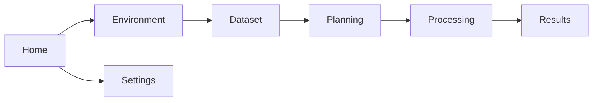

# Mission Control Screen Flow

## Home

Displays plugin version, PyForestScan version, environment status, latest dataset,
latest project, recent activity, quick start, and documentation links.

## Environment

Runs adapter-backed environment checks and displays status rows for Python, QGIS,
PyForestScan, PDAL, GDAL, rasterio, and numpy.

## Dataset

Chooses a supported dataset and performs in-memory inspection. Displays point
count, bounds, CRS, density, dimensions, warnings, and available products.

## Planning

Uses the current Dataset Explorer report to build an in-memory product plan with
products, resolution, height-bin size, output folder, warnings, and estimates.

## Processing

Shows the Phase 7 placeholder message.

## Results

Opens existing JSON, CSV, and HTML reports.

## Settings

Shows placeholder controls for default output folder, logging, and future
preferences.
