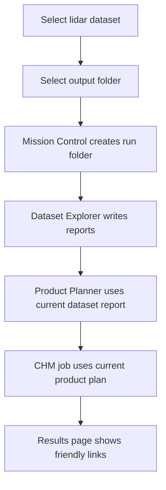

# Mission Control User Workflow

## Setup workflow

Open **Tools & Setup** and read the Processing Engine status. Choose **Set Up** when setup is required or **Repair** when the verified engine needs repair. Successful setup refreshes status automatically; no separate verification step is required. Use **Recheck Processing Engine** only to refresh existing evidence, and **Open Diagnostics** when support details are needed.

## Durable completion

Choose Input, Area, Products, and Output, then select **Process LiDAR**. Long polygon runs continue in the hidden Processing Engine. Completed areas are checkpointed, and a finalization-only failure can be repaired from validated CHM/Rumple outputs without recalculating LiDAR science.

For normal Batch work: choose LiDAR data, choose products, choose output, and select Process LiDAR. PyForestScan validates current inputs automatically and either starts from a frozen request or shows an actionable blocker. Advanced Processing is optional.

Mission Control uses a run-folder workflow so users do not need to manually pass
JSON files between Dataset Explorer, Product Planner, and CHM execution.

## User-Facing Flow



The primary workflow is:

1. Open Mission Control.
2. Select a LAS, LAZ, COPC, or EPT dataset on the Dataset page.
3. Select an output folder.
4. Run Dataset Explorer.
5. Open Planning and build a product plan.
6. Open Processing and start a CHM job.
7. Open Results for Dataset Report, Product Plan, Job Summary, Output Folder,
   and Products links.

## Run Folder Layout

Mission Control creates a timestamped run folder below the selected output
folder:

```text
<chosen_output_folder>/
  pyforestscan_runs/
    <YYYYMMDD_HHMMSS_datasetstem>/
      reports/
      tables/
      outputs/
      logs/
      temp/
```

If a run folder with the same timestamp and dataset stem already exists, Mission
Control appends a suffix such as `_02` to avoid overwriting earlier reports.

Internal files use predictable names:

```text
reports/dataset_report.json
reports/dataset_report.html
tables/dataset_summary.csv
reports/product_plan.json
reports/product_plan.html
tables/product_plan.csv
logs/job_summary.json
logs/job_summary.html
outputs/chm.tif
outputs/canopy_cover.tif
outputs/pad.tif
outputs/pai.tif
outputs/fhd.tif
outputs/rumple_summary.csv
```

The JSON and CSV files remain available in Run files and logs, but the normal UI
surfaces friendly links instead of asking users to browse for internal files.

## Scope Boundary

The run folder is not a project file. Phase 8C intentionally does not require a
`.pfs` project file or persistent project database. It is a simple execution
workspace for one Mission Control run.

Mission Control can create CHM, Canopy Cover, PAD, PAI, and FHD GeoTIFFs in
`outputs/`, plus a Rumple scalar CSV summary. Rasters load with grayscale styling by default. Vector and point-cloud outputs remain future products.
# Automatic processing defaults

Select sources and products, review Prerun Check, and process. One source runs with one source worker; independent multiple-file work is parallelized within the planner's safety ceiling. Successful current-job primary rasters load automatically.
