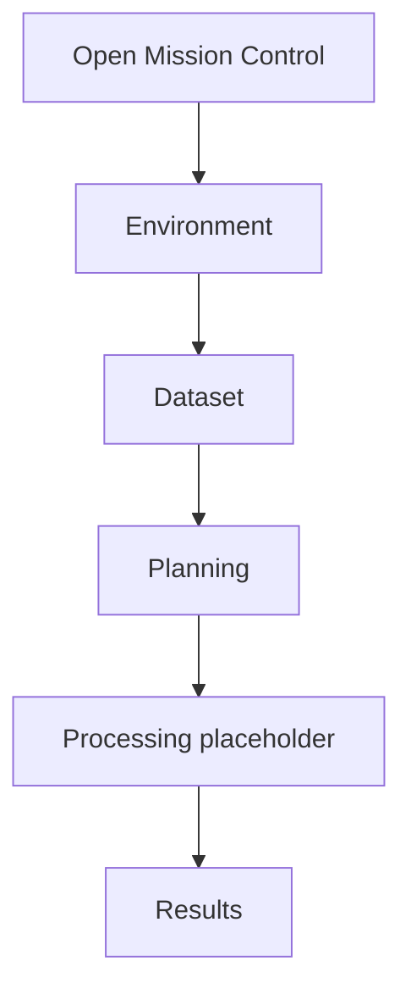

# Mission Control User Workflow

Mission Control guides users through the same sequence the Processing algorithms
support, but in a dockable interface.

## Recommended Workflow

## Steps

1. Open Mission Control from the PyForestScan toolbar or plugin menu.
2. Use Environment to refresh dependency status.
3. Use Dataset to choose and inspect a LAS, LAZ, COPC, or EPT dataset.
4. Use Planning to select desired future products, resolution, and output folder.
5. Review the Processing placeholder; scientific execution begins in a later
   phase.
6. Use Results to open existing JSON, CSV, and HTML reports.

Processing Toolbox algorithms remain available for repeatable report-producing
workflows. Mission Control is the guided operating environment.
