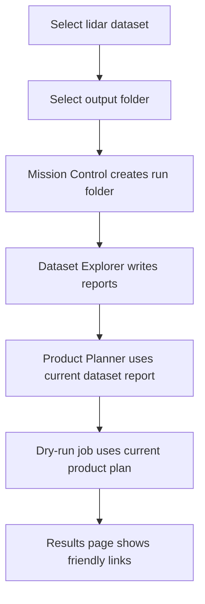

# Mission Control User Workflow

Mission Control uses a run-folder workflow so users do not need to manually pass
JSON files between Dataset Explorer, Product Planner, and dry-run execution.

## User-Facing Flow



The primary workflow is:

1. Open Mission Control.
2. Select a LAS, LAZ, COPC, or EPT dataset on the Dataset page.
3. Select an output folder.
4. Run Dataset Explorer.
5. Open Planning and build a product plan.
6. Open Processing and start a dry-run job.
7. Open Results for Dataset Report, Product Plan, Job Summary, Output Folder,
   and Future Products links.

## Run Folder Layout

Mission Control creates a timestamped run folder below the selected output
folder:

```text
<chosen_output_folder>/
  pyforestscan_runs/
    <YYYYMMDD_HHMMSS_datasetstem>/
      reports/
      tables/
      outputs/
      logs/
      temp/
```

Internal files use predictable names:

```text
reports/dataset_report.json
reports/dataset_report.html
tables/dataset_summary.csv
reports/product_plan.json
reports/product_plan.html
tables/product_plan.csv
logs/job_summary.json
```

The JSON and CSV files remain available in Advanced details, but the normal UI
surfaces friendly links instead of asking users to browse for internal files.

## Scope Boundary

The run folder is not a project file. Phase 8C intentionally does not require a
`.pfs` project file or persistent project database. It is a simple execution
workspace for one Mission Control run.

Mission Control still does not create CHM, PAI, PAD, FHD, canopy cover, rumple,
raster, vector, or point-cloud outputs. The `outputs/` folder is reserved for
future scientific products.
